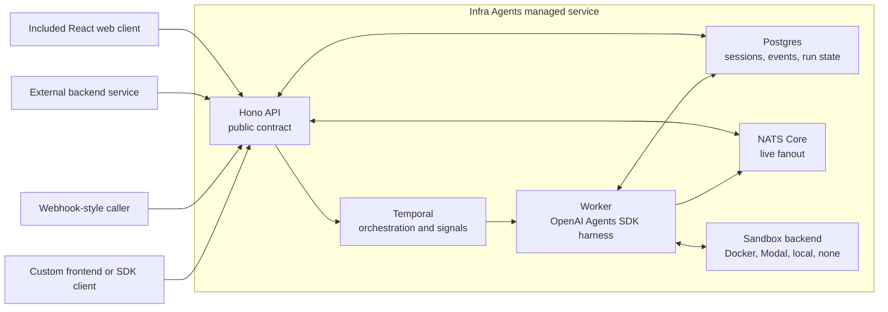
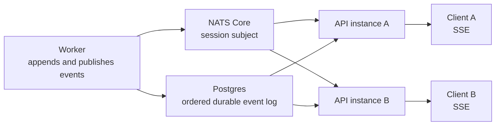
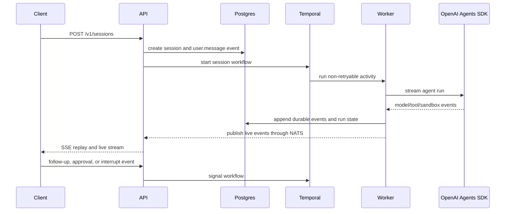
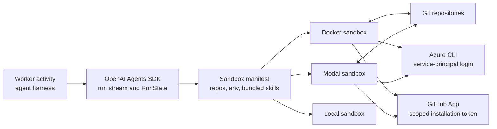

# infra-agents

Infra Agents is a self-hostable managed agent service for long-running infrastructure work.

The core product is the API contract for creating, steering, observing, and replaying agent sessions. The React web app in this repo is one example client. Other services, backends, webhook-style callers, or custom frontends can use the same API without storing their own chat history or agent state.

The architecture follows the same broad managed-agent shape described in Anthropic's public Managed Agents material: durable sessions, event-based control, a model harness/runtime, and isolated execution environments. Infra Agents keeps those pieces self-hostable and open around Bun, Hono, Temporal, Postgres, NATS, and the OpenAI Agents SDK.

## Stack

- Hono for the managed agent API
- React/Vite for the included example web client
- Temporal for orchestration, signals, approvals, and cancellation
- OpenAI Agents SDK for the agent runtime and sandbox agents
- Drizzle/Postgres for durable sessions, events, and SDK run state
- Core NATS for low-latency realtime fanout
- Docker, Modal, local, or no sandbox backend through the runtime sandbox abstraction

## Managed Service Boundary

Public clients talk only to the Hono API. The API is the managed-agent entry point: it validates requests, creates sessions, accepts user/approval/interrupt events, exposes durable event history, and streams live events.

The included web app uses this API directly, but it is not privileged. A different product can call the API from its own backend, store only the returned session id, and use Infra Agents as the source of truth for session state, event history, approvals, and final outputs.



## Session And Event Model

Sessions are durable server-side objects. Clients send commands as events and receive an ordered event stream back.

- `POST /v1/sessions` creates a session and dispatches the first user message.
- `POST /v1/sessions/:sessionId/events` sends follow-up messages, approval decisions, and interrupts.
- `GET /v1/sessions/:sessionId/events` reads durable event history from Postgres.
- `GET /v1/sessions/:sessionId/events/stream` streams replay plus live events over SSE.

Postgres is the durable source of truth. NATS Core is live fanout only. If an API instance or SSE client misses live events, the API backfills from Postgres by event sequence.

Multiple API instances can subscribe to the same session subject. A worker publishes each event batch once, and every API instance with interested clients receives the live events and fans them out to its own SSE clients.



## Temporal Control Plane

Temporal coordinates the work, but token streams and tool output do not go through workflow history.

The workflow receives signals for follow-ups, approval decisions, and interrupts. Agent execution runs inside non-retryable activities because model calls, sandbox commands, GitHub operations, and cloud-provider actions are side-effectful. If a full activity were retried automatically, it could duplicate real work.



## Agent Harness And Sandbox Execution

The worker is the harness around the OpenAI Agents SDK. It builds the agent, selects the model and reasoning effort, prepares resources, streams SDK events, normalizes them into the public event contract, and saves serialized SDK `RunState` after successful or approval-blocked segments.

Sandbox backends are execution environments. Docker makes fully local execution possible. Modal supports remote managed execution. Local and none are available for development and tests. Additional OpenAI Agents SDK-compatible sandbox clients can be added behind the runtime sandbox client factory.



Azure authentication uses normal Azure CLI preflight inside the sandbox when ARM/AZURE service-principal variables are available. GitHub App repository selections are validated to one installation and converted into scoped installation tokens for the selected repositories.

Current Docker limitation: file resources use native S3-compatible in-container mounts. Docker sandboxes can mount those files when they are present in the initial manifest, but cannot add a new in-container FUSE mount to an already-running container unless the container was started with the required Docker privileges. In V1, attach file resources before the first run when using the Docker backend. Mid-session native file mounts should be revisited when the OpenAI Agents SDK exposes a clean way to pre-enable or update those Docker mount privileges.

## Local Stack

```bash
bun install
cp .env.example .env
docker compose up -d postgres nats temporal minio minio-init
bun run db:migrate
docker build -f docker/sandbox.Dockerfile -t infra-agents-sandbox:local .
bun run dev:api
bun run dev:worker
bun run dev:web
```

Open:

- Web client: `http://127.0.0.1:3000`
- API health: `http://127.0.0.1:8000/healthz`
- NATS monitor: `http://127.0.0.1:8222`
- Temporal gRPC: `127.0.0.1:7233`
- MinIO console: `http://127.0.0.1:9001`

If you run Temporal with the local dev server instead of the compose service, the Temporal UI is commonly available at `http://127.0.0.1:8233`.

Configure `.env` before starting the API and worker. For Docker sandbox runs, build `infra-agents-sandbox:local`. For Modal runs, configure the Modal sandbox variables instead.

## Public API

- `GET /healthz`
- `GET /v1/config/client`
- `POST /v1/sessions`
- `GET /v1/sessions/:sessionId`
- `GET /v1/sessions/:sessionId/events`
- `GET /v1/sessions/:sessionId/events/stream`
- `POST /v1/sessions/:sessionId/events`
- `GET /v1/github/app`
- `GET /v1/github/repositories`
- `POST /v1/github/app-manifest`
- `GET /v1/github/app-manifest/callback`

The API is intentionally session-based.

## Testing

Fast checks do not require Temporal, NATS, Postgres, a sandbox backend, or live model credentials:

```bash
bun run typecheck
bun test
```

The broader suite is split by dependency level:

```bash
bun run test:integration
bun run test:e2e
bun run test:live
bun run check
bun run check:full
```

Normal integration and E2E tests use Bun's test runner. Deterministic SDK-level tests use a scripted model so they can exercise the real worker, Temporal workflow, NATS/SSE path, Postgres, and sandbox plumbing without depending on live model output.

## Roadmap

- Authentication, tenancy, API keys, and scoped client permissions.
- Outbound webhooks for event delivery to external systems.
- First-class `agents` and `environments` API resources.
- Client SDK for event streaming, timeline projection, markdown rendering, approvals, and interrupts.
- More OpenAI Agents SDK-compatible sandbox backends.
- Native mid-session file mounts for Docker sandboxes once the SDK supports privilege-safe late in-container mounts.
- Deeper Temporal/OpenAI Agents SDK integration when the TypeScript SDK supports durable agent, tool, and sandbox boundaries cleanly.

## References

- [Anthropic Managed Agents overview](https://platform.claude.com/docs/en/managed-agents/overview)
- [Anthropic engineering: Managed Agents](https://www.anthropic.com/engineering/managed-agents)
