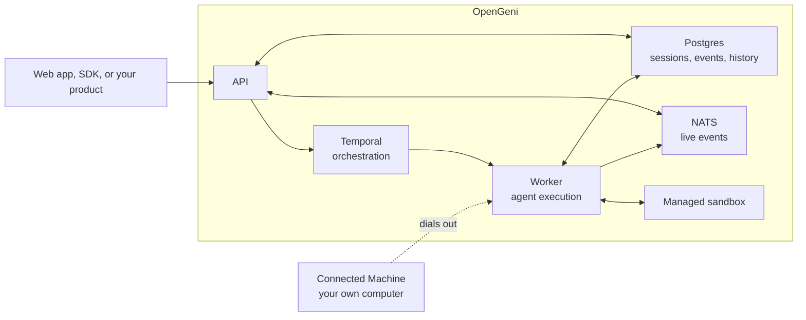

<p align="center">
  <a href="https://opengeni.ai">
    <picture>
      <source media="(prefers-color-scheme: dark)" srcset="docs-site/logo/dark.svg">
      
    </picture>
  </a>
</p>

<h3 align="center">The open, self-hostable runtime for long-running AI agents.</h3>

<p align="center">
  Durable sessions · human approvals · governed memory · your choice of compute
</p>

<p align="center">
  <a href="https://app.opengeni.ai">Try it</a> ·
  <a href="https://docs.opengeni.ai">Docs</a> ·
  <a href="https://docs.opengeni.ai/quickstart">Quickstart</a> ·
  <a href="https://docs.opengeni.ai/guides/self-host">Self-host</a> ·
  <a href="https://github.com/Cloudgeni-ai/opengeni/issues">Issues</a>
</p>

<p align="center">
  <a href="https://github.com/Cloudgeni-ai/opengeni/actions/workflows/ci.yml"></a>
  <a href="https://www.npmjs.com/package/@opengeni/sdk"></a>
  <a href="LICENSE"></a>
</p>

---

OpenGeni is the platform layer that makes AI agents safe to trust with real work. It runs agents for hours or days, records every step in a replayable event log, pauses for human approval when it matters, and lets each session run either in a managed sandbox or directly on a machine you own.

OpenGeni is the runtime, not the agent. Use the included web app to give agents work and follow along, or call the same session API from your own product and let OpenGeni own durable state, history, approvals, and outputs. It comes out of two years of running agents against production cloud infrastructure at [CloudGeni](https://cloudgeni.ai).

## Features

- **Durable, replayable sessions.** Every event lands in Postgres. Live streams backfill from it, so a browser reload, a new client, or an audit replays the same history.
- **Sessions that finish the job.** Give a session a goal with success criteria. The agent keeps working until it completes the goal with evidence, pauses with a rationale, or a human interrupts.
- **Humans in the loop.** Tool approvals gate risky actions. Agents can ask structured questions and resume the exact tool call after the answer, even across restarts.
- **Run anywhere.** A managed sandbox (Docker, Modal, or a cloud provider) or a **Connected Machine**: your laptop, build server, or GPU box, enrolled once and driven directly. Machines only dial out and receive no platform credentials.
- **Agent Knowledge.** Files, retained sources, and useful findings in one searchable library, with personal and workspace ownership and optional review before anything is published.
- **Integrate in one handler.** One organization API key on your server, one chat endpoint, and React components for the timeline, composer, and approvals.
- **Self-host everything.** API, web app, workers, Helm chart, and reference Terraform for Azure, AWS, and GCP are all Apache-2.0. Or use the managed service at [app.opengeni.ai](https://app.opengeni.ai).

## Quick start

You need [Bun](https://bun.sh), Docker, [rustup](https://rustup.rs), and an OpenAI or Azure OpenAI key.

```bash
git clone https://github.com/Cloudgeni-ai/opengeni.git
cd opengeni
cp .env.example .env   # add your model credentials
bun run dev
```

Open http://127.0.0.1:3000, describe a task, and watch the session run.

`bun run dev` installs dependencies, starts Postgres, NATS, Temporal, and object storage, runs migrations, builds the sandbox image, and starts the API, workers, and web app. See [Local development](docs/local-development.md) for manual startup, configuration, and the native (no Docker) path.

## Use it from your code

```ts
import { OpenGeni, createChatHandler } from "@opengeni/sdk/chat";

const og = new OpenGeni({
  apiKey: process.env.OPENGENI_API_KEY!,
  organizationId: process.env.OPENGENI_ORGANIZATION_ID!,
});

const chat = await og.chat({ tenant: "acme", user: "u_42", conversation: "c_9" });
const reply = await chat.send("Summarize open incidents from the last week.");
console.log(reply.text);
```

Start with the [product integration guide](docs/product-integration.md), then the [TypeScript SDK](packages/sdk/README.md) and [React components](packages/react/README.md). The [chat quickstart](examples/chat-quickstart) is a runnable server example, and [Northstar support](examples/northstar-support) shows a full SaaS embed.

## How it works

Public clients talk only to the API. Postgres is the source of truth, Temporal coordinates long-running work, NATS fans out live events, and workers run agents in a sandbox or on a Connected Machine.


```mermaid
flowchart LR
  Client["Web app, SDK, or your product"]

  subgraph OpenGeni
    API["API"]
    DB["Postgres<br/>sessions, events, history"]
    Temporal["Temporal<br/>orchestration"]
    Worker["Worker<br/>agent execution"]
    NATS["NATS<br/>live events"]
    Sandbox["Managed sandbox"]
  end

  Machine["Connected Machine<br/>your own computer"]

  Client --> API
  API <--> DB
  API --> Temporal
  API <--> NATS
  Temporal --> Worker
  Worker <--> DB
  Worker --> NATS
  Worker <--> Sandbox
  Machine -. dials out .-> Worker
```

Token streams and tool output never pass through Temporal history, and agent turns run as non-retryable activities because model calls and sandbox commands have side effects. The full map, including every app and package, is in [docs/architecture.md](docs/architecture.md).

## Documentation

| I want to...                          | Read                                                                                                        |
| ------------------------------------- | ----------------------------------------------------------------------------------------------------------- |
| Use the hosted app                    | [Quickstart](https://docs.opengeni.ai/quickstart)                                                           |
| Run it locally                        | [Local development](docs/local-development.md)                                                              |
| Deploy to production                  | [Self-host](https://docs.opengeni.ai/guides/self-host) · [Deployment guide](docs/deployment.md)             |
| Add agents to my product              | [Product integration](docs/product-integration.md) · [SDK reference](https://docs.opengeni.ai/reference/sdk) |
| Run sessions on my own hardware       | [Connect a machine](https://docs.opengeni.ai/guides/connect-a-machine) · [Connected Machines](docs/connected-machines.md) |
| Call the HTTP API directly            | [HTTP API overview](docs/http-api.md)                                                                       |
| Configure models and providers        | [Model providers](docs/model-providers.md)                                                                  |
| Give agents repository access         | [GitHub App](docs/github-app.md)                                                                            |
| Understand goals, approvals, memory   | [Goals](docs/goals.md) · [Human input](docs/human-input.md) · [Knowledge](docs/knowledge.md)                |
| Understand the internals              | [Architecture](docs/architecture.md) · [Run lifecycle](docs/run-lifecycle.md) · [Docs map](docs/README.md)  |
| See what is planned                   | [Roadmap](docs/roadmap.md)                                                                                  |

The public product docs live at [docs.opengeni.ai](https://docs.opengeni.ai). The [CloudGeni Infrastructure Agents Guide](https://github.com/Cloudgeni-ai/infrastructure-agents-guide) covers patterns for infrastructure-focused agents.

## Built with

Bun · Hono · React and Vite · Temporal · Postgres with pgvector · NATS · OpenAI Agents SDK · a Rust agent and relay for Connected Machines

## Security

OpenGeni's API is workspace-scoped and every request resolves to an access grant before touching data. Do not expose a production deployment without a deliberate access mode, tested database role posture, rate limits, and a reviewed sandbox credential policy. See the [security boundary](docs/deployment.md#security-boundary) and report vulnerabilities through [SECURITY.md](SECURITY.md).

## Contributing

Contributions are welcome. Read [CONTRIBUTING.md](CONTRIBUTING.md) for setup, checks, and the pull request workflow, and [AGENTS.md](AGENTS.md) if you work on the runtime itself.

```bash
bun run typecheck
bun test
```

## License

[Apache-2.0](LICENSE). Optional curated Skills under `packages/runtime/src/curated_skill_library` carry their own provenance and license metadata; HashiCorp-derived Terraform guidance is MPL-2.0 and is never mounted by default.
