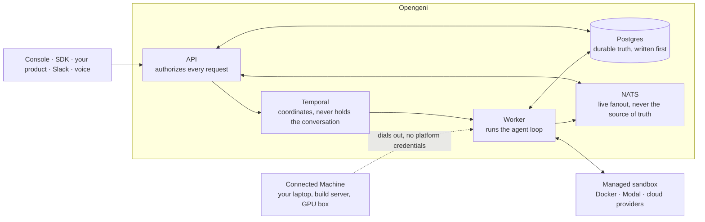

<p align="center">
  <a href="https://opengeni.ai">
    <picture>
      <source media="(prefers-color-scheme: dark)" srcset="docs-site/logo/dark.svg">
      
    </picture>
  </a>
</p>

<h3 align="center">The open, self-hostable runtime for long-running AI agents.</h3>

<p align="center">
  Durable sessions · human approvals · governed memory · your choice of compute
</p>

<p align="center">
  <a href="https://app.opengeni.ai"><strong>Start free at app.opengeni.ai →</strong></a>
</p>

<p align="center">
  <a href="https://docs.opengeni.ai/quickstart">Quickstart</a> ·
  <a href="https://docs.opengeni.ai">Docs</a> ·
  <a href="https://docs.opengeni.ai/guides/self-host">Self-host</a> ·
  <a href="https://github.com/Cloudgeni-ai/opengeni/issues">Issues</a>
</p>

<p align="center">
  <a href="https://github.com/Cloudgeni-ai/opengeni/actions/workflows/ci.yml"></a>
  <a href="https://www.npmjs.com/package/@opengeni/sdk"></a>
  <a href="LICENSE"></a>
</p>

---

Opengeni is the platform layer that makes AI agents safe to trust with real work. It runs agents for hours or days, records every step in a replayable event log, pauses for human approval when it matters, and lets each session run either in a managed sandbox or directly on a machine you own.

Opengeni is the runtime, not the agent. Use the web app to give agents work and follow along, or call the same session API from your own product and let Opengeni own durable state, history, approvals, and outputs. It comes out of two years of running agents against production cloud infrastructure at [CloudGeni](https://cloudgeni.ai).

## Get started

**The fastest way is the managed service.** Sign up at [app.opengeni.ai](https://app.opengeni.ai), name your organization, connect a model (a ChatGPT/Codex or SuperGrok subscription, a provider key, or prepaid credits), and start your first session. Nothing to deploy. The [quickstart](https://docs.opengeni.ai/quickstart) walks through it.

Prefer to run it yourself? The whole platform is open source. Jump to [Run it locally](#run-it-locally) for a one-command dev stack, or to [Self-host](https://docs.opengeni.ai/guides/self-host) for production.

## Features

- **Durable, replayable sessions.** Every event lands in Postgres. Live streams backfill from it, so a browser reload, a new client, or an audit replays the same history.
- **Sessions that finish the job.** Give a session a goal with success criteria. The agent keeps working until it completes the goal with evidence, pauses with a rationale, or a human interrupts.
- **Humans in the loop.** Tool approvals gate risky actions. Agents can ask structured questions and resume the exact tool call after the answer, even across restarts.
- **Run anywhere.** A managed sandbox (Docker, Modal, or a cloud provider) or a **Connected Machine**: your laptop, build server, or GPU box, enrolled once and driven directly. Machines only dial out and receive no platform credentials.
- **Agent Knowledge.** Files, retained sources, and useful findings in one searchable library, with personal and workspace ownership and optional review before anything is published.
- **Integrate in one handler.** One organization API key on your server, one chat endpoint, and React components for the timeline, composer, and approvals.
- **Managed or self-hosted.** Use [app.opengeni.ai](https://app.opengeni.ai) with nothing to run, or deploy the same API, web app, workers, Helm chart, and reference Terraform for Azure, AWS, and GCP yourself. All of it is Apache-2.0.

## Run it locally

For development, or to evaluate the platform before self-hosting. You need [Bun](https://bun.sh), Docker, [rustup](https://rustup.rs), and an OpenAI or Azure OpenAI key.

```bash
git clone https://github.com/Cloudgeni-ai/opengeni.git
cd opengeni
cp .env.example .env   # add your model credentials
bun run dev
```

Open http://127.0.0.1:3000, describe a task, and watch the session run.

`bun run dev` installs dependencies, starts Postgres, NATS, Temporal, and object storage, runs migrations, builds the sandbox image, and starts the API, workers, and web app. See [Local development](docs/local-development.md) for manual startup, configuration, and the native (no Docker) path.

## Use it from your code

```ts
import { OpenGeni, createChatHandler } from "@opengeni/sdk/chat";

const og = new OpenGeni({
  apiKey: process.env.OPENGENI_API_KEY!,
  organizationId: process.env.OPENGENI_ORGANIZATION_ID!,
});

const chat = await og.chat({ tenant: "acme", user: "u_42", conversation: "c_9" });
const reply = await chat.send("Summarize open incidents from the last week.");
console.log(reply.text);
```

Start with the [product integration guide](docs/product-integration.md), then the [TypeScript SDK](packages/sdk/README.md) and [React components](packages/react/README.md). The [chat quickstart](examples/chat-quickstart) is a runnable server example, and [Northstar support](examples/northstar-support) shows a full SaaS embed.

## How it works

"Agent" is one word for at least ten different jobs. A model is a function from tokens to tokens: it forgets everything between calls, has no idea what it is allowed to do, and has no obligation to keep working until the job is done. Everything above it exists to turn that into work that finishes, can be trusted with real systems, and can be explained afterwards.

Opengeni is built as those layers, kept deliberately separate so you can swap one without rebuilding the rest.

```text
  ┌───────────────┐   ┌───────────────────────────────────────────────────────┐
  │               │   │  10 SURFACES        console · embedded UI · Slack ·   │
  │ 8  GOVERNANCE │   │                     voice · SDK · API                 │
  │               │   ├───────────────────────────────────────────────────────┤
  │ identity      │   │   9 KNOWLEDGE       scoped retrieval · reviewed       │
  │ tenancy       │   │                     learning · never mixed with chat  │
  │ permissions   │   ├───────────────────────────────────────────────────────┤
  │ secrets       │   │   7 DURABLE STATE   sessions · turns · goals ·        │
  │ approvals     │   │     & ORCHESTRATION recovery · human-in-the-loop      │
  │ audit         │   ├───────────────────────────────────────────────────────┤
  │               │   │   6 COMPUTE         sandboxes · browsers ·            │
  │ +             │   │                     your own machines                 │
  │               │   ├───────────────────────────────────────────────────────┤
  │ OBSERVABILITY │   │   5 TOOLS           one gateway · MCP · connections · │
  │ & COST        │   │                     credentials outside the prompt    │
  │               │   ├───────────────────────────────────────────────────────┤
  │ every call    │   │   4 AGENT LOOP      cache-stable prompt · gradual     │
  │ records what  │   │                     tool disclosure · exact history   │
  │ it cost and   │   ├───────────────────────────────────────────────────────┤
  │ who pays      │   │   3 MODEL ROUTING   allowed models · fallback ·       │
  │               │   │                     capacity waits · billing          │
  │               │   ├───────────────────────────────────────────────────────┤
  │               │   │ 1-2 INFERENCE       any provider · any wire format ·  │
  │               │   │                     swappable mid-conversation        │
  └───────────────┘   └───────────────────────────────────────────────────────┘
```

**Rent the edges, own the middle.** Models, provider APIs, and the raw compute box change too fast to own, so every one of them is a swappable boundary. Durable state, governance, and knowledge are where your workflows, permissions, audit record, and institutional memory actually live, so they sit in a Postgres database you operate, export, and can leave with.

### Three systems, three jobs


```mermaid
flowchart LR
  Client["Console · SDK · your product · Slack · voice"]

  subgraph Opengeni
    direction LR
    API["API<br/>authorizes every request"]
    DB[("Postgres<br/>durable truth, written first")]
    Temporal["Temporal<br/>coordinates, never holds the conversation"]
    NATS["NATS<br/>live fanout, never the source of truth"]
    Worker["Worker<br/>runs the agent loop"]
  end

  Sandbox["Managed sandbox<br/>Docker · Modal · cloud providers"]
  Machine["Connected Machine<br/>your laptop, build server, GPU box"]

  Client --> API
  API <--> DB
  API --> Temporal
  API <--> NATS
  Temporal --> Worker
  Worker <--> DB
  Worker --> NATS
  Worker <--> Sandbox
  Machine -. dials out, no platform credentials .-> Worker
```

Postgres holds the truth and is written first. Temporal coordinates the work. NATS delivers live updates, and if a client misses one, the API backfills from Postgres by sequence. Token streams and tool output never pass through workflow history.

### A session that can run for days

The backbone is **session → turn → attempt**. A session is the durable conversation, policy, and compute context. A turn is one accepted unit of work: a human message, a goal continuation, a schedule, an approval, a child result. An attempt is one physical try at running it, fenced by a UUID and generation. If a worker dies mid-turn, the platform checkpoints the exact conversation truth and claims the same turn with a new attempt. A new attempt never means a new prompt, and a turn is never blindly re-run against a provider when nobody knows whether the first run went through.

Long runs are bounded by budget, capacity, humans, and goals, never by a cap on how many steps a loop may take. A goal is a row in the database that keeps waking the session until the agent completes it with evidence or pauses it with a reason. The longest goal-driven session so far ran 18 days.

### The parts that survive a security review

- **One tool gateway, several ways in.** The model, generated code, a human in the console, and an outside MCP client all pass the same tool definitions, the same permission checks, and the same execution code. Tools you are not allowed to use simply do not appear.
- **Credentials never enter the prompt.** Secrets are encrypted at rest and scoped to an organization, workspace, or person, with an audit trail that never contains the values.
- **Humans approve, agents cannot.** When a tool requires approval, only a human can grant it. An agent cannot approve its own call, or a child session's.
- **Tenancy is checked twice.** Identity and permissions are resolved before any application code touches workspace data, and Postgres row-level security checks again inside every transaction. Knowing a record's ID never gets you access to it.
- **Three memories, never mixed.** The exact history the model sees, the platform's control state for pauses and approvals, and an append-only audit timeline for humans. Knowledge sits above them and is retrieved when relevant, never replayed as history.

> Any SDK gives you the loop. The platform is everything around the loop that survives a security review.

The full map, including every app, package, and invariant, is in [docs/architecture.md](docs/architecture.md). The thinking behind the layers is on the [Opengeni blog](https://opengeni.substack.com/).

## Documentation

| I want to...                          | Read                                                                                                        |
| ------------------------------------- | ----------------------------------------------------------------------------------------------------------- |
| Start on the managed service          | [Quickstart](https://docs.opengeni.ai/quickstart)                                                           |
| Run it locally                        | [Local development](docs/local-development.md)                                                              |
| Deploy to production                  | [Self-host](https://docs.opengeni.ai/guides/self-host) · [Deployment guide](docs/deployment.md)             |
| Add agents to my product              | [Product integration](docs/product-integration.md) · [SDK reference](https://docs.opengeni.ai/reference/sdk) |
| Run sessions on my own hardware       | [Connect a machine](https://docs.opengeni.ai/guides/connect-a-machine) · [Connected Machines](docs/connected-machines.md) |
| Call the HTTP API directly            | [HTTP API overview](docs/http-api.md)                                                                       |
| Configure models and providers        | [Model providers](docs/model-providers.md)                                                                  |
| Give agents repository access         | [GitHub App](docs/github-app.md)                                                                            |
| Understand goals, approvals, memory   | [Goals](docs/goals.md) · [Human input](docs/human-input.md) · [Knowledge](docs/knowledge.md)                |
| Understand the internals              | [Architecture](docs/architecture.md) · [Run lifecycle](docs/run-lifecycle.md) · [Docs map](docs/README.md)  |
| See what is planned                   | [Roadmap](docs/roadmap.md)                                                                                  |

The public product docs live at [docs.opengeni.ai](https://docs.opengeni.ai). The [CloudGeni Infrastructure Agents Guide](https://github.com/Cloudgeni-ai/infrastructure-agents-guide) covers patterns for infrastructure-focused agents.

## Built with

Bun · Hono · React and Vite · Temporal · Postgres with pgvector · NATS · OpenAI Agents SDK · a Rust agent and relay for Connected Machines

## Security

Opengeni's API is workspace-scoped and every request resolves to an access grant before touching data. Do not expose a production deployment without a deliberate access mode, tested database role posture, rate limits, and a reviewed sandbox credential policy. See the [security boundary](docs/deployment.md#security-boundary) and report vulnerabilities through [SECURITY.md](SECURITY.md).

## Contributing

Contributions are welcome. Read [CONTRIBUTING.md](CONTRIBUTING.md) for setup, checks, and the pull request workflow, and [AGENTS.md](AGENTS.md) if you work on the runtime itself.

```bash
bun run typecheck
bun test
```

## License

[Apache-2.0](LICENSE). Optional curated Skills under `packages/runtime/src/curated_skill_library` carry their own provenance and license metadata; HashiCorp-derived Terraform guidance is MPL-2.0 and is never mounted by default.
