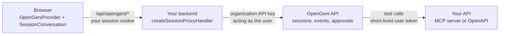

Your product and OpenGeni stay separate systems. Your product owns its users, tenants, business data, and pages. OpenGeni owns agent sessions, turns, event history, approvals, files, and compute. They meet at one backend route and at the tools you expose.

1. The browser runs the stock SDK client against your own origin, `/api/opengeni`.
2. Your proxy authenticates each request with your existing session check, resolves the user's workspace, and forwards only the routes the conversation needs, acting as that user.
3. OpenGeni runs the agent. When it needs product data, it calls your MCP server or OpenAPI Integration with a credential you issued for that user.

The organization API key stays on your server. The browser can never pick another workspace, choose tools, or send credentials.

## Mapping your product onto OpenGeni

| Your product                   | OpenGeni                          | Created by                                  |
| ------------------------------ | --------------------------------- | ------------------------------------------- |
| Your company                   | Organization                      | Sign-up, once                               |
| A customer, team, or tenant    | Organization workspace            | `ensureWorkspace` with your tenant id       |
| A signed-in user               | External workspace member         | `addExternalWorkspaceMember`, once per user |
| A chat, ticket, or task thread | Session                           | Your server, with `createSession`           |
| Your API                       | MCP server or OpenAPI Integration | You, selected per session in `tools`        |

A workspace is the sharing boundary for sessions, files, knowledge, connections, and integrations. Use one per customer when their users share those; see [Users, tenants & privacy](/integrate/users-and-tenants) for other choices.

## Who does what

| Your product                                  | OpenGeni                                           |
| --------------------------------------------- | -------------------------------------------------- |
| Authenticates users and checks CSRF           | Enforces workspace membership on every call        |
| Maps tenants to workspaces and stores the ids | Stores sessions, events, and files per workspace   |
| Decides tools, skills, and model per session  | Runs turns, streams events, recovers from failures |
| Authorizes every tool call on its own API     | Pauses for approvals and questions                 |
| Places the conversation in its UI             | Renders the conversation through `@opengeni/react` |

Link records by opaque ids. Keep your business data in your product and let the agent fetch it through tools.

<Tip>Using a coding agent? The [opengeni-client skill](/reference/for-ai-agents) covers this.</Tip>
