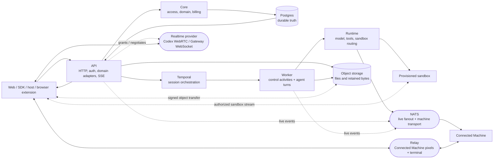
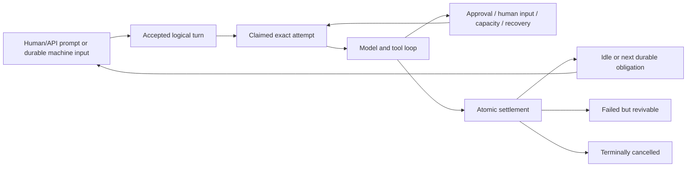

# OpenGeni architecture reference

> **This is the whole-system orientation map, not a second source of truth.**
> Code and the focused topic docs own exact behavior. This document explains
> the stable system shape, the boundaries that must not be crossed casually,
> and where to look before changing a subsystem. For setup and contributor
> procedure, use [`../AGENTS.md`](../AGENTS.md). For the documentation index,
> use [`README.md`](README.md).

## How to use this document

1. **New to the repository?** Read §2, §3, §4, and skim §6.
2. **Changing a subsystem?** Start with §13, then read the linked topic doc and
   canonical source.
3. **Looking for an exact route, field, permission, setting, table, timeout, or
   migration rule?** Follow the source links. Do not treat an architecture
   summary as an inventory.
4. **Found a stale boundary?** Update this map in the same change. See §14.

---

## 1. Scope

This document owns five things:

- the product and process-level shape of OpenGeni;
- cross-cutting invariants whose violation can cause security, durability, or
  recovery defects;
- the major request, event, and execution paths;
- the repository map and responsibility boundaries; and
- a routing index from change area to canonical source.

It intentionally does **not** own exhaustive API, schema, configuration,
permission, migration, provider, or release inventories. Those facts change
more frequently than the architecture and already have canonical homes in
code, package READMEs, focused topic docs, [`../CONTRIBUTING.md`](../CONTRIBUTING.md),
and [`../AGENTS.md`](../AGENTS.md).

A useful test is: if a paragraph needs a migration number, an exact timeout, a
complete route list, or a current table count to make sense, it probably
belongs in a focused topic document rather than here.

---

## 2. What OpenGeni is

OpenGeni is a self-hostable, session-based managed agent runtime. It runs
side-effectful agents while owning the durable control plane around them:
identity, tenancy, session state, human intervention, long-running goals,
recovery, compute routing, files, artifacts, usage, and observability.

Public control and authorization begin at the HTTP API. After the API grants a
bounded capability, high-bandwidth browser data planes may connect directly to
object storage, a sandbox/provider or relay stream, Codex WebRTC, or the AI
Gateway realtime WebSocket. Agent execution happens in a worker, either inside
a provisioned sandbox or directly on a Connected Machine. Postgres holds durable
truth, Temporal coordinates long-lived work, and NATS provides reconstructible
live fanout plus Connected Machine transport.

The product has several deliberately separate surfaces:

- **Sessions and turns** provide Send, Steer, Pause, Resume, Cancel, queues,
  goals, approvals, structured human input, durable semantic titles, and
  durable history.
- **Browser voice** has two separate boundaries: realtime conversation is a
  coexisting transport for an ordinary session, while composer transcription
  produces an editable draft that reaches session truth only through Send.
- **Compute** supports provisioned sandbox providers and user-owned Connected
  Machines without changing the session model.
- **Tools and integrations** combine first-party MCP, per-session MCP servers,
  workspace capabilities, Codemode, connections, and provider-specific
  adapters under explicit authority.
- **Knowledge and governance** keep Documents/RAG, Agent Knowledge, typed
  Memory, preferences, instructions, organization identity, and learning policy
  as distinct authorities.
- **Artifacts and interaction** support retained files, generated media,
  editable documents/spreadsheets/presentations, browser control, managed
  ComputerSession interaction, terminals, and published outputs.
- **Embedding and clients** expose a framework-neutral SDK, React surfaces, a
  stock web console, and advanced in-process host seams.
- **Operations** include usage metering, entitlement admission, billing,
  deployment contracts, observability, and release evidence.

The core design goal is not merely to call a model. It is to make a long-lived,
interruptible, multi-tenant agent run durable and recoverable without turning
live transports, workflow memory, or provider state into accidental authority.

Canonical introductions: [`../README.md`](../README.md),
[`run-lifecycle.md`](run-lifecycle.md), and [`embedding.md`](embedding.md).

---

## 3. Core invariants

These rules cross package and process boundaries. Focused docs contain the
complete contracts and edge cases; this section preserves the architectural
reason each rule exists.

### 3.1 Postgres is durable truth; NATS is transport

Authoritative state is committed to Postgres before any live notification is
published. NATS carries session-event fanout, invalidations, request/reply, and
Connected Machine streams, but it is not the event store and is never evidence
that a mutation committed.

Session events have a monotonic per-session sequence. The narrow
`session_event_cursors` row transactionally verifies every append and is the
sequence authority. Semantic writers retain the session row because state and
event truth commit together. Accepted raw exact-attempt batches hold only the
session identity with `FOR KEY SHARE`, serialize on the compact cursor, retain
the exact turn/attempt fence, and do not update the wide session row. Public
`lastSequence`, unread, child acknowledgment, and viewer-specific tree
attention projections (including unacknowledged failed descendants) read the
cursor; `sessions.last_sequence` remains only a semantic/legacy compatibility
projection. Legacy SQL writers are rebased at the database boundary, and late
raw events roll back and retry through the semantic gate before becoming
rejected audit evidence. SSE clients begin with durable replay, subscribe to
live fanout, and backfill from Postgres whenever a sequence gap appears. A NATS
restart may interrupt live delivery or machine reachability, but it must not
erase session history or queued obligations.

The raw isolation route has an operational rollback switch:
`OPENGENI_SESSION_EVENT_RAW_LANE_ENABLED=false` keeps cursor allocation and
validation active while restoring wide-session locking and compatibility writes.

Interactive commands acknowledge their durable transaction. NATS publication
and immediate Temporal signalling are replayable follow-up work. Never make a
committed command depend on a successful best-effort fanout.

Canonical: `packages/events/src/index.ts`, `apps/api/src/http/sse.ts`,
`packages/sdk/src/stream.ts`, and [`run-lifecycle.md`](run-lifecycle.md).

### 3.2 Temporal coordinates; streams stay outside workflow history

Temporal owns orchestration: the long-lived session workflow, activity
dispatch, signals, timers where appropriate, and `continueAsNew`. It does not
own conversation truth, goals, queue state, token streams, tool output, or
provider transcripts.

The workflow reads durable obligations through activities. Postgres remains
authoritative when a signal is duplicated, delayed, lost, or delivered to a
workflow run that is closing. Token and tool streams travel through the normal
event path rather than inflating workflow history.

Canonical: `apps/worker/src/workflows/session.ts` and
[`run-lifecycle.md`](run-lifecycle.md).

### 3.3 Logical turns and physical attempts are different

A **turn** is one accepted unit of work. An **attempt** is one physical worker
execution of that turn. Worker death, recovery, interruption, or capacity
waiting may create another attempt without creating another logical turn or
replaying an already-completed side effect.

The full `runAgentTurn` activity is non-retryable by default because model,
tool, sandbox, Git, connector, and cloud operations can have external effects.
Recovery is explicit and attempt-fenced. Provider work occurs outside database
transaction retries; only idempotent settlement transactions may be retried.

Every write from an active run must prove the exact current attempt and its
execution generation. A stale worker may retain compute or network activity,
but it cannot append authoritative events or settle a replacement attempt.
Temporal cancellation is a delivery mechanism, not proof that tools and
sandbox work have physically stopped; durable quiescence evidence gates
replacement admission.

A recoverable activity shutdown creates a transactional workflow-wake
obligation in Postgres. Delivery remains unacknowledged until the exact closed
attempt has durable quiescence, and every attempt-owned retained-process
settlement advances that same outbox row in its settlement transaction. A
workflow close or a writer exit racing the final reconciliation check therefore
cannot orphan a session in recovery.

A background command becomes session-owned only after its exact provider
identity is durably adopted. Before adoption it remains attempt-owned. After
adoption, ordinary turn completion and Steer detach from it, while explicit
command cancellation, Pause, or terminal Cancel control its lifetime.

Canonical: `apps/worker/src/activities/agent-turn/`,
`apps/worker/src/activities/session-state.ts`, and
[`run-lifecycle.md`](run-lifecycle.md).

### 3.4 Long runs are bounded by policy and intent, not arbitrary loop caps

Agents may work for days. OpenGeni does not infer lack of progress from the
number of model calls, continuations, or elapsed wall time. Budget admission,
provider capacity, explicit Pause/Cancel, goal state, and host policy are the
real control surfaces.

Recoverable conditions preserve the logical turn or session whenever doing so
is safe. An active goal creates a durable Postgres obligation to evaluate the
next continuation; Temporal signals and workflow runs are replaceable delivery
nudges for that obligation. Goals do not live in `Agent.instructions` or only
in workflow memory.

Do not add a generic model-call, continuation, or activity-duration cap as a
substitute for correcting a recovery, pacing, memory, or tool-lifecycle defect.

Canonical: [`goals.md`](goals.md) and [`run-lifecycle.md`](run-lifecycle.md).

### 3.5 Each durable store has one job

The similar-looking stores are not interchangeable:

| Store | Owns | Must not become |
| --- | --- | --- |
| `session_history_items` | Protocol-preserving conversation truth supplied to the model | An audit projection or mutable UI cache |
| `session_pending_tool_calls` | In-flight call/result receipts and the open suffix needed to resume | General conversation history |
| `agent_run_states` | Control snapshots and the open-suffix sentinel | Model memory |
| `session_events` | Exact append-only human/audit timeline and SSE replay | Model input |
| `session_system_updates` | Durable machine-origin inputs such as child results and schedules | Synthetic human messages |
| `session_goals` | The standing objective and continuation obligation | Workflow-local state |
| Sandbox leases and envelopes | Provider identity, routing, recovery, and workspace-generation truth | Session conversation state |
| Documents, Agent Knowledge, Memory, preferences, policies, and organization identity | Retrieval or governance authorities with their own scopes and lifecycle | One undifferentiated prompt-memory table |

Workspace Memory is the autonomous agent-retention lane. It is enabled by
default; an explicit workspace opt-out disables agent writes. When enabled,
exact live agent attempts save and correct active
facts, decisions, incidents, fixes, and outcomes without consulting Learning
mode. It remains retrieval-only model context through `memory_search`; it is
not a Skill, mandatory instruction, organization profile, or reviewed Knowledge
claim.

Organization identity has a separate organization-owner autonomy policy. Off
rejects agent-authored identity changes before proposal creation, Require approval
keeps the bound human-confirmation path, and Autonomous activates eligible
proposals without another prompt. All three modes still require an exact live
turn initiated by the active organization owner and use the existing
company-profile compare-and-swap lifecycle; workspace Learning mode and
workspace-admin authority cannot widen this organization scope.

Accepted conversation and tool content is preserved at its canonical boundary;
OpenGeni does not centrally rewrite arbitrary text because it resembles a
credential. Configured secrets are a separate concern: they are encrypted at
rest and exposed only through explicit permissioned operations with
metadata-only audit.

Generated media and editable artifacts are durable workspace artifacts, not
conversation blobs. Model-facing history retains compact receipts and resolves
bytes through the file or artifact authority when needed.

Canonical: [`run-lifecycle.md`](run-lifecycle.md),
[`hierarchical-memory.md`](hierarchical-memory.md),
[`scoped-knowledge.md`](scoped-knowledge.md),
[`company-brain-write-routing.md`](company-brain-write-routing.md), and
[`artifact-engine.md`](artifact-engine.md).

### 3.6 Tenancy and authority are established before resource access

Workspace-scoped access is the ordinary boundary. The API resolves an
authenticated principal into an access context and a permissioned grant before
domain code touches workspace data. Postgres FORCE RLS provides a second,
transaction-local boundary; a resource UUID by itself never authorizes access.

Organization membership, workspace membership, API keys, delegated grants,
private-session ownership, and personal-resource grants are distinct facts.
Do not infer human authority from session creation, current UI identity, a
worker process, a connection row, or provenance metadata. A turn freezes its
initiating principal and the authority snapshots needed by later execution and
recovery.

Organization settings owns the cross-workspace roster and organization roles.
A managed browser administrator is the ordinary authority. Single-user local
deployments additionally admit only the access resolver's canonical
`opengeni:local/default` + `dev` browser context to organization metadata,
shared-workspace, retention, company-identity, and organization Codex controls.
This is provenance-stamped authority, not a subject-name check; configured,
delegated, API-key, service, and agent principals remain excluded.
A shared-workspace creator receives one explicit named workspace-admin grant;
organization authority by itself still grants no operational access. Owners
and organization administrators can open the canonical
`/workspaces/:workspaceId/settings` route in a restricted management mode for
shared workspaces they cannot otherwise enter. That mode exposes identity,
direct access, and deletion only; it never mounts the workspace provider or
reveals sessions, files, credentials, integrations, or other workspace content.
A shared workspace's Members page is deliberately narrower: a caller with
`members:manage` may add an already-active human from the same organization and
change or revoke access only in that workspace. Personal workspaces,
cross-organization targets, self-demotion, and removal of the final workspace
administrator fail closed. The candidate inventory discloses only active
same-organization humans who do not already have access, without exposing their
other workspace grants.

Managed browser login slots are explicit session-set actors, not tenant hints.
Organization recovery custody is a separate quorum and actor-fenced authority;
ordinary organization administration cannot transfer immutable workspace
ownership or bypass recovery settlement.

Personal connections and resources require the exact human authority that made
them executable. Workspace-owned credentials remain workspace-scoped and are
revalidated at use. An embedding host may narrow access through an explicit
port; it cannot grant access that OpenGeni denied.

The managed personal-workspace owner receives a closed permission projection
that includes `capabilities:manage`, so they can configure their own Plugins,
Integrations, and Codex subscription without receiving the `workspace:admin`
wildcard, member management, or API-key delegation.

Canonical: `packages/core/src/access/index.ts`,
`packages/core/src/session-authorization.ts`, `packages/db/src/runtime-posture.ts`,
[`organization-tenancy.md`](organization-tenancy.md),
[`organization-recovery.md`](organization-recovery.md),
[`browser-login-session-sets.md`](browser-login-session-sets.md),
[`agent-session-authority.md`](agent-session-authority.md), and
[`credentials.md`](credentials.md).

### 3.7 Contracts and configuration are code-owned

`@opengeni/contracts` owns cross-boundary schemas, enums, permissions, event
shapes, capability descriptors, and token envelopes. `@opengeni/config` owns
settings parsing, defaults, validation, and derived runtime configuration.

Model catalog membership, workspace selectability, and cost are separate
authorities. A deployment selects one membership source (`code` or the
operator-owned database singleton); workspace policy, connection readiness,
and provider health decide selectability; deployment cost policy decides
`free` versus `credits` independently of upstream settlement. Workspace custom
Gateway and OpenRouter rows are provider-qualified workspace overlays, never
deployment catalog or billing rows. Deployment-managed `openrouter/*` and
workspace-managed `workspace-openrouter/*` remain separate provider and billing
identities even when they name the same upstream slug.
The accepted turn policy freezes executable provider identity, not the separate
workspace-facing cost policy. Operators must drain or fence accepted turns
before changing `free`/`credits` for a product.

Documentation may explain why a contract exists, but it must not copy complete
lists that can drift. Cross-boundary enum evolution is additive within a major
release unless the whole release train takes a breaking change. Contract-parity
tests pin intentional mirrors in clients and deployment code.

Canonical: `packages/contracts/src/index.ts`, `packages/config/src/index.ts`,
`packages/core/src/model-catalog.ts`, [`model-providers.md`](model-providers.md),
and `packages/sdk/test/contract-parity.test.ts`.

### 3.8 A Connected Machine is first-class primary compute

A Connected Machine (`selfhosted` internally) is a user's own computer. When
selected for a turn, the agent runs on that machine directly; OpenGeni does not
create, lease, or bill a hidden provisioned sandbox behind it.

The machine owns its filesystem, Git authentication, ambient environment, and
long-lived platform credentials. OpenGeni does not clone repositories onto it
or install durable control-plane credentials. Exact-attempt Codemode authority
is the narrow transient exception and is supplied only to an authorized child
process.

Machine paths are host-native and session-specific rather than aliases for a
universal `/workspace`. An unavailable machine surfaces as a typed operation
outcome; text-only reasoning can still begin without contacting it. OpenGeni
never interprets an offline machine as permission to cold-create a rival box,
snapshot it, or provider-terminate the user's computer.

Generated-session schedules follow the same explicit route: they persist an
exact workspace- or organization-scoped machine target and seed the session's
active pointer before its first turn. A targetless generated schedule cannot
resolve to `selfhosted`; ingress rejects that configuration, and dispatch
revalidates the frozen target rather than falling back to managed compute.
Manual and generated creates preflight the target's current liveness and
workspace root before insertion, then recheck durable target authority and
commit the active pointer in the same transaction as the session row. A
rejected target therefore leaves no queued session shell for discovery or
parent-tree projections to mistake for live work.

Child workers keep the ordinary low-friction rule: omitting placement shares
the creator's box. Because a Connected Machine pointer is session-local, that
default copies the trusted parent's exact active machine and working directory
before the child's first turn. This includes a `backend:none` parent that has
attached a Connected Machine: the child keeps the shared backend-none home and
group while inheriting the exact active route. A selfhosted-only child with no
inherited or explicit machine fails at create rather than reaching an unbound
runtime.

A machine-home session does not pre-provision a hidden managed box. When the
deployment has a managed sandbox backend, its fleet nevertheless exposes the
session's synthetic managed group as a separate explicit target. Selecting
`session`/`default` clears the active machine pointer, verifies that managed
group through the ordinary viewer/lease lifecycle, and lets the next operation
or turn use it. This is an intentional user route change, not an
offline-machine fallback; deployments configured with only `none` or
`selfhosted` expose no managed group.

Connected Machine event ingestion cannot make every runner wait behind one
global database queue. The API drains the NATS event subscription immediately
into exact-process queues: different connection subjects progress concurrently
within a fixed database-concurrency bound, each subject preserves event order,
and only consecutive pending heartbeats collapse latest-wins. GoingOffline and
update-progress events remain ordering barriers. A database slowdown can
therefore delay current telemetry, but a backlog of old heartbeats from a killed
runner cannot renew its short ownership lease once per stale sample for minutes.
Canonical:
`apps/api/src/sandbox/metrics-ingestion.ts`.

Canonical: `packages/runtime/src/sandbox/selfhosted/`,
`apps/worker/src/activities/agent-turn/sandbox-establish.ts`,
`packages/core/src/domain/scheduled-tasks.ts`,
`apps/worker/src/activities/scheduled-tasks.ts`,
`agent/proto/opengeni_agent.proto`, [`connected-machines.md`](connected-machines.md),
and [`../AGENTS.md`](../AGENTS.md) Sandbox Notes.

### 3.9 Compute routing and sandbox ownership stay explicit

A session has durable home-compute policy and may also have an active target
pointer. The active pointer is epoch-fenced and establishment-safe: selection
must prove that the current turn context can establish the target, and a stale
or structurally invalid pointer is reconciled visibly rather than silently
routing to an arbitrary provider.

Managed sandbox lifecycle belongs to the lease and reaper. An API or viewer
that resumes a box receives a non-owned handle and must not terminate it when
the request ends. Provider create/restore identity is persisted before setup,
and workspace capture is fenced against every live writer. A provider loss may
retire only the exact matching instance and must never cause an ambiguous
operation to be replayed. Ordinary periodic and turn-end snapshots keep the
short `OPENGENI_SANDBOX_SNAPSHOT_TIMEOUT_MS` provider budget. Zero-holder drain
and rotation captures may use the independent
`OPENGENI_SANDBOX_DRAIN_SNAPSHOT_TIMEOUT_MS` budget; when unset it inherits the
ordinary timeout. Deployment admission always reserves provider-deadline
rotation headroom for the larger configured capture budget plus one reaper
period, including after the default backend changes because historical Modal
leases remain durable. A drain timeout therefore cannot outlive the rotation
window. An explicit drain budget is also admitted only when one reaper period,
the full durable capture, and retry handoff fit inside the lifecycle transition
wait ceiling. A caller's current configuration supplies only its initial wait:
after it observes an active capture, PostgreSQL's remaining
`archive_capture_deadline_at` plus the fixed handoff grace extends that wait up
to the same one-hour ceiling. Lowering the timeout or rolling the setting across
processes therefore cannot make an opted-in viewer, turn, or mutation caller
abandon a still-valid child whose timeout was frozen earlier. Zero-wait internal
probes remain immediate.

Lease liveness, provider existence, route attachment, archive availability,
workspace readiness, and operation availability are separate facts. A warm row
or selected pointer alone is not proof that a command can run.

The effective backend behind a synthetic managed group is resolved once from
the session policy and deployment backend. Fleet projection, swap readiness,
viewer attachment, API-direct operations, and worker turns must use that same
answer so a route cannot be advertised under one backend and established under
another.

The canonical backend enum currently contains `docker`, `modal`, `local`,
`none`, `daytona`, `runloop`, `e2b`, `blaxel`, `cloudflare`, `vercel`,
`selfhosted`, and `opensandbox`. The enum and provider registry—not this list—
own exact membership and ordering.

Canonical: `packages/contracts/src/index.ts`,
`packages/runtime/src/sandbox/providers/index.ts`,
`packages/runtime/src/sandbox/routing/`,
`apps/worker/src/activities/sandbox-lease.ts`, and
[`connected-machines.md`](connected-machines.md).

### 3.10 Client/server compatibility policy

Published clients (`@opengeni/sdk`, `@opengeni/react`) and server builds are
compatible within the same major release-train version. Evolution within a
major is additive and both sides are tolerant readers:

- servers ignore unknown request parameters and preserve behavior when a new
  optional parameter is absent;
- clients ignore unknown response fields and event types; and
- removing or retyping an existing field, parameter, or event shape requires a
  major release-train change.

Official server builds expose `serverVersion` through health and client-config
responses. There is no runtime negotiation protocol: tolerant reading and a
shared major version are the compatibility mechanism.

An optional field that changes execution authority is not an ordinary additive
response field. Its readers must ship first, new external writes stay behind a
default-off admission switch until every shared-queue consumer is compatible,
and public projections must remain safe for indefinitely open old browser
bundles. Once admitted, upgraded readers preserve and execute the durable field
regardless of the local admission-switch value; activation switches gate
producers, not consumers.

Canonical: `packages/sdk/src/`, `packages/react/src/`,
`packages/contracts/src/index.ts`, and `packages/sdk/test/contract-parity.test.ts`.

### 3.11 Work discovery remains advisory and permission-first

Compact related-work discovery is a read projection over already-authorized
sessions, durable semantic titles, active goals, and bounded typed work claims.
Workspace/private-session rules, exact live-attempt validation, Slack-private
scope, and optional embedding-host list narrowing run before lifecycle filters,
matching, ranking, counts, cursors, or ancestor labels. A hidden session cannot
influence even aggregate discovery output.

Work claims are non-exclusive evidence. They do not reserve a repository,
transfer ownership, grant access, or trigger control. Exact-attempt mutation is
CAS- and operation-id-fenced; terminal goal/session lifecycle settles active
evidence while retaining immutable revisions. Search never includes opening
prompts, instructions, resources, tools, files, or full history, and no agent is
required to search before working.

Canonical: `packages/contracts/src/work-claims.ts`,
`packages/db/src/work-claims.ts`, `packages/db/src/index.ts`, and
[`work-discovery.md`](work-discovery.md).

---

## 4. System architecture

OpenGeni separates durable control from live transport and separates control
plane processes from the place where user code runs.



### 4.1 Request and event path

1. A client calls `apps/api`. Middleware establishes the deployment perimeter,
   observability context, authentication, workspace, and permissioned grant.
2. HTTP routes adapt the request into `@opengeni/core` domain operations.
3. The domain operation validates the request and commits authoritative rows,
   events, queue/control state, audit facts, and workflow-wake intent in
   Postgres.
4. The API returns the committed projection. NATS fanout and immediate Temporal
   wake delivery happen as replayable follow-up work. Temporal transport
   acceptance does not acknowledge the current durable wake while an accepted
   human/API turn is still queued or an Agent Steer is still pending; only the
   attempt-fenced Postgres claim proves admission.
5. The session workflow observes the durable obligation and dispatches a turn
   activity.
6. The worker claims the logical turn, registers an exact attempt, freezes its
   execution and authority snapshots, then invokes `@opengeni/runtime`.
7. Runtime builds the model/tool environment and lazily establishes the
   selected provisioned sandbox or Connected Machine when an operation needs
   compute.
8. Worker events are appended durably before best-effort live publication.
   The API's SSE stream replays and gap-fills from Postgres.

### 4.2 Control path versus data path

The API, Postgres, Temporal, and worker form the durable control plane. NATS
session fanout is a live projection of that control state. Connected Machine
commands also cross NATS, but authorization and durable ownership are decided
before transport. Direct browser data planes are established only from a
short-lived API-authorized grant and never become an independent source of
session, tenant, or provider authority.

Large or high-frequency bytes take separate paths:

- files, generated media, recordings, and retained evidence use object storage;
- terminal and desktop streams use the sandbox/provider transport or the
  dedicated relay edge for Connected Machines;
- realtime voice uses Codex WebRTC or the AI Gateway WebSocket while durable
  ownership, ledger, delegation, context, and recovery remain in OpenGeni;
- model token and tool events use the session event stream, not Temporal; and
- editable artifacts use their typed artifact authority and kernels rather
  than treating Office files or rendered output as mutable truth.

Canonical realtime behavior is in [`run-lifecycle.md`](run-lifecycle.md) and
the public transport surface is in [`../packages/sdk/README.md`](../packages/sdk/README.md).

### 4.3 Dependency direction

At a high level, dependencies flow inward from process adapters toward stable
contracts and domain boundaries:

```text
contracts / config / network
          ↓
db / events / storage / documents / capabilities / provider leaves
          ↓
core / runtime
          ↓
apps/api and apps/worker

contracts → sdk → react → apps/web
```

The client closure remains server-free. `apps/web` consumes the SDK and React
packages; it does not own session or authorization semantics. Advanced hosts
may embed API/core/worker packages, but the same domain and persistence
boundaries still apply.

---

## 5. Runtime spine: session → turn → attempt

### 5.1 The three identities

| Identity | Meaning | Lifetime |
| --- | --- | --- |
| Session | Durable conversation, workstream, policy, visibility, and compute context | Until archived or safely deleted |
| Turn | One accepted human, machine, goal, schedule, approval, or recovery unit | Until logically settled |
| Attempt | One physical worker execution of a turn | Until completion, interruption, loss, or replacement |

A new attempt does not imply a new prompt. A new prompt does imply a new turn.
This distinction is the basis for safe worker-death recovery and protection
against duplicate external effects.

Automatic semantic naming is an attempt-owned auxiliary branch, not part of the
main model/tool loop. When the durable title is still pending and exact session
tool policy permits naming, the production runtime starts one bounded tool-less
title request in parallel with the ordinary stream, meters it independently,
and joins it before atomic turn settlement. A normal fast response waits for the
already-running bounded title request instead of cancelling it; exceptional or
cancelled exits abort and join it. The title write uses the generic session-title
lifecycle and still loses to a human rename. Custom runtimes without the
optional auxiliary seam retain the serialized `set_session_title` compatibility
path.

### 5.2 Lifecycle overview



Send and Steer create durable turn intent. A normal human Send is promoted to
Steer-equivalent replacement only when the active, unpaused branch is waiting in
`requires_action`; checked-out queue edits, paused sessions, and other active
lifecycle states keep ordinary Send ordering. Human prompts are the reorderable
queue surface; machine-origin inputs remain typed records and join a turn only
through the claim transaction. A `requires_action` resume preserves that rule
without violating provider protocol: it first writes the interrupted
call/result pair, then re-enters the exact attempt claim to attach only machine
input whose durable pending-event sequence was inside the resume attempt's
frozen start boundary. Pause blocks
admission without pretending that physical execution has already stopped.
Cancel fences a session subtree and is terminal for the affected sessions.

Steer ordinarily inserts at the head and immediately supersedes the live
direction. Active compaction is the exact exception: while a claimed standalone
compaction is running, or an ordinary attempt's latest compaction landmark is
`session.context.compaction.started`, Steer is accepted without inserting the
interruption that would fence the terminal checkpoint write. A durable
`compacted` or `skipped` landmark becomes the handoff: the ordinary turn settles
`superseded` before another model request, while standalone maintenance completes
and the waiting Steer is claimed next. Pause and Cancel retain immediate
interruption semantics. Automatic starts also maintain one content-free private
pending projection keyed by exact attempt; terminal landmarks, attempt closure,
and active-attempt replacement clear it so control-worker alerting survives
turn-worker loss without exporting session identity.

Pause and Resume are desired-state commands with durable semantic receipts. A
fresh key allocates a control revision, events, interruptions, and wakes only
when it changes direct blocker/override truth or repairs an uncovered lifecycle
effect. Effective state alone is insufficient: a later ancestor Pause must
invalidate newer descendant Resume overrides, and a narrower child Pause under
an inherited blocker remains a real change. Exact idempotency retries stay
`replayed`; represented intent with no repair stays `unchanged`. Human prompt
boundary retries also preserve committed truth across mutable prechecks: before
surfacing a pre-reservation model, limit, resource, or attachment failure, the
retry takes the actor/key prompt-operation fence and rechecks the completed
receipt so an overlapping committed Send or Steer is replayed exactly once.

Failed sessions can be revived by new accepted work. Cancellation remains the
terminal boundary.

An operational database failure after an exact claim but before turn-start
completion revalidates that immutable attempt and uses the ordinary same-turn
recovery and bounded redispatch path. A lost claim response that later reveals
the exact active attempt follows the same transition. Permanent database or
state failures remain terminal, and no model, tool, or provider work is replayed
or converted into a new queue item.

Transient provider recovery is bounded by a durable consecutive-failure streak,
not lifetime failures accumulated across a long turn. A completed model request
from the exact current attempt clears the durable streak atomically with its
timeline event, and the worker clears its in-memory copy only after that commit;
late attempt evidence cannot replenish the retry budget. See
[`run-lifecycle.md`](run-lifecycle.md) for pacing and exhaustion semantics.

### 5.3 Goals, schedules, automations, and child work

These producers all converge on the ordinary session/turn runtime:

- an active **goal** creates a durable continuation obligation;
- a **scheduled task** freezes one accepted occurrence and its execution
  authority before dispatch;
- an **automation** authenticates an external event, freezes the matching
  trigger revision, and creates an ordinary session/run; and
- a **child session** is a normal session with explicit lineage, depth, compute,
  visibility, and initiating-authority rules.

For an existing session, a scheduled turn that omits its turn-level `tools`
field inherits the durable session tool policy; explicit `tools: []` remains an
empty override.

A pure scheduled-occurrence batch that creates a standalone scheduler-owned
turn is persisted in model-facing history as a direct `user`-role task boundary
carrying the immutable scheduled task, run, and update ids. That role is
conversation structure only: the logical turn still freezes the scheduler
service as initiator, retains its causal-human and personal-connection authority
snapshots, and remains a scheduled run in audit and settlement. Scheduled
occurrences attached to an existing human/API turn, and all other machine-input
batches, keep the internal `system`-role envelope.

For `skip`, a scheduled occurrence targeting an existing or reusable session is
admitted only when that session's locked status is exactly `idle`. The status
check, optional reusable-goal reset, run settlement, and pending-update append
share the ordinary session event transaction, so concurrent occurrences cannot
both cross the same idle boundary and a skipped occurrence cannot mutate the
goal. An admitted occurrence persists `queued` to consume that boundary even
when a pause or active realtime lease withholds its workflow wake. A newly
generated session still admits the occurrence that creates it.

Pausing or soft-deleting a scheduled task is a durable first-claim cutoff. The
task lifecycle transaction locks each nonterminal agent run and marks it
skipped only when no scheduler-owned turn exists. A concurrent deposit
therefore either commits first and is invalidated, or observes the terminal run
and cannot publish; a concurrent claim either creates its turn first and
remains recoverable, or observes the skipped run and cancels the pending update
without starting model, tool, or sandbox work. Resuming the task never revives
those pre-pause deposits. A database delivery fence rejects `pending` to
`delivered` transitions for terminal scheduled runs, so a rolling old worker
cannot bypass the cutoff before the new claim logic is fully deployed.

None of them creates a parallel agent engine. They differ in admission and
provenance, then use the same logical turn, attempt, event, recovery, and usage
boundaries.

Canonical: [`goals.md`](goals.md), [`automations.md`](automations.md),
[`nested-agent-depth.md`](nested-agent-depth.md), and
[`reliability-fixes.md`](reliability-fixes.md).

### 5.4 Approval and structured human input

Tool approval and structured human input are durable interruptions. The worker
stores enough exact protocol state to stop without pairing an unfinished call
into model history. A response must bind to the pending request, target turn,
execution generation, requester, and current authorization.

Tool approvals are human-only. Agents may answer an authorized structured
human-input request for another session where the agent-session authority model
allows it, but they cannot grant themselves tool approval.

Canonical: [`human-input.md`](human-input.md),
[`agent-session-authority.md`](agent-session-authority.md), and
[`run-lifecycle.md`](run-lifecycle.md).

### 5.5 Model, tool, and compute preparation

The accepted turn freezes its public model choice, provider/deployment routing,
billing attribution, governance context, initiating authority, and relevant
tool/connection delegations. Recovery reuses that accepted truth rather than
sampling mutable workspace defaults again.

A fresh session selecting a workspace Gateway or OpenRouter custom model, an
existing session explicitly switching from another model, a new/materially
reaccepted scheduled task, automation trigger, or PR-review binding, or a fresh
generated-session scheduled occurrence rechecks that exact provider-qualified
active slug under the model catalog's shared transaction lock before the
session, turn, task, trigger, binding, or accepted occurrence can commit.
Adapter-rendered automation templates are the acceptance authority, so Pack
parameters cannot hide a model override from this gate. Deployment-curated
workspace provider models use their provider's public prefix but no mutable
custom row, so they do not enter this fence. Custom-model retirement holds the
exclusive counterpart; already accepted work, exact occurrence replay,
same-model/existing-session continuations, and administrative-only task,
trigger, or binding edits use retained definitions instead of reopening
fresh-selection authority. A committed keyed session shell is also replayed as
retained before active-only catalog checks so initialization remains repairable.

Human preference snapshots require an exact causal human. Service-only turns
with no causal human skip that human-bound capability; service continuations
and legacy subject turns use only their already-frozen causal human.

Tool disclosure is progressive, but authority is not. A tool may be eager or
lazy, local or MCP-backed, direct-model or Codemode-accessible; every invocation
still resolves through the current authorized catalog and the same execution
fences. Approval-required tools remain approval-required regardless of access
path.

The closed always-visible local first-request set is `exec_command`,
`write_stdin`, `apply_patch`, `view_image`, `load_skill`,
`request_human_input`, and `list_models`. The last tool returns the current
workspace's selectable model IDs and deployment-defined costs; it does not
switch the session model. Other non-MCP function tools and non-eager MCP schemas
remain behind progressive search.

Before every follow-up provider request, the worker reconciles the SDK's
complete prior history into durable call/result truth; the first request has no
prior model/tool history to flush. An empty Responses terminal is reconstructed
from observed `output_item.done` events in numeric `output_index` order. Sparse
indices do not create synthetic history items, while duplicate indices remain
invalid.

Compute is established lazily where possible. A text-only turn can begin
without provisioning a box or contacting a Connected Machine. Once a tool
needs filesystem, process, Git, browser, or computer access, routing resolves
the exact current target and validates its epoch and authority.

Explicit Variable Sets are ordered from low to high precedence and are frozen
for execution. Reconfiguration is a quiescent session-control mutation that
rotates managed compute rather than hot-swapping credentials into active work.

Canonical: [`model-providers.md`](model-providers.md),
[`mcp-surfaces.md`](mcp-surfaces.md),
[`session-mcp-servers.md`](session-mcp-servers.md), and
[`connected-machines.md`](connected-machines.md). Variable Set lifecycle and
ordering are canonical in [`variable-sets.md`](variable-sets.md).

### 5.6 Files, knowledge, and artifacts

A file attached to a human prompt is eager model/compute input only for that
accepted turn. Later turns retain a durable file receipt and retrieve the bytes
explicitly when needed. Generated images and video follow paid-operation and
artifact-retention fences; provider bytes do not become permanent prompt
history.

Documents/RAG and scoped Knowledge are retrieval systems whose authority is
checked before ranking. Agent Knowledge is the product view over workspace
instructions, Skills, accepted Memory, organization knowledge, and related
governance sources; those underlying authorities remain separate. Editable
documents, spreadsheets, and presentations use a canonical artifact model with
native and WASM kernels; Office formats are import/export forms, not the mutable
source of truth.

Canonical: [`knowledge-retrieval.md`](knowledge-retrieval.md),
[`scoped-knowledge.md`](scoped-knowledge.md),
[`image-generation.md`](image-generation.md),
[`artifact-engine.md`](artifact-engine.md), and
[`artifact-collaboration.md`](artifact-collaboration.md).

### 5.7 Usage, limits, and billing

Usage is normalized at the provider boundary and recorded per authoritative
model call. Admission limits and entitlements are domain policy; provider
telemetry, comparison pricing, and dashboards do not independently debit or
grant capacity. The durable `agent.model.usage` event carries the accepted
billing path and any validated Gateway endpoint provider so the additive
Insights fact can be repaired exactly after a soft writer failure; repair
prefers those authorities over the logical Gateway provider and legacy
inference from `usage_events.model.tokens` and `usage_events.model.cost` rows.
Each new fact also freezes provider cost and equivalent OpenGeni credit price as
separate nullable comparisons, while `priced_cost_micros` remains the actual
credits-path price and is zero for externally billed calls.

Managed billing is an API concern over the shared usage and entitlement
boundaries. Provider subscription pools such as Codex or SuperGrok add their
own credential and capacity authority without changing the logical-turn model.
Codex may resolve to a workspace pool or an organization pool inherited by a
shared workspace; the resolved pool remains one complete allocator boundary.
Vercel AI Gateway and OpenRouter expose separate workspace- and
organization-owned BYOK products. Organization products use dedicated encrypted
FORCE-RLS storage, inherit only into same-organization shared workspaces, and
retain organization payer identity through admission and execution; no rail
implicitly falls back to another key.
Provider-refusal cooldowns carry separate provenance and revision authority so
fresh usage repairs only an older quota refusal, never generic backpressure or
a concurrently newer refusal. All-capped admission and durable capacity waits
run that reconciliation through bounded control-plane refreshes.

Canonical: `packages/core/src/billing/`, `packages/runtime/src/usage-telemetry.ts`,
[`model-providers.md`](model-providers.md),
[`codex-subscription-rotation.md`](codex-subscription-rotation.md), and
[`supergrok-subscription.md`](supergrok-subscription.md).

---

## 6. Repository layout

The TypeScript system is a Bun workspace over `apps/*`, `examples/*`, and
`packages/*`. Internal packages are consumed from source. The Connected Machine
agent and relay are a separate Rust Cargo workspace under `agent/`.

Package manifests and `.changeset/config.json` own exact publication status and
entrypoints. The lists below describe responsibility, not current publish
metadata.

### 6.1 Applications

| Path | Package | Owns |
| --- | --- | --- |
| `apps/api` | `@opengeni/api-router` | Hono HTTP composition, middleware, routes, MCP transport, SSE, and API-side control adapters over core |
| `apps/worker` | `@opengeni/worker-bundle` | Temporal workflows, control/turn activities, agent execution, maintenance pumps, and worker lifecycle |
| `apps/web` | `opengeni-web` | Stock React/Vite operator console consuming the public SDK and React packages |
| `apps/browser-extension` | `@opengeni/browser-extension` | Browser attachment extension and its control-plane protocol; a leaf client, not session authority |

The standalone `apps/api` entrypoint installs a one-shot fatal process
boundary before configuration or dependency startup. Startup failures,
unhandled promise rejections, and uncaught exceptions emit only reviewed
structural diagnostics plus an opaque correlation id, drain accepted OTLP
exports for a bounded interval, and then exit nonzero. Exception messages,
stacks, enumerable fields, and arbitrary rejection values never cross the
public telemetry boundary. Embedded API composition does not install process
handlers because its host owns process lifecycle.

### 6.2 Packages

| Path | Package | Owns |
| --- | --- | --- |
| `packages/contracts` | `@opengeni/contracts` | Cross-boundary schemas, enums, permissions, events, capability descriptors, and tokens |
| `packages/config` | `@opengeni/config` | Settings parsing, validation, defaults, and derived runtime configuration |
| `packages/network` | `@opengeni/network` | DNS-pinned, bounded credential-bearing HTTP transport |
| `packages/core` | `@opengeni/core` | Framework-neutral access, domain, billing, and dependency seams |
| `packages/db` | `@opengeni/db` | Drizzle schema, scoped repositories, migrations, RLS posture, and role provisioning |
| `packages/runtime` | `@opengeni/runtime` | Agent construction, model routing, tool execution, history projection, and sandbox abstraction |
| `packages/events` | `@opengeni/events` | NATS event bus, auth callout/JWT support, fanout, and SSE formatting helpers |
| `packages/storage` | `@opengeni/storage` | Object-storage abstraction for files, recordings, and retained bytes |
| `packages/documents` | `@opengeni/documents` | Document parsing/indexing and authority-first hybrid retrieval |
| `packages/capabilities` | `@opengeni/capabilities` | Integration definitions, facets, local MCP bridges, and protocol compilers |
| `packages/tool-gateway` | `@opengeni/tool-gateway` | Protocol-neutral tool identity, cataloging, schemas, validation, authorization, approval classification, and execution |
| `packages/codemode` | `@opengeni/codemode` | Attempt-frozen programmatic tool catalog and execution client |
| `packages/ogtool` | `@opengeni/ogtool` | CLI over the Codemode catalog and journal |
| `packages/codex` | `@opengeni/codex` | Codex subscription authentication, transport, and provider normalization |
| `packages/xai-subscription` | `@opengeni/xai-subscription` | SuperGrok/xAI subscription authentication and transport |
| `packages/github` | `@opengeni/github` | GitHub App installation discovery, proof, and token operations |
| `packages/interaction` | `@opengeni/interaction` | Provider-neutral browser and computer interaction control |
| `packages/browserd` | `@opengeni/browserd` | Placement-resident browser controller and audited browser adapter |
| `packages/artifact-tool` | `@opengeni/artifact-tool` | Editable document, spreadsheet, and presentation authoring facade |
| `packages/artifact-kernel-wasm-document` | `@opengeni/artifact-kernel-wasm-document` | Lazy document WASM kernel distribution |
| `packages/artifact-kernel-wasm-presentation` | `@opengeni/artifact-kernel-wasm-presentation` | Lazy presentation WASM kernel distribution |
| `packages/artifact-kernel-wasm-spreadsheet` | `@opengeni/artifact-kernel-wasm-spreadsheet` | Lazy spreadsheet WASM kernel distribution |
| `packages/agent-proto` | `@opengeni/agent-proto` | Generated TypeScript side of the Connected Machine wire protocol |
| `packages/sdk` | `@opengeni/sdk` | Framework-neutral API client, event streaming, and transport helpers |
| `packages/react` | `@opengeni/react` | React hooks and styled session, composer, artifact, and machine surfaces |
| `packages/observability` | `@opengeni/observability` | Structured logs, traces, metrics, and Prometheus exposition |
| `packages/deployment` | `@opengeni/deployment` | Typed deployment profiles, preflight, plans, and generated runtime artifacts |
| `packages/testing` | `@opengeni/testing` | Shared test services, fixtures, scripted models, and sandbox helpers |

### 6.3 Examples

| Path | Package | Owns |
| --- | --- | --- |
| `examples/northstar-support` | `@opengeni/example-northstar-support` | Executable standalone-product integration reference with a server-side SDK proxy, authenticated product MCP, React embedding, and independent event streams |

### 6.4 Rust agent and relay

`agent/` is the Cargo workspace for Connected Machine execution and the relay
edge. `agent/proto/opengeni_agent.proto` is the single wire source, generated to
Rust and `@opengeni/agent-proto` TypeScript types.

One installed agent process may maintain independent connections to multiple
OpenGeni deployments and workspaces while sharing the physical machine's host
capacity and OS containment. The relay carries live terminal and desktop bytes;
it is stateless beyond active channels and does not own session or lease truth.

Canonical: [`../agent/README.md`](../agent/README.md) and
[`connected-machines.md`](connected-machines.md).

### 6.5 Deployment, docs, scripts, and tests

- `deploy/helm/opengeni` owns the Helm chart for OpenGeni services and
  integration resources.
- `deploy/terraform/` contains cloud-specific infrastructure roots;
  `deploy/stacks/` wraps external dependencies.
- `docs/` contains current topic docs and point-in-time records; its canonical
  index is [`README.md`](README.md).
- `scripts/` owns development, static checks, release mechanics, deployment
  helpers, and operator-only utilities.
- `test/` contains integration, end-to-end, and live suites; package-local
  tests stay with their owners.
- `docker/sandbox.Dockerfile` is the stock headless sandbox image;
  `docker/desktop.Dockerfile` is the desktop/browser image.

---

## 7. Ownership boundaries

### 7.1 API adapters versus core domain behavior

`apps/api` owns HTTP concerns: middleware, request/response translation,
cookies and bearer extraction, route composition, SSE, callbacks, and API-side
control adapters. `@opengeni/core` owns reusable access, domain, billing, and
admission behavior. A route should not create a second implementation of a
domain rule already used by MCP, workers, or embedded hosts.

Composer draft submission is one shared application command in
`packages/core/src/application/composer-submit.ts`. The stock HTTP route and
in-process embedding hosts call that command so validation, draft rotation,
event append, turn routing, receipt/replay behavior, and the response contract
have one owner.

Canonical: `apps/api/src/app.ts`, `apps/api/src/routes/`, and
`packages/core/src/`.

### 7.2 Worker orchestration versus runtime execution

`apps/worker` owns durable activity/workflow sequencing, turn claim and
settlement, recovery, capacity waits, scheduling, and injected process
dependencies. `@opengeni/runtime` owns provider-neutral agent construction,
model input/output handling, tool execution, progressive disclosure, and the
sandbox interface.

The embedding process—not the Agents SDK—owns process-global rejection and
termination policy. SDK background lifecycle work must settle an owned promise;
it may not detach a rejecting task or install an `unhandledRejection` handler
that exits the shared worker. The worker's global rejection listener is a
last-resort observational boundary, while deliberate restart remains an
OpenGeni drain-and-checkpoint decision.

The worker supplies frozen authority and durable sinks. Runtime must not invent
tenancy or persistence authority from its in-memory agent context.

Canonical: `apps/worker/src/workflows/`,
`apps/worker/src/activities/agent-turn/`, and `packages/runtime/src/`.

### 7.3 Persistence, events, files, and retrieval

`@opengeni/db` owns relational truth and tenant-scoped repositories.
`@opengeni/events` owns live NATS transport. `@opengeni/storage` owns retained
object bytes. `@opengeni/documents` owns parsing, indexing, and retrieval after
authority has selected eligible content.

Do not move durable event authority into NATS, large bytes into relational
conversation rows, or authorization into vector ranking.

### 7.4 Capabilities, connections, and MCP

Capabilities define available integration/tool shapes. Connections bind live
credentials and ownership. Session tool policy selects from authorized tools.
MCP and Codemode are execution surfaces, not grant sources.

`@opengeni/tool-gateway` is the protocol-neutral catalog, validation,
authorization, approval-classification, and execution boundary. Runtime prepares
one canonical provider set from enabled first-party and integration MCP servers;
the model adapter, exact-attempt Codemode adapter, current-human MCP route, and
workspace HTTP/SDK adapter project that same catalog and invoke the same executor
closures. Friendly model names and JavaScript paths are projections of the
opaque `{serverId, toolName}` identity and never authority.

Codemode adds only attempt scope, active-attempt fencing, its durable operation
journal, sandbox delivery, and recovery semantics. The current-human gateway
rebuilds live authority for each request. Browser callers use
`client.tools.forWorkspace(...)`; opaque-origin Sites use the narrower
parent-held `@opengeni/sdk/site` MessagePort adapter and receive neither bearer
credentials nor workspace routing context. Every Site invocation is confirmed
in the parent and enforced again with a one-shot capability bound to the current
viewer, operation, arguments, catalog, identity, and immutable Site version;
archived Sites receive no bridge. Provider construction is permission-filtered
and resource-filtered before any connection or `tools/list` traffic.

External MCP clients may use the opt-in OAuth authorization server. Its public
metadata and dynamic registration lead to an authorization-code flow with
mandatory PKCE S256, one exact RFC 8707 workspace MCP resource, issuer-bound
redirects, opaque short-lived access tokens, and rotating refresh tokens.
Consent freezes the current human's permissions and tool identities; every MCP
request intersects that snapshot with live workspace authority and the current
gateway catalog. Reuse of a rotated refresh-token generation revokes every
refresh and access token in that family. OAuth bearer tokens are never accepted
as REST credentials.

Provider adapters may narrow destinations, credentials, and retry policy, but
they must preserve the shared connection, approval, idempotency, and audit
boundaries.

GitHub App binding keeps account selection explicit whenever owner-authorized
installations already exist: the owner may choose one of them or enter GitHub's
new-installation flow for another personal account or organization. Both paths
retain the same signed-state and exact owner revalidation boundaries.

Canonical: [`capabilities.md`](capabilities.md),
[`integrations-design.md`](integrations-design.md),
[`mcp-surfaces.md`](mcp-surfaces.md), and [`credentials.md`](credentials.md).

### 7.5 Artifacts, browser control, and managed computer sessions

Editable artifacts use `@opengeni/artifact-tool` plus durable collaboration
services. Browser and computer control use attempt-scoped managed
`ComputerSession` tools from `@opengeni/interaction` and `@opengeni/browserd`,
with the selected sandbox or machine providing placement. Agents do not receive
the retired model-bound shared-desktop capability; human viewer control remains
a separate consented surface. Computer screenshot bytes and their bounded frame
metadata remain one evidence unit: the placement runtime verifies their digest
and controller/session/target binding, the API repeats that validation against
its durable `ComputerSession` binding before forwarding the exact bytes, and the
SDK retains its independent verification. The browser extension is an attachment
client, not an authorization service.

New capability negotiation advertises only `manual` and `on-verify` recording.
Historical `ComputerUse`, `on-turn`, and `computer_screenshot` contract shapes
remain parseable for old events, SDK clients, and retained evidence, but they do
not register a runnable legacy computer tool.

Static published HTML, retained evidence, Documents/RAG, and editable artifacts
are different products and must not share mutable truth accidentally. Workspace
Sites are immutable versions of the existing HTML artifact primitive: one
self-contained HTML runtime, one retained source bundle, an exact requested-tool
allowlist, rollback, and recoverable archive/restore. They run in the existing
opaque-origin iframe; there is no second host, wildcard domain, or compute
runtime.

Canonical: [`artifact-engine.md`](artifact-engine.md),
[`artifact-collaboration.md`](artifact-collaboration.md), and
[`connected-machines.md`](connected-machines.md).

### 7.6 SDK, React, web, and embedding

`@opengeni/sdk` is the framework-neutral client contract. `@opengeni/react`
adds hooks and UI. `apps/web` is a consumer of those packages and should not
become a hidden source of domain semantics.

The stock web console imports the browser-focused `@opengeni/sdk/browser`
entry. Operator-only Document-authority and tenancy-backfill methods live in
the optional `@opengeni/sdk/document-authority` entry, while the root and
`core` clients retain their compatibility surface. New SDK methods that the web
does not call belong in a focused optional entry so they add nothing to the
direct-session browser graph; bundle-boundary and browser-surface tests pin that
separation.

Most product integrations use the standalone service through a server-side SDK
proxy and optional React surfaces. Advanced in-process embedding may bind host
identity, persistence, event, billing, credential, and worker ports, but must
preserve the same core boundaries.

The built-in `opengeni-product-integration` Pack is an opt-in implementation
aid for those standalone integrations. Installing it adds no executable tools,
credentials, compute, or customer-facing agent behavior. Its Skill teaches an
implementation agent to derive the workspace isolation unit, UI surface, data
tool boundary, runtime profile, and delivery workflow from the host product.
The Skill uses the existing `capability_facets.activation_mode` authority as
`session_selected`: ordinary workspace Skill resolution excludes it, and an
explicit create-time `installedSkillIds` selection freezes the verified
artifact into exactly one session. The web Pack action carries that immutable
capability ID into the new-session composer; Pack installation alone cannot add
the guidance to customer-facing chats. The activation value enters storage at
maintenance migration 0394; old workers must be fully drained because they do
not filter this mode. A dedicated implementation workspace
remains an optional additional operational boundary, not a prerequisite for
this activation guarantee. The Pack lives in
`packages/core/src/domain/product-integration-pack.ts`, while the exact customer
integration contract remains
[`product-integration.md`](product-integration.md).

Canonical: [`../packages/sdk/README.md`](../packages/sdk/README.md),
[`../packages/react/README.md`](../packages/react/README.md),
[`product-integration.md`](product-integration.md),
[`embedding-workbench.md`](embedding-workbench.md), and
[`embedding.md`](embedding.md).

---

## 8. Compute and sandbox model

OpenGeni supports three compute shapes:

1. **Provisioned managed sandboxes** created and recovered through a provider
   adapter.
2. **Connected Machines** enrolled by a user, workspace, or organization and
   addressed through the Rust agent.
3. **No compute**, where model and non-sandbox tools remain usable but
   filesystem/process operations are unavailable until a target is attached.

The provider registry gives every backend one capability descriptor and one
implementation registration. Adding a backend is a contract change across
contracts, runtime, SDK/deployment parity, tests, and this map.

Managed sandboxes are grouped and lease-owned. Provisioning is lazy; a session
can exist before a box does. The lease tracks provider identity, epoch,
holders, workspace mutation generation, archive/recovery state, and teardown
authority. The active session pointer selects an effective target without
rewriting the session's durable home policy.

Immutable rig setup is single-flight at the lease boundary. The exact lease
epoch, provider instance, and non-secret setup specification hash own one
durable claim/revision/settlement receipt. Sibling turns join or reuse that
receipt with backed-off durable reads; after an owner disappears, a deadline
successor safely re-enters the box-local marker guard. This shared receipt never
contains or covers per-turn credentials, repository authorization, Codemode
tokens, cloud login, attached files, or generated media.

Rigs layer versioned setup and checks on the deployment-owned platform sandbox
base; they cannot replace that base image. A verified provider-native Rig image
is only a physical cold-create optimization and never changes the logical lease
image, workspace archive, session snapshot, or credential authority.

Sandbox snapshots and provider-native checkpoints are recovery artifacts, not
session history. Capturing a workspace requires proof that no unaccounted writer
can race the snapshot. A failed or unverifiable capture cannot be treated as an
empty successful snapshot, and teardown must not destroy the only recoverable
workspace state.

Provider-deadline rotation is an explicit preemption boundary. Once the durable
lead-time request fences new mutations, each live turn aborts immediately rather
than waiting for a turn-side snapshot that can be blocked by that turn's own
mutation admission or an earlier provider capture. The attempt finalizer drains
every tool and credential writer before releasing its holder; only the resulting
zero-holder reaper may take over an in-flight same-request capture, publish the
exact workspace generation, and terminate the old provider. When this abort
reaches an Agents SDK run, the SDK closes the readable stream before its
completion promise rejects. Iterator EOF is therefore not terminal success
authority: the worker must await SDK completion and route its rejection through
`sandbox_deadline_rotation` recovery before settling `turn.completed`.

BrowserSession and ComputerSession interaction holders are durable placement
authority, not UI-presence leases, so an active controller never expires merely
because its heartbeat timestamp is old. A requested finite-lifetime Modal
rotation is the narrow exception: at the lead-time rotation boundary, the global
lifecycle reaper marks each exact controller resource `lost`, settles a prepared
operation as a deterministic rotation failure or a dispatched operation as
`outcome_unknown`, preserves the controller binding for cleanup evidence, and
then lets the ordinary holder/orphan and lease-drain transaction rotate the box
while capture headroom remains. The deadline batch admits only leases that still
carry interaction holders, so unrelated overdue turn/direct/process-held leases
cannot starve it, and includes an exact lease that entered `draining` before the
deadline. The same global
reaper inventories due lease-free Connected Machine and attached-device
transitions under its owner-only FORCE-RLS capability, acquires every affected
workspace advisory fence in canonical UUID order, and only then opens mutation
visibility. This rotation override remains batch-bounded and imposes no
independent age limit on healthy interaction sessions; it interrupts only when
the underlying finite provider identity has entered its mandatory handoff
window.

Repeated retained-process Modal binding-missing or binding-mismatch observations
may be quarantined for a 24-hour recheck after five claimed probes, but the
process, admission, PTY, and holder remain capture blockers. Quarantine never
becomes exit/loss proof and never authorizes capture, rotation, provider
termination, or replay.

Desktop/browser capability is layered on a compute target. The stock desktop
image and browser daemon are separate from the ordinary headless image and
control-plane release lifecycle. Connected Machine desktop and terminal data
use the relay, while command authority remains in the control plane.

Canonical: `packages/runtime/src/sandbox/`,
`apps/worker/src/activities/sandbox-lease.ts`,
[`connected-machines.md`](connected-machines.md), [`rigs.md`](rigs.md), and
[`deployment.md`](deployment.md).

---

## 9. Data and storage

| System | Architectural role | Recovery expectation |
| --- | --- | --- |
| Postgres | Sessions, turns, attempts, events, authority, configuration, ledgers, goals, usage, and workflow obligations | Durable system of record |
| Temporal | Long-lived orchestration and activity dispatch | Reconstructs behavior from workflow history plus Postgres activities |
| NATS Core | Live fanout, invalidation, request/reply, and Connected Machine transport | Reconnect and rebuild from durable truth |
| Object storage | Files, generated media, recordings, exports, retained evidence, and portable sandbox archives | Provider durability plus Postgres ownership receipts |
| Sandbox/provider storage | Live workspace and optional native checkpoints | Must be fenced and represented by durable lease/checkpoint evidence |
| Search indexes | Document and memory retrieval projections | Rebuildable from authorized source records |

Postgres tables are cross-service contracts. Forward migrations and the exact
runtime-role/RLS posture are owned by `@opengeni/db`; this document does not
track migration ordinals, table totals, or privilege counts.

Object storage endpoints and signed URLs are transport details. Postgres owns
which tenant and resource may access an object, whether an upload is complete,
and whether retained evidence is still live. URLs, object keys, and provider
identities should not leak into prompt history when a provider-neutral receipt
is sufficient.

Search is authority-first: resolve the allowed organization/workspace/user
scope, then rank eligible records. ACL tags and relevance scores refine results
but do not replace access control.

Canonical: `packages/db/src/schema.ts`, `packages/db/src/runtime-posture.ts`,
`packages/storage/src/index.ts`, `packages/documents/src/index.ts`,
[`knowledge-retrieval.md`](knowledge-retrieval.md), and
[`force-rls-migration-backfills.md`](force-rls-migration-backfills.md).

---

## 10. Security and access model

- **Authenticate, authorize, then query.** API middleware establishes the
  principal and deployment perimeter; core resolves workspace/account grants;
  database transactions install matching RLS context.
- **RLS is a real boundary.** Standalone runtime roles are non-owner,
  non-superuser, and non-bypass. Missing or mismatched tenant context fails
  closed.
- **Human, service, API-key, and agent identities are distinct.** Provenance is
  not authority. Personal-resource execution requires the exact permitted
  human snapshot; worker identity never substitutes for it.
- **Secrets and arbitrary content are different.** Configured credentials are
  authenticated-encrypted and read through explicit capability boundaries.
  Conversation, source, tool, and error text is not centrally regex-redacted.
- **Tool visibility is not permission.** Session selection, capability state,
  connection ownership, action policy, approval, exact attempt, and live
  provider authority all participate in execution.
- **External side effects require replay policy.** Safe reads may retry within
  a reviewed boundary. Mutations use idempotency receipts or stop as
  outcome-unknown after an ambiguous provider start.
- **Network destinations are constrained.** Credential-bearing HTTP uses the
  shared pinned transport or a reviewed provider adapter. Tool arguments do not
  choose arbitrary credential destinations.
- **Connected Machine transport is tenant-scoped.** NATS credentials, subjects,
  enrollment generation, connection instance, operation identity, and relay
  tokens prevent one machine or viewer from crossing workspaces or epochs.
- **Sandbox credentials are least-lived and least-scoped.** Host preparation
  profiles and explicit allowlists are the only way ambient credentials enter
  managed sandboxes. Connected Machines retain their own environment.

Canonical: [`../SECURITY.md`](../SECURITY.md),
[`credentials.md`](credentials.md), [`variable-sets.md`](variable-sets.md),
[`session-mcp-servers.md`](session-mcp-servers.md),
[`organization-tenancy.md`](organization-tenancy.md), and
[`agent-session-authority.md`](agent-session-authority.md).

---

## 11. Build, test, and release

The TypeScript stack uses Bun with strict TypeScript. The Rust agent and relay
use Cargo. Unit tests and typechecking are infrastructure-free; integration,
end-to-end, browser, artifact-runtime, and live lanes add their required
services and credentials explicitly.

Release publication is an evidence-bound process spanning npm packages,
container images, the Helm chart, the Rust agent, and retained source identity.
Package manifests, Changesets configuration, CI workflows, and release scripts
own the exact closure and procedure. Do not copy those inventories here.

Canonical commands and contribution rules are in
[`../AGENTS.md`](../AGENTS.md) and [`../CONTRIBUTING.md`](../CONTRIBUTING.md).
Toolchain details are in [`toolchain.md`](toolchain.md).

---

## 12. Deployment

OpenGeni can run as a standalone service or be embedded into a host product.
The typed `@opengeni/deployment` contract translates a deployment profile into
validated environment requirements, preflight checks, stack plans, and runtime
artifacts.

The Helm chart owns OpenGeni application components and integration resources.
Cloud Terraform roots and stack wrappers compose external infrastructure.
Bundled Postgres, Temporal, NATS, and object-storage templates are development,
CI, conformance, or explicitly documented single-machine fixtures—not a claim
that those topologies are appropriate production defaults.

Deployment procedures, provider-specific requirements, activation boundaries,
and recovery runbooks belong in [`deployment.md`](deployment.md). Advanced host
ports and in-process composition belong in [`embedding.md`](embedding.md).

---

## 13. If you are changing X, read Y first

This index intentionally routes at subsystem granularity. Use
[`README.md`](README.md) for the complete topic-doc map.

### Runtime and orchestration

| Change area | Canonical source | Read first |
| --- | --- | --- |
| Session workflow, wake delivery, or `continueAsNew` | `apps/worker/src/workflows/session.ts` | [`run-lifecycle.md`](run-lifecycle.md) |
| Turn claim, execution, settlement, or recovery | `apps/worker/src/activities/agent-turn/` | [`run-lifecycle.md`](run-lifecycle.md) |
| Goals and continuations | `apps/worker/src/activities/goals.ts`, `packages/db/src/` | [`goals.md`](goals.md) |
| Approval or structured human input | `apps/worker/src/activities/agent-turn/stream-attempt.ts`, `apps/api/src/routes/sessions.ts` | [`human-input.md`](human-input.md) |
| Schedules | `packages/core/src/domain/scheduled-tasks.ts`, `apps/worker/src/activities/scheduled-tasks.ts` | [`reliability-fixes.md`](reliability-fixes.md) |
| Event-triggered automations | `packages/core/src/domain/automations.ts`, `apps/worker/src/activities/automations.ts` | [`automations.md`](automations.md) |
| Child sessions or depth policy | `packages/core/src/domain/sessions.ts`, `packages/core/src/session-authorization.ts` | [`nested-agent-depth.md`](nested-agent-depth.md) |
| Automatic or human session titles | `packages/contracts/src/session-titles.ts`, `apps/api/src/mcp/server.ts`, `packages/core/src/domain/sessions.ts`, `apps/worker/src/activities/agent-turn/session-title.ts`, `packages/db/src/` | [`run-lifecycle.md`](run-lifecycle.md) |
| Realtime browser conversation | `packages/sdk/src/realtime.ts`, `packages/react/src/realtime/`, `apps/api/src/session-realtime-context.ts` | [`run-lifecycle.md`](run-lifecycle.md), package READMEs |

### Contracts, access, and persistence

| Change area | Canonical source | Read first |
| --- | --- | --- |
| Wire type, enum, permission, or event | `packages/contracts/src/` | §3.7 and contract-parity tests |
| Setting, default, or boot validation | `packages/config/src/index.ts` | [`deployment.md`](deployment.md) when operator-visible |
| Authentication or workspace grants | `packages/core/src/access/index.ts`, `apps/api/src/http/auth.ts` | [`../SECURITY.md`](../SECURITY.md) |
| Managed browser login actors or session sets | `packages/contracts/src/managed-auth-session-sets.ts`, `packages/core/src/managed-auth-session-sets.ts`, `apps/api/src/routes/managed-auth-session-sets.ts` | [`browser-login-session-sets.md`](browser-login-session-sets.md) |
| Agent access to peer sessions | `packages/core/src/session-authorization.ts`, `packages/db/src/session-control.ts` | [`agent-session-authority.md`](agent-session-authority.md) |
| Advisory work discovery or durable work claims | `packages/contracts/src/work-claims.ts`, `packages/db/src/work-claims.ts`, `packages/db/src/index.ts`, `apps/api/src/` | [`work-discovery.md`](work-discovery.md), [`agent-session-authority.md`](agent-session-authority.md) |
| Schema, repository, RLS, or migration | `packages/db/src/`, `packages/db/drizzle/` | [`force-rls-migration-backfills.md`](force-rls-migration-backfills.md) |
| Organization, personal resources, or private sessions | `packages/db/src/`, `packages/core/src/access/` | [`organization-tenancy.md`](organization-tenancy.md) |
| Organization recovery custody or workspace ownership | `packages/contracts/src/organization-recovery.ts`, `packages/db/src/organization-recovery.ts`, `apps/api/src/routes/organization-recovery.ts` | [`organization-recovery.md`](organization-recovery.md), [`organization-tenancy.md`](organization-tenancy.md) |
| Variable Sets, ordered session attachment, or secret reads | `packages/core/src/`, `packages/db/src/`, `apps/api/src/routes/` | [`variable-sets.md`](variable-sets.md) |
| Connections and credential ownership | `apps/api/src/routes/connections.ts`, `packages/db/src/connection-token-resolver.ts` | [`credentials.md`](credentials.md) |

### Models, tools, and compute

| Change area | Canonical source | Read first |
| --- | --- | --- |
| Model registry, routing, pricing, provider identity, or OpenAI-compatible inference routes | `packages/config/src/index.ts`, `packages/runtime/src/model-provider*.ts` | [`model-providers.md`](model-providers.md) (start at Configuring inference) |
| Codex subscription authority or capacity | `packages/codex/`, `apps/worker/src/activities/codex-rotation.ts` | [`codex-subscription-rotation.md`](codex-subscription-rotation.md) |
| SuperGrok/xAI subscription authority or capacity | `packages/xai-subscription/`, `packages/db/src/xai-subscription.ts` | [`supergrok-subscription.md`](supergrok-subscription.md) |
| First-party MCP, Codemode, or tool selection | `apps/api/src/mcp/`, `packages/codemode/`, `packages/runtime/src/` | [`mcp-surfaces.md`](mcp-surfaces.md) |
| Per-session MCP or action approval | `packages/core/src/domain/sessions.ts`, `apps/worker/src/activities/agent-turn/tool-environment.ts` | [`session-mcp-servers.md`](session-mcp-servers.md) |
| Capabilities, packs, or integration definitions | `packages/capabilities/`, `packages/core/src/domain/capabilities.ts` | [`capabilities.md`](capabilities.md), [`packs.md`](packs.md) |
| Sandbox backend or provider registry | `packages/runtime/src/sandbox/providers/`, `packages/contracts/src/index.ts` | §3.9 and [`../AGENTS.md`](../AGENTS.md) Sandbox Notes |
| Lease, snapshot, reaper, or active target | `apps/worker/src/activities/sandbox-lease.ts`, `packages/runtime/src/sandbox/routing/` | §8 and [`connected-machines.md`](connected-machines.md) |
| Connected Machine agent or protocol | `agent/`, `agent/proto/opengeni_agent.proto`, `packages/runtime/src/sandbox/selfhosted/` | [`connected-machines.md`](connected-machines.md) |
| Browser or computer interaction | `packages/interaction/`, `packages/browserd/`, `apps/browser-extension/` | [`connected-machines.md`](connected-machines.md) |

### Knowledge, artifacts, integrations, and clients

| Change area | Canonical source | Read first |
| --- | --- | --- |
| Documents, RAG, or Knowledge retrieval | `packages/documents/`, `apps/api/src/routes/documents.ts` | [`knowledge-retrieval.md`](knowledge-retrieval.md), [`scoped-knowledge.md`](scoped-knowledge.md) |
| Agent Knowledge, Memory, preferences, instructions, organization identity, or learning | `packages/db/src/`, `packages/runtime/src/workspace-governance.ts` | [`workspace-state.md`](workspace-state.md) and the linked authority doc |
| Editable artifacts | `packages/artifact-tool/`, `packages/core/src/domain/editable-artifacts/` | [`artifact-engine.md`](artifact-engine.md), [`artifact-collaboration.md`](artifact-collaboration.md) |
| Generated images or media | `apps/worker/src/activities/generated-images.ts`, `packages/contracts/src/image-generation.ts` | [`image-generation.md`](image-generation.md) |
| Composer voice input or resumable transcription | `packages/contracts/src/transcription-recordings.ts`, `apps/api/src/routes/transcription-recordings.ts`, `packages/react/src/hooks/use-voice-input.ts` | [`transcription.md`](transcription.md) |
| Composer draft submission or native embedding host seam | `packages/core/src/application/composer-submit.ts`, `apps/api/src/routes/sessions.ts`, `packages/react/src/embedded-session-client.ts` | [`embedding.md`](embedding.md), package READMEs, and §7.1 |
| Provider integrations and social connectors | `apps/api/src/integrations/`, `packages/github/` | [`integrations-design.md`](integrations-design.md), [`github-app.md`](github-app.md), [`google-drive.md`](google-drive.md), [`slack-bot.md`](slack-bot.md), [`social-connectors.md`](social-connectors.md), [`fiken.md`](fiken.md) |
| OpenGeni Review Bot and pull-request automation | `packages/core/src/domain/pr-review.ts`, `apps/api/src/routes/pr-review.ts`, `apps/api/src/routes/pr-review-github.ts` | [`automations.md`](automations.md), [`pr-review-pack.md`](pr-review-pack.md) |
| HTTP routes or SSE | `apps/api/src/app.ts`, `apps/api/src/http/sse.ts` | §4 and [`../packages/sdk/README.md`](../packages/sdk/README.md) |
| SDK, React, or browser bundle surface | `packages/sdk/src/`, `packages/react/src/`, `packages/sdk/test/core-bundle-boundary.test.ts`, `packages/sdk/test/browser-client-surface.test.ts` | Package READMEs, §3.10, and §7.6 |
| Stock web console | `apps/web/src/` | [`command-palette.md`](command-palette.md) for command behavior |
| Standalone product integration and implementation Pack | `packages/sdk/`, `packages/react/`, `packages/core/src/domain/product-integration-pack.ts` | [`product-integration.md`](product-integration.md), [`packs.md`](packs.md), and [`embedding-workbench.md`](embedding-workbench.md) |
| Advanced in-process embedding | `packages/core/`, `apps/api/`, `apps/worker/` | [`embedding.md`](embedding.md) |

### Operations

| Change area | Canonical source | Read first |
| --- | --- | --- |
| Deployment profile, Helm, Terraform, or conformance | `packages/deployment/`, `deploy/` | [`deployment.md`](deployment.md) |
| Build, CI, publishing, or release evidence | `package.json`, `.github/workflows/`, `scripts/release/` | [`../CONTRIBUTING.md`](../CONTRIBUTING.md), [`../AGENTS.md`](../AGENTS.md) |
| Logs, traces, metrics, or dashboards | `packages/observability/`, `deploy/observability/` | [`deployment.md`](deployment.md) Observability |

---

## 14. Keeping this current

A stale architecture map is a defect because it sends maintainers to the wrong
authority. Update this file in the same change when you:

- add, remove, or rename an application, package, example workspace, sandbox
  backend, or major process;
- move a responsibility across package or process boundaries;
- change a cross-cutting invariant in §3;
- change the control/data-flow shape in §4 or the session/turn/attempt spine in
  §5; or
- change the canonical source or topic doc for a row in §13.

Use [`README.md`](README.md) as the complete docs map. Update the focused topic
doc—not this file—with feature mechanics, migration histories, rollout
instructions, exact settings, provider-specific behavior, route inventories,
or schema detail.

Keep additions concise:

1. State the stable architectural rule.
2. Explain why the boundary exists.
3. Link to the code and focused document that own exact behavior.
4. Prefer deletion over retaining a stale enumeration.

This file should remain an orientation document that can be read in one sitting,
not an append-only ledger of everything the repository has ever learned.
