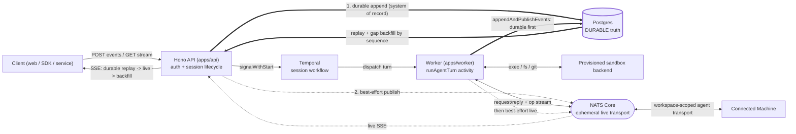
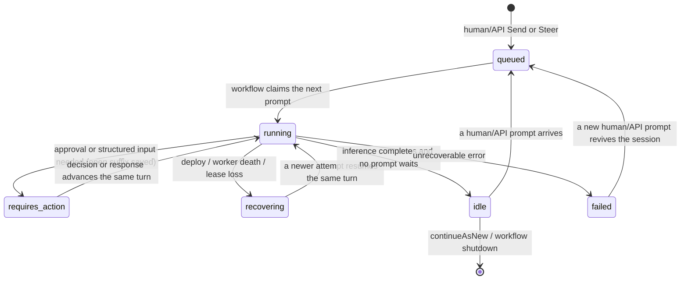

# OpenGeni architecture reference

> **This is an orientation map, not the source of truth.** It exists so an agent or human contributor can understand the whole system fast and know which rules are load-bearing _before_ changing anything. **Code wins over this doc.** Where a detail here disagrees with the source, the source is right and this doc is the bug — every section names its canonical anchor so you can go check. This file complements two siblings: [`../README.md`](../README.md) (the user-facing pitch + rendered architecture diagram) and [`../AGENTS.md`](../AGENTS.md) (how to run the stack + the contributor guardrails). For the runtime behavior of a single run, read [`run-lifecycle.md`](run-lifecycle.md) and [`goals.md`](goals.md).

## How an agent should use this doc

1. **New to the repo?** Read §2 (what it is) and §3 (invariants), then skim the §6 repo map.
2. **About to change something?** Jump to §13 (_"If you're changing X, read Y first"_) — it routes you to the canonical source and the deep-dive doc for your change area.
3. **Need a wire shape, an env var, a permission, a route, a table?** Don't trust this doc's lists — they are _followers_. Go to the canonical source named in the relevant section (almost always `packages/contracts/src/index.ts`, `packages/config/src/index.ts`, `apps/api/src/app.ts`, or `packages/db/src/schema.ts`).
4. **Found this doc stale?** Fixing it is part of your change. See §15.

---

## 1. What this doc is

A single canonical map of the OpenGeni monorepo: the system shape, the cross-cutting invariants, the full repository layout, concise per-component deep-dives, and a decision table that tells you what to read before editing each area. It is deliberately dense but scannable — use the section headers and tables as an index.

It does **not** restate the run lifecycle, goal loop, deployment procedures, or capability mechanics in full; those have dedicated topic docs (§14) that go deeper and are themselves code-canonical for their topic.

---

## 2. What OpenGeni is

**OpenGeni is a self-hostable, session-based "managed agent service."** It runs OpenAI Agents SDK agents inside sandboxes and owns the durable state around them: session lifecycle, event history, human-in-the-loop approvals, long-running goals, and outputs. Public clients talk **only** to the HTTP API; everything else (orchestration, agent execution, live streaming, durable storage) is internal machinery.

**Who it's for.** Operators and product teams who want to run long-lived, side-effectful agents — infrastructure work, code changes, multi-day autonomous tasks — without building the durability, recovery, streaming, multi-tenancy, and sandbox plumbing themselves. It pairs especially well with infrastructure-focused agents (Terraform/Checkov skills and a cloud-capable sandbox ship in the box).

**The "managed agent service" framing.** OpenGeni is the _substrate_, not the agent. You bring a goal and a workspace; OpenGeni gives you:

- **A session API** — create/list/get/rename sessions, Send/Steer human prompts, Pause/Resume recursive workstreams, terminally cancel session subtrees, approve tools, and read durable history.
- **An exactly-once live stream** — SSE anchored on a per-session monotonic `sequence`, with reconnect, replay, and gap backfill.
- **Durable, recoverable runs** — runs survive worker death and provider hiccups, with no run-length limits by design.
- **A dual compute model** — _provisioned sandboxes_ (disposable boxes OpenGeni creates, snapshots, and reaps across ten local/cloud backends) **and** _Connected Machines_ (a user's own always-on machine, enrolled via the `selfhosted` backend, as a **first-class, co-equal PRIMARY** compute target — a machine-targeted turn runs the agent **directly on the machine** with no cloud box created, leased, or billed).
- **A multi-tenant security boundary** — workspace-scoped access with Postgres row-level security, three product access modes, authenticated-encrypted configured secrets, and metadata-only ordinary projections. Scoped Variable Sets add one dedicated exact-value read boundary guarded by independent resource and literal plaintext permissions plus value-free audit.
- **Scheduled, recurring work** — cron-style scheduled tasks that wake a session and run a turn unattended.
- **Usage metering & entitlements** — per-model-call usage accounting with static or managed (Stripe) billing.

Core value props in one line: **durable + recoverable + streamable + multi-tenant + sandbox-agnostic** agent execution you can self-host.

**The product framing (from [opengeni.ai](https://opengeni.ai)).** The public pitch is _"The open agent runtime. Embed it. Self-host it. Own it."_ — positioned as _"a durable, observable, interruptible agent service, with the boring infrastructure already wired in."_ What that emphasis is buying you, and the lens to keep when weighing a design trade-off:

- **Data sovereignty / bring-your-own-everything.** You control your models, keys, and inference routes (OpenAI, Azure, Anthropic, Bedrock, or self-hosted) and — by enrolling a **Connected Machine** (the `selfhosted` backend) — even the machine the agent runs on, as first-class primary compute: no durable platform credential/setup is installed there and no cloud box is created for its turns. Exact-attempt Codemode authority is transient per child command. Don't add hard dependencies on a single provider or a hosted control plane.
- **Production foundation, not a demo.** Session persistence, event replay, durable orchestration, sandboxed execution, multi-tenancy, and billing are meant to be already-wired. New features should preserve those guarantees, not bolt around them.
- **Deployment flexibility.** One runtime that ships as an _embedded library_ inside another product **or** as an enterprise-wide service across AWS/Azure/GCP. Keep the client closure (`contracts → sdk → react`) embeddable and server-free (§3.9), and keep deployment provider-agnostic (§12).
- **It's substrate, not a chatbot.** OpenGeni targets teams _building_ agentic products — operational control, observability, and compliance over consumer convenience. Optimize for the operator and the embedding product, not an end-user persona.

> Canonical: [opengeni.ai](https://opengeni.ai) (product vision), [`../README.md`](../README.md) (product framing + route/env surface), [`../AGENTS.md`](../AGENTS.md) (the load-bearing "do not" rules).

---

## 3. Core design principles / invariants

These are the load-bearing, cross-cutting rules. Breaking one tends to be a subtle correctness or security bug, not a compile error. Each is stated as an imperative rule with its canonical anchor.

Editable spreadsheets persist and hash authored/causal state only. Formula
source is durable; calculated values are query/render/export projections rebuilt
by the Rust kernel and never enter commands, snapshots, collaboration history,
authored/retained admission, or state hashes. Calculated projections retain
separate memory and query-response limits. Current format/schema identifiers govern
stored-state compatibility; producer build identity is diagnostic there but
remains exact for package installation and materialization. Superseded
spreadsheet formats have no reader or converter. Canonical:
`packages/artifact-tool/kernel/src/value.rs`,
`packages/artifact-tool/kernel/src/snapshot.rs`,
`packages/artifact-tool/kernel/src/collaboration/snapshot.rs`, and
[`artifact-engine.md`](artifact-engine.md).
Live admission uses one explicit current modality/live/model/snapshot/command/
committed-transaction tuple. Release receipts execute the same formula corpus
on every native target and WASM and aggregation rejects any digest mismatch.

### 3.1 Postgres is durable truth; NATS is an ephemeral transport

> Postgres remembers; NATS transports.

- **Session-event fanout is best-effort.** `appendAndPublishEvents` writes the DB
  (system of record) **then** best-effort-publishes to NATS. Never publish an
  authoritative session event without a prior durable append; never reverse the
  order. A fanout failure must not kill an in-flight turn because consumers
  reconcile missed events from the durable log.
- **Prompt admission acknowledges the durable commit, not transport follow-up.**
  Send/Steer authorization, policy and limit checks precede one transaction that
  commits the `user.message`, queued turn, session/queue mutation, audit record,
  run-usage fact, and workflow-wake outbox revision. The API response is projected
  from those committed rows without a post-commit reload. NATS/workspace-control
  fanout and the immediate Temporal wake attempt are replayable post-commit work;
  they cannot delay or reverse the accepted response. The browser ordinary-Send
  path likewise acknowledges locally with one `clientEventId`, renders a bounded
  optimistic message, and reconciles it against the authoritative event stream.
- **Connected-machine commands also use NATS.** Agent request/reply, streamed
  operation frames, heartbeats, and enrollment auth callout all cross the same
  broker. They are live transport, not durable broker state. A broker restart
  loses no session history, but connected machines are unreachable until
  clients reconnect; affected operations surface typed offline/timeout outcomes.
- **NATS is therefore restartable, not optional.** API and worker startup require
  a connection and readiness turns unhealthy during a disconnect. Already
  committed state and queued Temporal work survive, while new or active
  connected-machine execution waits, retries at its owning boundary, or fails
  visibly.
- **Missed events are backfilled from Postgres by `sequence`.** The SSE stream replays durable events in bounded pages, subscribes live, and on a sequence gap **backfills from the DB**, deduping by sequence. During replay or slow-client delivery it retains only the newest live notification and then gap-fills, so a hot producer cannot create an unbounded API or NATS-client buffer. Each session and workspace-control HTTP body queues at most one complete frame of at most 96 KiB. A second write waits on `desiredSize` for at most 30 seconds; a still-stalled reader is disconnected, its upstream subscription is released, and the SDK reconnects from the last sequence it actually observed. Fixed-cardinality `stream`/`reason` counters expose queue pressure, timeout, and impossible oversized-frame failures without tenant identifiers. The streaming core _refuses to deliver with a gap or without monotonic cursor progress_ (it throws rather than skip or spin).
- **An idle live stream remains observable and recoverable.** The API sends a serialized SSE heartbeat on a completion-scheduled timer. The SDK reconnects with bounded exponential backoff plus jitter when no bytes arrive within its heartbeat deadline. Authoritative pre-live reconciliation is also time-bounded, so one slow read cannot leave a connection permanently stuck between `connecting` and `live`.
- **One visible session route owns one session SSE feed.** It shares that feed with header, lineage, capability, and account consumers; an empty shared feed is authoritative and never means “open a private fallback stream.” Account metadata refreshes only after the durable post-selection event, not the earlier turn-admission event.
- **Hidden browser pages stop noninteractive live work.** After a short grace period, session/workspace SSE, viewer heartbeats, and periodic HTTP reads stop. The last durable cursor remains in memory. Visibility resumes through one bounded authoritative reconcile and replay-from-cursor before live delivery, preserving monotonic deduplication. Simultaneous identical session-projection reads are single-flight, and completion-scheduled polling cannot overlap itself.
- **Reads never ride the bus.** Channel-A point reads go client→API→box in-process; only side-effect notifications (`fs.changed`/`git.changed`/`terminal.pty.*`) are appended+published. Putting reads on the bus would corrupt SSE gap-fill. One batched request keeps its independent reads concurrent, while separate read-only requests targeting the same exact live Modal lease use a bounded PostgreSQL advisory lock across API replicas; this prevents load balancing from racing independently reconstructed provider handles without serializing writes, other sandboxes, or the reads inside a batch.
- **Gateway failures cross one bounded typed boundary.** The browser/SDK sends a bounded safe `x-opengeni-correlation-id`; the API validates or replaces it, returns it, and emits typed JSON error envelopes. The SDK retains only structured JSON error bodies up to 16 KiB and discards raw proxy HTML/plain text. A raw `502`/`503`/`504` or unexpected successful non-JSON response to a mutation is outcome-unknown: callers reconcile before retrying and reuse the exact idempotency key rather than manufacturing a new operation. The React composer preserves draft text/resources through these failures and reuses the same Send/Steer `clientEventId`. Error metrics use only fixed-cardinality route/status/code labels, never tenant or correlation identifiers.
- **Established-session drafts store the same canonical command resources that Send/Steer compares.** Composer saves pass repository URIs, refs, subpaths, mount paths, credential bindings, and file mounts through the ordinary `normalizeResources` boundary before persistence. The exact draft revision therefore fences the same canonical content hash used at prompt admission; a transport-only repository spelling such as HTTPS userinfo cannot save successfully and then conflict with its equivalent submitted command.

> Canonical: `packages/events/src/index.ts`, `apps/api/src/http/sse.ts`, `apps/api/src/app.ts`, `packages/sdk/src/stream.ts`, `packages/sdk/src/client.ts`, `packages/sdk/src/errors.ts`, `packages/react/src/hooks/internal.ts`, `packages/react/src/hooks/use-session-events.ts`, `packages/react/src/provider.tsx`, `apps/web/src/context.tsx`.

### 3.2 Temporal coordinates; token streams never enter workflow history

- Temporal runs the long-lived per-session workflow and signals — orchestration only. **Token streams and tool output never go through workflow history.**
- The session workflow holds **no goal state in memory** — it reads/mutates `session_goals` only through activities, so the loop is replay-safe by construction.

> Canonical: `apps/worker/src/workflows/session.ts`.

### 3.3 Agent turns run as NON-retryable activities — fix idempotency, don't blind-retry

- Each turn runs as one activity with `maximumAttempts: 1` (`apps/worker/src/workflows/activities.ts`). **There is no automatic activity retry.** Model/sandbox/GitHub/cloud calls are side-effectful.
- **Do not add automatic Temporal retries around full agent turns** unless every model/tool/sandbox boundary has been made idempotent.
- Recovery is _explicit_: graceful shutdown checkpoints the same turn as `recovering`; ungraceful death is detected via typed heartbeat/schedule-to-start timeout failures and re-dispatched through `recoverTurnAfterWorkerDeath`, **bounded by a per-turn redispatch ceiling of 3** before the session fails for real. A resource-based turn worker uses Temporal's lower cgroup-aware target for ordinary admission backpressure, then monitors the most pressured finite process cgroup/ancestor (whole-host memory only when no finite cgroup exists) against a distinct higher emergency threshold. Every durably reconciled model response also schedules one process-wide, coalesced forced GC when JavaScript or external memory has reached 512 MiB, with a 30-second cooldown; this releases completed request/stream allocations while every active turn and its exact model context remain reachable. Process RSS pressure receives a bounded asynchronous GC opportunity before only a sustained emergency breach invokes graceful drain rather than a hard kill or turn-length limit. If a recovered attempt reaches required-MCP setup while that service is briefly unavailable, the runtime carries only an allowlisted secret-safe transport marker and the worker recovers the same accepted turn after capped pacing; it does not fail the session or replay a completed tool call. For required first-party connect/tools-list only, a rolling API replacement's temporary `404` or statusless plain transport `Error` is part of that recovery boundary; external MCP servers, tool calls, explicit non-404 client responses, and typed protocol/programming failures remain outside it.
- Optional connection-backed MCP setup is non-conversational availability state: an `initialize` or `tools/list` credential miss drops only that ordinary optional server for the turn without a chat auth card. Codex Apps is the server-authoritative exception: because its enabled/designated catalog item is explicitly selectable, missing/expired/insufficient-scope Apps authorization and safe setup transport failure retain an Apps-specific actionable reconnect/retry state without exposing provider bodies or credentials. A concrete `tools/call` authentication failure still emits an actionable `tool.auth_needed` event carrying the tool name; older tool-less setup events for ordinary optional MCPs remain debug/audit evidence and are not projected into chat.
- A claimed turn creates a first-class `session_turn_attempts` row before model/tool work. It binds the exact Temporal activity id, trigger, dispatch generation, control revision, and write lease to one logical turn. A genuine Temporal activity retry retains the activity id; every explicit re-dispatch creates a new attempt. A typed schedule-to-start timeout is the sole no-attempt exception because no activity started.
- At claim, the attempt also freezes the session tenancy authority tuple: positive epoch, persisted visibility, and owner membership provenance. Every later activity write compares that immutable snapshot with the locked live session; any missing, partial, or stale mismatch fails closed.
- The first admitted attempt freezes one secret-safe execution policy on the logical turn: public product model, provider, upstream deployment, credential-source class, billing attribution, wire API, and definition version. The same logical turn reuses that policy across approval, capacity wait, recovery, and Pause/Resume attempts; a new user, goal, system, child-result, or scheduled logical turn resolves a fresh policy. A malformed present policy fails closed before credit admission, allocator selection, compaction, or provider work.
- Connected SuperGrok/xAI work separately freezes an identifier-free provider-account authority snapshot on the accepted logical turn. Workspace scope is the default shared pool; user scope is explicit/private and remains bound to the exact initiating human across Send, Steer, edit, child, goal, schedule, compaction, and internal-update propagation. Runtime never infers this authority from the session creator, current worker, or another user's active account. See [`supergrok-subscription.md`](supergrok-subscription.md).
- The same claim also freezes the workspace's bounded connector-action policy rows. A connection-backed MCP call resolves exact-over-wildcard `Allow` / `Ask` / `Block` from that snapshot. `Block`, rejection, pending approval, and ambiguous equal-specificity matches never invoke the provider; `Allow` cannot remove an existing per-session approval requirement. `Ask` uses the ordinary durable SDK approval interruption, while `connector_action_requests` preserves the original requester and policy across the resumed execution attempt. Every managed decision/outcome emits metadata-only audit evidence keyed by a canonical SHA-256 action fingerprint; raw tool arguments, credentials, request bodies, and results are never persisted.
- Product identity and upstream deployment identity are distinct: for example, public `codex/gpt-5.6-sol` routes upstream as `gpt-5.6-sol`. Billing and allocator eligibility come from the accepted policy's explicit provider/credential/billing fields, never from a model-name prefix or the currently active credential.
- Claim, interruption, and every event-writing lifecycle settlement use one lock order: `workspace_inference_controls FOR SHARE` when control-aware → actual `workspaces FOR KEY SHARE` → UUID-ordered sessions `FOR NO KEY UPDATE` → UUID-ordered exact turns `FOR UPDATE` → UUID-ordered exact attempts `FOR UPDATE`. Session primary/composite identity keys are immutable, so the session lock excludes competing mutations while remaining compatible with FK `FOR KEY SHARE` checks. Generic audit/title appends skip the control row but retain the workspace-key-share prefix, so unrelated sessions in one workspace do not serialize. Start, requires-action, ordinary terminal, recoverable interruption, supersession, and worker-death events commit with queue delivery/version state, system-update bundles, turn/session state, active pointer, and sequence. Every write from a running activity is attempt-fenced. A missing/closed owner is an event-free stale no-op, so a zombie cannot publish contradictory terminal or recovery truth. An organization-wide seam that spans every workspace of an account prefixes the same order with a transaction-scoped advisory lock on the organization id and may take no lock stronger than `managed_accounts FOR KEY SHARE`, because ordinary workspace writers reach `managed_accounts` only through the account FK check of a row they insert while already holding their `workspaces` row (migration 0299; see [`organization-tenancy.md`](organization-tenancy.md)).
- In receipt-gated v2 workflow histories, Pause/Steer logical settlement commits that Postgres authority fence **before** requesting Temporal cancellation. `runAgentTurn` uses nonblocking `TRY_CANCEL`; Temporal cancellation or activity terminalization proves only transport delivery, never physical sandbox/tool quiescence. The local activity heartbeat and worker SDK throttle share a 500 ms bound so cancellation observation does not consume the unchanged four-second live control budget before physical drain and replacement admission. Histories without the `session-attempt-quiescence-v2` patch retain the v1 WAIT/fallback command order solely for deterministic replay; new runs never use it, and the current activity still owns the authoritative receipt.
- The exact activity owns physical proof: it cancels the turn's hard tool/sandbox fence, waits for that fence to drain, then normally persists `session_turn_attempts.quiesced_at` directly. Explicit `tty:false` shell work remains pipe-mode during that fence and skips terminal control bytes while retaining marker-bound process-group TERM/KILL proof; omitted `tty` keeps the interactive default. Modal gives each turn-owned exec start an isolated command-router handle. Cancellation before provider yield closes only that pending handle, reattaches the same sandbox for token-guarded control, and publishes an in-box tombstone before proving the matching PID/PGID absent; the wrapper publishes identity before checking the tombstone, so a late accepted start cannot run user code. The original provider promise must still settle, and timeout/missing identity/transport failure remain non-proof. The receipt, `session.queue.changed` event, session queue revision/sequence, and `session_workflow_wake_outbox` revision commit atomically. That commit returns the exact pending wake for immediate `signalWithStart` before NATS fanout; failure leaves the same revision for bounded outbox repair. If all three direct DB attempts fail, the activity retries `signalWithStart` delivery of one immutable exact account/workspace/session/attempt/workflow-run/activity proof. The workflow persists accepted proofs before any peek/close/continue-as-new boundary through a DB-only control activity with unbounded Temporal retry. The same locked Postgres transaction validates the exact dispatch and remains the sole receipt/admission authority; NATS is separate best-effort fanout. Provider/batcher completion and lease/cache/recording/workspace housekeeping are detachable and remain attempt-fenced. Until that transaction commits, admission stays fail-closed without treating Temporal cancellation, completion, or failure as proof.
- Retained POSIX command cancellation keeps provider latency out of the proof state machine: one exact-backend in-box helper validates the randomized marker and PID/PGID, performs TERM/KILL escalation, and proves group absence; one final exact provider-session settlement phase durably settles the retained holder. Any inconclusive helper or settlement result retries without opening admission.
- Model-facing shell waits use that same fence in at-most-250-ms provider slices while honoring the requested wait window. Short commands settle inside the original tool call instead of consuming model-only `write_stdin` polls; explicit early yields and genuinely running commands still expose the retained process. Internal empty polls use process control rather than a workspace-mutation admission.
- Worker-death detection **must use typed SDK failure classes** (`instanceof ActivityFailure` + `TimeoutFailure.timeoutType`), never message-string matching, so it is replay-safe.
- The activity is one linear lifecycle split across `apps/worker/src/activities/agent-turn/`; `agent-turn.ts` is only the public barrel. `run.ts` is the orchestrator and owns the `try`/`catch`/`finally` skeleton plus provider request contexts; it calls the phase modules **in this order**: `claim` → `codex-capacity` / `xai-capacity` → `governance-model` → `compaction-prep` → `tool-environment` (`prepareTurnToolPolicy`) → `sandbox-establish` (`resolveSandboxRoute`) → `run-credentials` → `sandbox-establish` (`establishTurnSandbox`) → `tool-environment` (`prepareTurnToolRuntime`) → `agent-build` → `sandbox-establish` (`bindLazySandboxProvisioner`) → `compaction-prep` (post-agent) → `stream-attempt`, with `failure-settlement` as the `catch` and `finalization` as the `finally`. Supporting modules (`errors`, `history`, `history-sink`, `model-usage`, `quiescence`, `admission`, `media-artifacts`, `tool-result-spill`, `file-resources`, `credential-leases`, `sandbox-runtime`, `sandbox-provision`, `sandbox-route`, `tool-policy`, `codex`) hold pure helpers and per-turn services.
- Mutable per-turn state is **not** passed by value between phases. `turn-context.ts` owns typed clusters (`control`, `attempt`, `billingState`, `sandboxState`, `renewals`, `recordingState`, `eventing`, `workspaceRefs`, `providerTurn`) that every phase mutates in place, so a later phase's write is visible to an earlier phase's closure exactly as it was in the single-function original. Adding a new cross-phase mutable value means adding a context field, never a new phase return value that a closure snapshots.

> Canonical: `apps/worker/src/activities/agent-turn/` (orchestrator `run.ts`, shared state `turn-context.ts`), `apps/worker/src/activities/session-state.ts`, [`run-lifecycle.md`](run-lifecycle.md).

### 3.4 No default run-length limits, by design

- Runs legitimately span days. Budget/admission policy and explicit completion or pause bound execution; OpenGeni does not infer "no progress" from tool/event shape. **Do not add or lower caps** on model calls per turn, continuation count, or activity timeout "to be safe" — fix the pathology instead.
- Recoverable conditions **idle or explicitly resume** the session (keep context) rather than fail it: retryable provider failures, escaped MCP request timeouts (checkpointed without replaying completed tool calls), provider context overflow after strict-shrink compaction recovery, the max-turns segment cap, and budget/credit exhaustion. Repeated productive compactions are allowed; no-shrink recovery idles instead of churning. Empty-summary or provider-error recovery preserves active history, settles the exact turn once, and ends the workflow run until a human/API prompt, Agent Steer, or explicit Compact creates newer truth; ordinary machine updates remain pending and an active goal cannot synthesize an unchanged retry loop. Resolved model metadata controls raw/effective/auto-compact limits end-to-end (Codex subscription and billed GPT-5.6 Sol/Terra/Luna: 272,000 / 258,400 / 244,800), and local checkpoint rebuilds retain one cumulative 20,000-token newest-user-message budget. A failed session would reject the very retry it asks for.
- **Failed sessions are revivable**: a new `user.message` transitions `failed → queued` and restarts the workflow (`signalWithStart`). Only `cancelled` is terminal.
- **Automatic compaction is provider-accounted and prefix-stable.** A local whole-request approximation never forces compaction. The durable prior-call provider input count may trigger at a later turn boundary; within one activity, the immediately preceding provider total plus bounded newly appended input may trigger the next call. Without either, OpenGeni sends the request and recovers from a genuine provider context overflow. Local media-aware estimates are limited to fitting the explicit compaction request and reporting its history-only replacement. For unchanged active history and settings, a later provider request must reproduce the earlier serialized model-visible prefix exactly: request-time filters cannot delete or reorder an earlier `view_image` pair. Computer use is exposed only when the caller supplies a proven visual transport (`responses` hosted tools or Codex structured image results); chat-wire and omitted/unproven public runtime routes fail closed with no computer tools rather than returning screenshot data URLs as text.
- **Progressive tool disclosure is provider-contained, session-scoped, and cache-prefix stable.** Codex subscriptions and direct built-in OpenAI/Azure Responses use native client `tool_search`; other ordinary function-calling routes use stable `tool_search` + `tool_invoke` functions. `ToolRef.optional` controls failure/degradation and is orthogonal to `ToolRef.eager`: only an exact session ref with `eager: true` connects/lists before a fresh progressive-disclosure attempt's first provider request and contributes schemas to that request. Eager vs lazy for non-MCP tools is origin, never transport: `exec_command`, `write_stdin`, `apply_patch`, `view_image`, `load_skill`, and `request_human_input` are the closed non-MCP first-request set on every provider; every other non-MCP function tool (Browser/Computer plus `generate_image`/`generate_video`/`get_video_generation_capabilities`) hides behind search everywhere. MCP eagerness remains the per-session `ToolRef.eager` choice. Every non-eager MCP—strict or optional—starts concurrently, and ordinary text output does not join its preparation; search, deferred invocation, Codemode activation, catalog persistence, and cleanup share the one exact readiness promise. Approval/human-input resumes and editable-artifact turns stay fully prepared because they require the prior execution/catalog identity before continuing. Deferred MCP schemas stay out of the initial provider tool block; eager tools remain ordinary configured tools. A remembered authorized name — native raw call or generic `tool_invoke` — binds through `resolveMissingFunctionTool` after the current catalog is ready, including SandboxAgent approval resume (the live catalog wins before any serialized-tool placeholder), then follows normal approval, guardrail, timeout, MCP-error, and event handling. Unknown or revoked names return a typed error to the model and do not kill the turn. Generic search returns only complete tool definitions within the independent 128 KiB per-tool and 256 KiB aggregate disclosure bounds; its exact bounded result is retained as internal protocol metadata and restored before provider replay so ordinary tool-output truncation cannot corrupt or silently omit a large authorized schema. Leftover historical registration items stay stripped from provider history and user-visible events; the exact original dispatcher arguments are retained as protocol metadata and restored before every provider request and compaction projection. No lossy summary or historical disclosure ledger grants tool authority; the current authorized registry does. Host workers route first-party MCP through `OPENGENI_MCP_INTERNAL_URL`; the distinct `OPENGENI_MCP_URL` remains sandbox/external for Codemode and remote placements.

> Canonical: [`run-lifecycle.md`](run-lifecycle.md), [`goals.md`](goals.md).

### 3.5 Three memory stores, three jobs

Reaching for the wrong store is the classic mistake.

| Store                   | Job                                                                                                                                                       | Rule                                                                                                                                                                                                                                                                                                                                               |
| ----------------------- | --------------------------------------------------------------------------------------------------------------------------------------------------------- | -------------------------------------------------------------------------------------------------------------------------------------------------------------------------------------------------------------------------------------------------------------------------------------------------------------------------------------------------- |
| `session_history_items` | **Conversation truth** fed to the model (default read path).                                                                                              | Protocol-preserving, replay-ready JSON exact for accepted user, agent, tool, and source content. Persist omits Responses output-only item `status` (`canonicalizePersistedHistoryItem`); pairing is `call_id`. The SDK persistence boundary also omits only object properties whose JavaScript value is `undefined`, matching JSON wire semantics; other non-JSON graphs fail with a path. Content is never regex-scanned or rewritten because text resembles a credential. Dual-written as the agent streams. Compaction **supersedes, never deletes** (`active=false`); summary inserted at fractional position `boundary - 0.5`. |
| `agent_run_states`      | **Requires-action sentinel plus control snapshots.** Pauses persist the bounded open suffix on `session_pending_tool_calls` (pending call item, tied reasoning, interruption kind) plus paired `session_history_items`, and store the open-suffix sentinel in `agent_run_states` with pending-approval / human-input snapshots. Resume settles that suffix and continues from history; it does not reconstruct SDK `RunState`. | Never use as conversation memory. Canonical state remains exact; protocol compatibility repair is explicit and path-owned rather than content-shape inference. Historical non-record sandbox `exposedPorts` values receive one exact-path root + `sessionsByAgent[*]` repair before SDK validation; provider predeclared-port arrays remain provider state. |
| `session_events`        | **Exact append-only human/audit timeline** — drives replay/SSE/UI.                                                                                         | Accepted payloads remain exact in canonical storage and replay. Separately named monitoring/public projections may be deterministically bounded without replacing the stored payload. **Must never be fed back to the model.** Per-session monotonic `sequence`.                                                                                   |

SDK-origin in-flight call and result receipts in `session_pending_tool_calls`,
approval snapshots in `agent_run_states`, and their durable `session_events`
projections use the same protocol-JSON boundary as canonical history before
strict lossless storage. JavaScript-only `undefined` object properties are
omitted without mutating the SDK item; undefined array entries and every other
non-JSON graph still fail with an exact path. The database codec remains strict
and never silently repairs arbitrary callers. Completed pending tool receipts
retain the model-facing SDK result item separately from the exact
`agent.toolCall.output` audit value, allowing worker-death recovery to publish
the same complete event projection as the live path without exposing its extra
MCP fields to later model requests. A `requires_action` pause additionally
stamps `interruption_kind` and `tied_reasoning_items` on those receipts so
unpaired calls never enter model-facing history; resume promotes reasoning +
call + bounded result as one pair. Side-effecting approvals invoke through the
existing MCP execute-once fence immediately and, if sibling interruptions
remain, stay `requires_action` without a model call.

Generated image bytes are permanent workspace artifacts, not another memory
store. Native provider base64 is replaced before durable history/event/RunState
serialization by the same compact provider-neutral receipt returned by adapter
tools. Model requests project native hosted items to a deterministic artifact
fact; adapter history keeps its provider-neutral call and compact receipt.
Browser retrieval uses the workspace file authority, and sandboxes receive the
exact materialized file. Provider ids, object keys, signed URLs, and base64 do
not enter the model-facing prefix. See
[`image-generation.md`](image-generation.md).

Serving workers fail closed before decoding an active transcript above 15 MiB,
8,192 rows, 131,072 JSON nodes, or 65,536 object properties. Pause always
writes the open-suffix sentinel in `agent_run_states`; resume uses that suffix
plus paired history and does not reconstruct SDK `RunState`. The distinct
3 MiB / 65,536-node / 32,768-property serving envelope still rejects a leftover
SDK heap on insert and read so an expand-era blob cannot enter a serving worker.
Oversized state is never silently trimmed or compacted inside a serving worker;
repair and forensic work belongs in a bounded non-serving execution class.

Sandbox recovery state is separate again. The group lease is authoritative for
provider, archive, restore, workspace-readiness, liveness, and epoch truth;
`sandbox_session_envelopes` retains the per-session provider/manifest descriptor
and may supply a legacy archive only after the lease atomically imports and
selects that revision.

Actionable human-input state is also separate from all three memory stores.
`session_human_input_requests` binds a structured question set and its
first-writer-wins answer/skip/expiry/cancellation to one exact turn execution
generation. It is atomically installed with the open-suffix pending-tool
receipts, an `agent_run_states` sentinel row, and `requires_action`
events/status. A crash cannot expose a pending request without durable completed-pair
history **and** the open suffix. Events tell clients to reconcile; the row
is the authoritative pending-request read model. See
[`human-input.md`](human-input.md).

Human session-list pages are bounded independently of event/history storage: ordinary rows are cursor-paginated, while the personal pinned section returns at most the 100 newest matching pins and sets `pinnedTruncated` when older pins are omitted. The legacy array-shaped HTTP response also reports that fact in `x-opengeni-pinned-truncated` without changing its body. Tree aggregates reject more than 600 roots per call, are bounded per returned root, and are cycle-safe; `treeStats.truncated` makes every reported count a lower bound whenever node/depth/cycle defense omits traversal work. Canonical: `packages/db/src/index.ts` (`listSessionsForSubject`, `sessionTreeStatsForSessions`) and `packages/contracts/src/index.ts` (`SessionListResponse`).

Workspace-level knowledge is a separate store again: `knowledge_memories` holds curated and agent-written, workspace-scoped memory records. Workspace Memory V1 makes the agent/product lane **active by default** through one deterministic write gate (`saveWorkspaceMemory`): preserve accepted text exactly, apply exact/near dedup, enforce the active-record cap, optionally supersede, then persist. The older `proposed → approved/rejected` lifecycle remains for the curated docs-MCP lane (`memory_propose` and human review); agent-visible memory is `active ∪ approved`. Corrections retire records as `superseded` or `archived`, and pinned records rank first in the per-turn working set. Usage counters (`usage_count`, `last_used_at`) are bumped on memory search and feed ranking/decay work.

Migration 0152 adds the database/domain foundation for composable knowledge without changing those V1 contracts: typed `workspace`/`user`/`role`/`session`/`ephemeral` scopes, hierarchical namespaces, normalized labels, typed provenance/relationship edges, immutable creator facts, and append-only deterministic apply/revert evidence. All three memory-governance tables use FORCE RLS; missing selector context denies, relationships require both endpoints visible, lifecycle evidence is exact-actor visible, and secret-bearing memory fields never enter lifecycle state. This is a maintenance cutover because typed-scope-local dedup replaces the V1 workspace-global unique identity. API/SDK/MCP, retrieval/injection, prompts, automatic learning, and UI remain later slices. The structured preference registry and workspace instruction-policy backend remain separate authorities. See [`hierarchical-memory.md`](hierarchical-memory.md).

Root-task-tree notes are a separate, deliberately narrow coordination surface.
`task_notes` and immutable `task_note_events` attach bounded, expiring technical
notes to the canonical root session so coordinators and descendants can retrieve
them explicitly through `task_notes_list`; they are never injected into prompts.
Exact-attempt create/archive/replace functions derive immutable turn provenance,
recheck private-session visibility under the turn's frozen initiating human,
serialize the 500-active-note cap on the root session, and preserve separate
create/archive receipts. Atomic replacement archives the old immutable note,
creates a fresh note, and records content-free old/new lineage; exact replay
converges while changed input, stale versions, or another tree/attempt fail
closed. The runtime role has no direct table access. This workspace-
local slice neither widens personal/organization tenancy nor creates another
Knowledge, Memory, preference, policy, or goal authority. See
[`company-brain-write-routing.md`](company-brain-write-routing.md).

Governed Company Brain writes use a separate explicit, proposal-only router;
they do not expose a generic `memory_save`. Workspace-local operations may
propose an existing scoped-Knowledge
claim with exact evidence, propose a correction through an immutable
`supersedes` relation, materialize an exact Knowledge change proposal as an
inactive instruction-policy draft, or materialize it as an inactive untrusted
workspace preference. An active rooted Task note may also be promoted into
proposed Knowledge alone or, atomically, onward into either inactive Ways
destination; its exact note bytes become both the proposed fact and destination
content, never caller-supplied replacement bytes. One transaction locks and
revalidates the exact active session, turn, attempt, execution generation,
immutable initiating human, and fresh interruption state. Instruction-policy
destinations take their exclusive workspace lock before rooted Task-note session
locks, so the nested policy lifecycle never upgrades a workspace lock after two
independent roots have diverged; Knowledge and preference retain their narrower
lock path. A common immutable Knowledge review binds the full input hash and
operation UUID across all destinations; exact retry reconstructs the same
content-free receipt and changed input conflicts. The preference path adds an
immutable destination receipt so later human activation, rejection, or
supersession cannot rewrite replay identity. Human-governed destination
lifecycle remains the only activation authority. This slice owns no selector or
logical-turn context receipt, personal/organization activation, MCP/API/UI
surface, or rollback token. A transport-neutral follow-on resolves the exact
evidence source against the immutable accepted-attempt workspace-learning
snapshot before this writer: `off` blocks, `suggest` proposes, and `automatic`
requests destination-owned activation without claiming it occurred or
bypassing human-only policy/preference lifecycle. Canonical:
`packages/contracts/src/company-brain-governed-writes.ts`,
`packages/core/src/domain/company-brain-governed-writes.ts`,
`packages/db/src/company-brain-governed-writes.ts`, and migration
`0255_company_brain_governed_write_proposals.sql`. Migration 0260 adds exact
active rooted Task-note to proposed workspace Knowledge promotion: evidence is
one Document version or one immutable value-free Task-note source receipt, the
note text becomes the proposed fact only, the one-shot database capability
verifies that exact claim-to-fact binding, retries converge after note archival,
and another root/tenant/stale attempt fails closed. It also adds the atomic
`task_note_replace` correction/revert operation and immutable content-free
replacement receipt without making Task notes authoritative. Its explicit
`pg_catalog`, target-schema, `pg_temp` posture covers both the new entry points
and their full legacy Task-note/session-visibility closure, so runtime TEMP
objects cannot replace authority reads at a nested definer or RLS boundary. The
explicit proposal MCP tools remain proposal-only and learning-policy gated; see
[`company-brain-write-routing.md`](company-brain-write-routing.md).
Migration 0261 is a rolling function-only repair for the two released
Knowledge-backed Ways adapters: canonical global/role instruction target
projection and an unambiguous preference service-actor binding. It changes no
runtime privilege, destination lifecycle, or receipt authority.

Workspace decision publication to Slack retains the pure Memory policy/projection boundary, then atomically binds eligible changes to an immutable workspace-admin destination revision and durable outbox. A security-definer `SKIP LOCKED` claim path records append-only attempt/receipt history, retries transient Slack failures, terminally fails or cancels unsafe work, and reuses the existing verified-bot post-operation idempotency fence. The Capabilities UI selects only active non-shared bot-member channels; delivery revalidates that exact live membership/archive/Slack-Connect boundary after the post claim and immediately before the provider call, making destination drift a no-post immutable cancellation receipt. The UI exposes bounded review/retry/history state. A narrow post-persistence adapter consumes immutable governed-learning activation and undo receipts (migration 0269) after they commit, publishing only content-free facts, failing closed for Slack-derived evidence, and never owning router or learning-policy authority. Slack receives only bounded summaries and authoritative application links; canonical Memory and learning ledgers never derive authority from Slack. See [`memory-slack-publication.md`](memory-slack-publication.md).

Shared-conversation Slack tasks have a separate immutable, CAS-activated workspace authority: `slack_task_policy_revisions`, its active head and activation events, plus immutable accepted-origin evidence. No active policy denies. An exact authorized Slack Connect or MPIM invocation is revalidated immediately before content read, then handed to an initiating-user-private bot-DM session; it never becomes a shared OpenGeni session. Requester-triggered result publication revalidates the exact accepted policy revision, installation, identity/grants, conversation membership/facts, and terminal result immediately before an idempotent source-thread post. Ordinary channels, bot DMs, and the selected-message-only human-DM shortcut retain their existing paths. Canonical: `packages/contracts/src/slack-task-policy.ts`, `packages/db/src/slack-task-policy.ts`, `apps/api/src/routes/slack-task-policy.ts`, and `apps/api/src/integrations/slack-interactions.ts`; see [`slack-bot.md`](slack-bot.md).

Migration 0154 adds a separate provider-neutral scoped knowledge provenance foundation: provider/source/ACL/sync/object/document-version ledgers and normalized entities, facts, immutable claims, evidence, reviews, and inactive change proposals. It has exactly three fixed authorities—organization, current workspace, and the immutable initiating user's personal scope—and FORCE RLS fails closed across account, workspace, and subject boundaries. Permission filtering is a live all-support intersection over evidence-time ACL, current source ACL, lifecycle state, and any bridged current Document/chunk authority before ranking or return. Document bases and collections remain optional organizational groupings, never authority boundaries. Migration 0165 projects the same immutable authority tuple onto Documents/chunks, retaining legacy workspace rows as workspace authority and binding legacy private rows to their original workspace and creator. Migration 0258 activates the common organization-user authority for new personal Documents while preserving their physical origin as immutable indexing provenance. Human inventory, exact reads, reindex, filing, deletion, retrieval, and document-scoped original-file access follow the owner across currently accessible same-organization workspaces while operating on that immutable origin; the original-file resolver proves the requested-workspace Document, current owner authority, provider ACL, and immutable origin File in one database authority boundary, while generic file inventory remains origin-workspace scoped. Agent retrieval admits common-authority personal Documents only through exact-attempt `document.read` grant snapshots and revalidates membership, workspace, authority/grant generation, visibility/epoch, interruption, and Document state on every read. Configured/local subjects without an eligible active organization membership and legacy personal rows remain origin-workspace anchored; a null-authority legacy Document has only a same-origin-workspace, exact-initiating-subject agent compatibility lane. Documents and claims remain RAG evidence rather than automatic prompt content, and the change does not alter `knowledge_memories`, preferences, company profile, instruction policy, or governed write routing. See [`scoped-knowledge.md`](scoped-knowledge.md).

Migration 0197 extends shared Schedules with a discriminated action contract. It is a maintenance-only cutover: stop every API/control/turn worker, require zero other `opengeni_app` database sessions, run the migration from the new image, and never restart a pre-0197 image. This simultaneously prevents an old control worker from interpreting a new sync schedule as an agent/model run and bounds the exclusive locks needed to replace the live Document identity indexes. Existing rows backfill to `agent_turn`; `knowledge_source_sync` rows freeze exact account/control-workspace/source/config/lifecycle/connection/destination/initiating-subject authority plus a provider coordination key and permit only `skip` or `buffer_one`. Schedule dispatch branches before agent admission, session creation, model configuration, or agent usage. A stable per-source Temporal child executes bounded batches through a provider driver port. FORCE-RLS sync state, wake receipts, item outcomes, index obligations, and per-object scan observations own leases, typed wake provenance, execution checkpoints distinct from provider cursors, active scan generations, one-item durable buffering, reconnect state, fail-closed ACL eligibility, bounded summaries, retention hooks, and retry/idempotency truth. Only an explicitly complete scan may tombstone active objects absent from its stable generation; partial or failed scans never infer absence. Successful source completion rolls scheduler state to the exact live output generation, deterministic completed-run replay avoids a second provider call, and unchanged-item retries reconcile version-before-obligation, index-before-settlement, failed-index retry, and metadata-observation crash seams. Within one scan generation the first accepted per-object observation becomes a durable floor rather than an overwrite target; provider-specific canonical monotonic revisions may advance that floor only under the exact lease, initiating subject, scan, and execution-checkpoint generation. Item version/metadata writes, checkpoint persistence, and terminal cursor settlement lock and revalidate the exact floor, so concurrent or replayed older work cannot regress current truth. Lifecycle generations participate in immutable observation identity, so an unchanged object or source restored after tombstoning receives a fresh version/obligation chain rather than reusing invalidated authority. Provider revision is observation metadata, not immutable version identity, so metadata/ACL-only changes remain durable even when bytes and Document identity are unchanged. ACL evidence and successful index settlement lock and revalidate the live-or-newer sync state, source lifecycle/configuration and ACL generations, source object, current immutable version, obligation, and Document binding; stale completions are invalidated and deindexed. Source selection is inert until an explicit sync-enable decision; after creation, shared Schedules owns cadence and user pause while connection lifecycle contributes a separate effective pause reason. Connection pause/disconnect, revocation, app removal, re-consent/reconnect requirements, and permission loss additionally advance a deny ACL generation, invalidate obligations, revoke Document agent access, and delete chunks; reconnect or resume requires a fresh version/index/ACL-evidence chain and never restores old eligibility. Permission-loss deauthorization errors release the source lease but remain retry-visible instead of settling fail-open. Deleting a knowledge schedule first disables the exact subject-owned connector selection and tombstones the source, so ordinary connector saves cannot recreate it; only a disabled-to-enabled transition restores it. Connector task discovery uses a complete repeatable-read `(created_at,id)` keyset traversal, so workspaces with more than 500 schedules neither duplicate hidden tasks nor leave them active after deselection. Google Drive is the first adapter: it materializes/restores/tombstones scoped sources, starts initial or repair wakes, deduplicates content-addressed blobs independently from immutable source-object/version Document identities, retires stale version chunks and agent access, and indexes behind a durable obligation with `agentAccess=false`. The scheduled worker captures a Changes start token before the initial full inventory, normalizes My Drive's `root` alias to the actual ancestry boundary, drains Shared Drive-aware Changes pages under cumulative item/request/elapsed checkpoint budgets, and routes removals, reparenting, unresolved ancestry, folder topology, cursor invalidation, and daily safety repair through an authoritative full scan before cursor adoption. Delta-to-full and checkpointed full scans persist bounded per-object revision floors: canonical decimal Drive revisions may advance monotonically, older replays are suppressed only after the current version, metadata, lifecycle, ACL, and index obligation prove that durable floor was fully processed, and unresolved or conflicting observations fail closed before checkpoint or terminal Changes-token adoption. Workspace Events/Pub/Sub event production and production-provider acceptance remain separate boundaries. Canonical: `packages/contracts/src/index.ts`, `packages/core/src/domain/scheduled-tasks.ts`, `packages/db/src/knowledge-source-sync.ts`, `apps/worker/src/workflows/knowledge-source-sync.ts`, `apps/worker/src/activities/google-drive-changes.ts`, `apps/worker/src/activities/knowledge-source-sync-driver.ts`, `apps/worker/src/activities/knowledge-source-sync.ts`, `apps/api/src/integrations/google-drive.ts`, migration `0197_knowledge_source_sync_schedules.sql`.

Migration 0243 adds Google Drive's per-object retrieval authority. The worker paginates the permissions collection, hashes normalized permission/email/domain principals before append-only persistence, and records freshness-bounded evidence against the exact source, object, immutable version, file, Document, connection version, provider revision, lifecycle generations, and index obligation. ACL refresh clears the live evidence pointer and Document access before provider I/O. Query-time SECURITY DEFINER predicates revalidate the immutable initiating subject's current account/workspace context, active subject-owned read-only Google connection and recursive Drive scope, source/object/current-version/sync/obligation fences, evidence freshness, and supported user/domain/anyone match before Knowledge ranking, exact reads, citations, or any file-byte use. Authorization is an all-protectors intersection: every historical Google Drive object mapped to the same file bytes must still authorize, so a non-Google mapping or second allowed Drive object cannot mask a denied/stale/revoked one. Group membership is unsupported and fails closed. Citations contain bounded provider object/version/revision, Drive/deep-link, ACL revision, and authorization timestamps only—never principal or connection identities. The evidence/principal tables are FORCE-RLS and runtime append-only. A private transaction capability plus owner-checked permissive SELECT policies lets only the exact two SECURITY DEFINER routines inspect otherwise-hidden protectors under a non-superuser/non-BYPASSRLS owner; the runtime role cannot create that capability. The functions are revoked from PUBLIC and granted only through role provisioning. Canonical: `packages/db/drizzle/0243_google_drive_object_acl_authority.sql`, `packages/db/src/knowledge-source-sync.ts`, `packages/db/src/index.ts`, `packages/documents/src/index.ts`, `apps/worker/src/activities/knowledge-source-sync.ts`, and [`google-drive.md`](google-drive.md).

Atlassian is the second provider adapter over the migration-0197 knowledge-source lifecycle. Its subject-owned OAuth 3LO connection discovers multiple Jira/Confluence Cloud sites, source selection re-verifies current projects and spaces, and optional schedules inventory issues/pages plus comments into governed Documents. This synchronized evidence is independent of the explicit-only `atlassian_sources_list`, `atlassian_search`, and `atlassian_get` first-party MCP tools: those revalidate the exact frozen personal connection delegation and read live provider state only within selected source boundaries. V1 is read-only. Canonical: `packages/contracts/src/atlassian.ts`, `packages/documents/src/atlassian.ts`, `apps/api/src/integrations/atlassian.ts`, `apps/api/src/mcp/server.ts`, `apps/worker/src/activities/knowledge-source-sync.ts`, `apps/web/src/components/capabilities/use-atlassian-integration.tsx` (sheet adapter) and `apps/web/src/components/capabilities/atlassian-source-dialog.tsx`, and [`atlassian.md`](atlassian.md).

Migration 0201 adds the separate account-scoped company-profile authority: one
active concise identity/mission/products/customers/goals/constraints profile,
immutable revisions and activation events, exact-attempt snapshots, and
account-admin history/rollback. Head/event mutation is lifecycle-only through a
tenant/actor/CAS-validated security-definer function; the runtime tables are
otherwise read-only. The bounded list response resolves the active revision
separately from its newest-proposal page. It enters the existing governance
composer after CORE and before workspace charter/policy; it is not Documents/RAG,
Memory, Preference Registry, or another prompt composer. Durable learning may
reach it only through the concrete `@opengeni/core` authority adapter documented in
[`company-profile.md`](company-profile.md).

Per-workspace `settings.memoryEnabled` gates only agent surfaces: first-party `memory_search`. The Memory V1 agent writes `memory_save` and `memory_correct` are retired, and no working set is injected. Human REST/UI audit and seed paths stay available regardless of the setting. The existing settings JSON owns `memoryPromptMode`, now always `retrieval_only`: no pinned/recency block is composed, legacy preference-kind rows are excluded from agent search only, and company-profile knowledge is omitted from child prompts. The `legacy_standing` opt-out is retired (migration 0295); stored values and historical snapshots are left untouched. Roots, mandatory instruction policy, structured preference descriptors, and configured Skill descriptors are preserved. Persistent runtime instruction composition remains ordered workspace core/codemode/memory → per-session instructions. Each accepted turn's frozen standing-goal snapshot instead extends the newest durable model-input item, preserving the persistent instruction and history prefix. Application-provided `modelContext` likewise never enters that prefix: it is a separate `input_text` part of the exact canonical user-role history item, so per-message context changes preserve the reusable prompt-cache prefix. Standard timeline rendering omits it, while full event/audit reads retain it; it is not secret or privileged authority. Search over memory is hybrid semantic + keyword with keyword fallback; episodic memories are search-only and excluded from legacy standing injection. Migration 0259 freezes `memoryEnabled`, `memoryPromptMode`, and bounded legacy workspace instructions at turn acceptance. Its first exact attempt writes one immutable, content-free selection receipt that binds that snapshot, root/child composition, governance hashes, and, for turns accepted before the standing block was retired, the legacy workspace-Memory candidate identities and the exact whole-entry subset that fit the prompt budget. Newly accepted turns record no memory candidates, because nothing is composed. Recovery ignores newer and originally budget-omitted rows and can only shrink the rendered subset through current lifecycle/version/content-hash revalidation. Ordinary inference and provider-backed compaction emit content-free, attempt-bound contribution telemetry tied to that receipt and the existing governance snapshots. See [`hierarchical-memory.md`](hierarchical-memory.md).

Workspace instruction-policy revision, activation, rollback, and audit storage is a separate control plane from model routing policy and workspace knowledge. Migration 0157 adds an immutable normalized session policy role plus exact-attempt policy snapshots. After claim, the snapshot function reconstructs organization, workspace, and role policy from immutable activation events as of the logical turn's accepted `created_at`, so queued work remains frozen even if a head changes before execution and recovery replays the same snapshot. Runtime composition is deterministic and keeps Documents, RAG evidence, memory roles, and membership roles outside policy authority. With no applicable structured policy or preferences, the exact legacy `agent_instructions` and deployment/default-template prompt path remains unchanged. See [`workspace-instruction-policies.md`](workspace-instruction-policies.md).

Workspace learning policy is a separate versioned authority for governed **derived** learning. Migration 0199 adds immutable `off`/`suggest`/`automatic` revisions, sparse exact-source overrides (request-only `inherit` is never stored), one lifecycle-only head, immutable activation/rollback audit events, and exact accepted-attempt snapshots reconstructed at the logical turn's `created_at`. The pure `resolveWorkspaceLearningPolicyEffectiveMode(snapshot, source)` seam returns one source override or the inherited workspace mode. Migration 0268 adds an inert deterministic evaluator that binds one exact accepted snapshot to one workspace Knowledge proposal/claim/evidence lineage, rechecks current evidence/review/conflict/confidence state, and records only content-free IDs, hashes, versions, enums, counts, and timestamps. `automatic` means eligible only: the evaluator cannot call a destination writer, activate a head, manufacture human authority, or grant a reusable capability. A missing active policy snapshots as `off`, and neither policy nor evaluator alters `memory_search`. Activation is owned by the separate migration 0269 controller. The Company Brain learning-policy router (`packages/core/src/domain/company-brain-governed-writes.ts`) is the production caller of both: after a Ways-of-working proposal commits it evaluates the proposal with the accepted snapshot and the turn's initiating human, and under `automatic` hands an eligible **preference** decision to the controller (instruction policy stays human-activated); failures never roll back the proposal and are reported as bounded `learningFailure` facts. The explicit `remember` / `remember_confirm` tools compose task-note evidence with that router and, when the policy will not activate on its own, require one bound `request_human_input` answer that migration 0272's human-confirmed capability verifies before activating with `authority_kind = human_confirmed`. Migration 0270 adds exact-human, bounded, read-only inspection capabilities without granting the runtime role direct receipt-table access. The canonical `/learning` API and SDK expose sanitized current policy, immutable history, source IDs, confidence/reasons, activation/undo evidence, and next-accepted-attempt boundaries; the Workspace State Learning & autonomy view owns admin-only mode/source-override changes plus CAS-fenced rollback and destination-native undo. See [`workspace-learning-policy.md`](workspace-learning-policy.md).

Workspace State is an additive read-only projection over those existing authorities, not another control plane. `GET /v1/workspaces/:workspaceId/workspace-state` requires `workspace:read`; knowledge aggregates are independently hidden without `documents:search`, and private Documents remain subject-scoped. An optional exact `attemptId` projects the existing immutable accepted-attempt policy/preference snapshot metadata only when the authenticated subject is the attempt's frozen initiating human; missing and cross-account/workspace/subject lookups collapse to one unavailable result. Current-versus-snapshot drift is deterministic (`identical`, `superseded`, `changed`, `missing`, `truncated`, or `unavailable`) over stable IDs/revisions/content hashes/counts, never bodies, prompt text, personal preference values, retrieval handles, credentials, or another user's attempt details. Its `knowledge_memories.kind = preference` count remains explicitly labeled as legacy, non-authoritative observation metadata; the dedicated structured preference registry remains the sole active preference authority and is not duplicated by this projection. The Company Brain console adds a portable, permission-filtered read/export projection at `/v1/workspaces/:workspaceId/company-brain`: it includes bounded authorized company-profile, instruction-policy, and structured-preference history, retains independently gated sanitized knowledge facts, and emits explicit item/history/UTF-8 truncation and omission facts. Personal preference bodies stay subject-scoped under the existing FORCE-RLS authority, inaccessible relationship targets are omitted, and authorized-empty knowledge stays distinguishable from unavailable knowledge. The deterministic Markdown package contains one fenced YAML 1.2-compatible canonical JSON payload, so arbitrary guidance cannot escape the package structure. PostgreSQL remains canonical and the export creates no import-time or runtime authority. The console hosts bounded administration over existing canonical routes: instruction-policy onboarding creates only inactive drafts, while direct authorized humans may administer organization/workspace/self-personal preference proposals and lifecycle revisions with CAS/audit evidence, including typed same-scope supersession. Browser detail remains descriptor/revision/event metadata only; full content stays behind exact-attempt `preference_registry_summary`/`preference_registry_get` and the subject-authorized Company Brain export, and retained expired/superseded heads are labeled as historical rather than active authority. Documents, Memory, connectors, and imports cannot activate preferences directly. The separately authorized governed-learning controller is the sole automatic seam: it consumes only a final automatic evaluator receipt, revalidates current evidence, policy, proposal, and destination authority, records content-free activation and undo receipts, and delegates to destination-native workspace Knowledge, Instruction Policy, or Preference lifecycles. Instruction-policy compensation preserves legacy required activation-event projections while retaining a separate immutable deactivation event and per-target monotonic inactive boundary for exact reactivation CAS. It has no prompt, background sweep, or Personal or Organization expansion. No synthesis or Workspace State write endpoint exists. See [`workspace-state.md`](workspace-state.md), [`preference-registry.md`](preference-registry.md), and [`workspace-learning-policy.md`](workspace-learning-policy.md).

The Company Brain route family also exposes human-authorized Knowledge
search/get/browse through the permission-first Documents contracts, a bounded
read-only view of visible Knowledge-backed proposals, and content-free
accepted-turn context receipts. Migration 0266 grants one exact-subject and
session-visible `SECURITY DEFINER` read over already-existing 0259 receipts; it
cannot manufacture a receipt, and the receipt tables retain zero direct runtime
privileges. The browser inspector loads these bodies and histories explicitly,
not into the default agent prompt. It paginates structural Knowledge and receipt
cursors without dropping prior authorized rows, and it renders every
guidance/proposal truncation fact instead of claiming that a bounded projection
is complete.

**Documents, optional collections, knowledge drops + durable authority.** A workspace's first `GET /document-bases` deterministically find-or-creates one case-insensitive **Default** collection through the existing partial unique index; concurrent callers converge on the same row, and a later rename or deletion is repaired on the next list. The Documents UI selects Default when it has no still-valid selection, so uploading never requires a user-created base; base IDs, names, and base-specific routes remain compatible organizational metadata rather than security scopes. `POST /v1/workspaces/:id/knowledge/drops` accepts raw text (stored server-side via `putObject` + the ordinary upload finalize) or an uploaded `fileId`, with no required metadata. The drop lands in Default with `curation_status='pending'`; during indexing (between parse and chunking in `indexDocumentNow`) the optional `DocumentCurator` service names, summarizes (`documents.summary`/`topics`), classifies (`source_kind`), and picks a target collection from the existing bases. A move is applied only at/above `DOCUMENT_CURATION_AUTO_FILE_CONFIDENCE`; otherwise the pick stays a suggestion in the `documents.curation` audit blob, applied later via `POST /documents/:id/move` (which also moves the chunks). Curation is fail-soft: an LLM failure falls back to the deterministic heuristic curator and never blocks indexing (`OPENGENI_DOCUMENT_CURATION_PROVIDER`: `openai` | `heuristic` | `none`). Every document and chunk now carries exactly one immutable `organization`/`workspace`/`personal` authority tuple; personal authority is bound to the initiating subject and originating workspace, propagated through direct and Temporal indexing, and enforced by FORCE RLS before ranking. Connector configuration uses the same typed tuple, freezes the organization/workspace/personal subject at save time, treats an optional collection as organization only, and resolves legacy connector metadata to the current workspace rather than trusting old connector-specific scope labels. `visibility` remains a compatibility projection, while `agent_access=false` independently hides a document from docs-MCP agent retrieval without removing human access. Canonical: `packages/contracts/src/index.ts`, `packages/contracts/src/connector-destinations.ts`, `packages/db/src/schema.ts`, `packages/documents/src/index.ts`, `packages/documents/src/google-drive.ts`, `apps/api/src/routes/documents.ts`, `apps/api/src/integrations/google-drive.ts`, `apps/worker/src/activities/documents.ts`, migration `0165_document_authority_foundation.sql`.

Effective retrieval has one composition boundary: `searchEffectiveDocuments`. The authenticated immutable initiating subject is bound outside request/tool input, then `/knowledge/search`, SDK `searchKnowledge`, and docs-MCP `knowledge_search` compose authorized organization + current-workspace + initiating-user personal Documents before vector/keyword ranking and limits. Typed results retain source metadata and immutable authority provenance. The single-record compatibility predicate applies the same exact authority tuple: legacy personal authority remains anchored to its originating workspace, workspace authority requires that workspace, and incomplete, non-canonical, overlong, or unknown tuples deny rather than becoming visible. Agent calls additionally require `agent_access=true`; Documents remain explicit RAG evidence and never enter prompts or memories automatically. Docs-MCP `list_indexed_documents` applies that same effective agent scope and returns source plus authority/ingestion provenance in database-assigned indexing-completion order. Its opaque checkpoint is bound to the account, requesting workspace, and immutable initiating subject; callers persist `nextCheckpoint` only after processing the page. Migration `0202_document_index_checkpoints.sql` stamps the sequence only on transitions to `ready`, so metadata refreshes and collection moves do not manufacture new review work while a successful reindex does. Canonical: `packages/documents/src/index.ts`, `apps/api/src/routes/documents.ts`, `apps/api/src/mcp/documents.ts`, `packages/contracts/src/index.ts`, `packages/db/src/schema.ts`, `packages/sdk/src/client.ts`.

The workspace-local agent Knowledge surface projects those same authorized
Documents through a strict identity/authority/provenance/lifecycle envelope and
flexible Markdown content. `knowledge_search` ranks only pre-authorized chunks
and re-fetches selected records before projection; `knowledge_get` rechecks one
stable id; `knowledge_browse` lists authorized Documents or one authorized
Document's chunks with a subject/parent/filter-bound opaque cursor. Internal
link traversal repeats the authorization check, and the projection omits
personal subject ids plus inaccessible relationship metadata. Agents search and
follow links rather than crawl bases. This is explicit RAG retrieval, not prompt
policy, automatic context composition, normalized-claim activation, or a new
store. Canonical: `packages/contracts/src/knowledge.ts`,
`packages/documents/src/index.ts`, `apps/api/src/mcp/documents.ts`, and
[`knowledge-retrieval.md`](knowledge-retrieval.md).

Migrations 0218 and 0219 add the staged organization-tenancy foundation and
managed-human lifecycle dual-write. The physical `managed_accounts.id` remains
the organization identifier; each Better Auth managed human now converges on
one same-organization `organization_memberships` row and one deterministic
personal-workspace lifecycle pointer, while stable user-resource authority
still belongs to the organization membership rather than that workspace.
The four tenancy tables remain FORCE-RLS with no direct `opengeni_app` table
DML; the only runtime write path is the target-schema-local,
PUBLIC-revoked `ensure_managed_human_personal_workspace` SECURITY DEFINER
capability, which validates the exact account, `user:<id>` subject, existing
owner membership, workspace identity, and control row before the lifecycle
write.
Grant rows carry the owning membership and a canonical action; `once` and
`session` are fenced to one exact session plus positive authority epoch, while
`always` is a standing grant with null session and epoch. Migration 0264's
bounded Connection activation consumes `once` atomically at accepted-turn
admission; Slice B itself does not create any authority or grant rows. Migration
0305 makes owner management activation-gated and canonical-managed-cookie-only:
one kind derives its action and permission gate, lists are route-workspace-
filtered bounded keyset pages, session issuance passes the ordinary session
authorization seam with an expected epoch, and revocation proves the target
route workspace. Its SDK exposes only `session` and `always`; standalone `once`
remains an internal atomic-consumption primitive. Its rolling backfill opens and
closes one transactional owner-only FORCE-RLS window, expires past-due active
rows, revokes active cross-kind/arbitrary actions, and omits invalid terminal
history from typed lists without rewriting it. The runtime functions use one
dedicated lifecycle marker and an exact hardened target-schema search path while
the app role keeps zero direct authority-table DML. The first
disjoint runtime activation
appends the exact active membership's personal workspace only to the
authenticated owning managed human's `AccessContext.workspaceGrants`, after the
lifecycle capability converges. It remains absent from `workspace_memberships`,
keeps the legacy Better Auth workspace as `defaultWorkspaceId`, and omits
workspace/member/API-key administration permissions so neither account admins
nor another principal gain ambient or delegable access.
The managed-human-only `GET /v1/organization-memberships` route exposes just
the exact active membership, organization, and personal-workspace identifiers
returned by that provisioning capability; it is unavailable to API keys and
delegated principals and does not expose retention, grant, or resource state.
Migration 0263 adds registered-user invitations with exact-subject acceptance,
owner/admin/member roles, revision-fenced suspension/reactivation/offboarding,
and versioned retention policy. Input-bound operation receipts make retries
idempotent and immutable lifecycle events retain bounded evidence. Suspension
removes persisted shared-workspace grants, revokes user-resource grants, fences
membership-owned sessions, terminally cancels all of their nonterminal work,
and cancels shared-session work whose frozen initiating human matches the
subject. Every SSE frame rechecks current authority before delivery, while
active realtime connections owned by the subject are ended atomically.
Offboarding applies the same canonical workspace/session/turn/attempt teardown,
then terminally revokes membership and rejects re-invitation while retaining
physical data and authority until expiry. Organization invitation enumeration is an
admin-only, bounded `(created_at,id)` keyset page. Expired offboarded personal
resources are deleted only by the explicit bounded
`db:sweep-organization-retention` operator command: database finalization first
freezes a closed exact-key cleanup-obligation set and removes personal metadata,
then provider deletion records a separate content-free receipt for each
obligation. File bucket identity is checked before finalization and frozen into
every obligation, so reconfiguration cannot reinterpret a key on resume.
Concurrent retained references therefore abort before external
bytes are touched; provider retries see only unfinished obligations. Each
member has an independent expiring claim, and immutable evidence survives
cleanup. There is no new
always-on service. Active
memberships are re-read on managed access refresh to derive role-bounded account
grants and only the human's own personal-workspace projections. Long-lived
session, workspace-control, live, and interaction SSE responses bypass the
request-local access cache on a bounded timer so suspension/offboarding closes
an already-open connection. Canonical:
`packages/contracts/src/organization-membership-lifecycle.ts`,
`packages/db/src/organization-membership-lifecycle.ts`, and
`apps/api/src/routes/organization-memberships.ts`; fresh stream access is owned
by `packages/core/src/access/index.ts` and `apps/api/src/http/sse.ts`.
Sessions gain additive owner, `user_private|workspace_shared` visibility,
authority-epoch, and independent-fork provenance columns; every existing row
defaults to workspace-shared epoch 1 with no owner or fork authority. This slice
does not change resource FKs, RLS read policies, APIs, workers, sharing/forking,
execution fencing, or resource materialization. Activation is staged through
dual-write, backfill, validation, and subsystem-by-subsystem cutover. Each
subsystem's cutover is one way: before it, an application/image rollback is an
ordinary decision and the legacy workspace-owned lane stays byte-identical;
after it, only forward recovery is permitted and a pre-activation image must
never restart. `0264_connection_authority_runtime_activation.sql` has already
crossed that boundary for the Connection surface. The named pre-activation
opt-out is `OPENGENI_ORGANIZATION_TENANCY_CANONICAL_ACTIVATION_ENABLED`
(default off). See
[`organization-tenancy.md`](organization-tenancy.md) for the boundary and its
preconditions, [`deployment.md`](deployment.md) for the operator procedure, and
the accepted [ADR](design/organization-tenancy-slice-a-2026-08-11.md).

The separately activated session-tenancy product surface exposes a secret-safe
`Session.tenancy` projection plus owner-only managed-cookie visibility and
same-workspace private-fork SDK mutations. The web console renders access state
only when that projection is present. One activation-gated app-lifetime, principal +
workspace-transition + session-fenced controller retains the exact
outcome-unknown idempotency attempt across route component reloads and clears it
only after authoritative settlement or an identity/target transition. Replay
receipts are reconciled against a fresh current `Session.tenancy`; a superseding
epoch or missing projection retires the historical attempt without presenting
its old result as current. Private-fork navigation additionally requires a
fresh owned-private destination in the same workspace. Late results remain
inert after a principal, workspace, or session transition. The canonical caller
is only `apps/web`; there is no cross-workspace fork, attachment,
personal-resource-grant, worker, runtime, MCP, or `packages/react` caller.
Canonical: `apps/web/src/lib/session-tenancy-operation-controller.ts`,
`apps/web/src/lib/session-tenancy.ts`,
`apps/web/src/components/session/session-tenancy-control.tsx`, and
[`organization-tenancy.md`](organization-tenancy.md).

Migration 0223 adds organization-independent canonical human identity and
verified login-binding authority. Each Better Auth user converges on one
canonical identity, while multiple provider/account bindings can authenticate
that human without implying organization membership, workspace access, or
resource authority. Identity and binding mutations use revision CAS, immutable
operation receipts, advisory locking for provider-account collisions, and a
monotonic authentication revision; accepted authority changes invalidate
existing Better Auth sessions in the same transaction. Lost-factor and
collision states fail closed, and only recovery-authorized identity routes may
accept a session stamped with a recovery-required revision. The four authority
tables are FORCE RLS and expose no direct application-role DML; target-schema-
local, PUBLIC-revoked SECURITY DEFINER routines are the only runtime path. The
public identity projection intentionally contains no organization, workspace,
membership, or resource identifiers. Canonical: migration
`0235_canonical_human_login_bindings.sql`,
`packages/contracts/src/canonical-human-identities.ts`,
`packages/db/src/canonical-human-identities.ts`,
`packages/core/src/canonical-human-identities.ts`, and
`apps/api/src/routes/canonical-human-identities.ts`.

> Canonical: [`run-lifecycle.md`](run-lifecycle.md), `packages/db/src/schema.ts`.

### 3.6 Workspace is the access boundary + three access modes

- **The requesting workspace grant is the route boundary, not a resource id.** _"The group uuid is NOT an access boundary, the workspace grant is."_ Every workspace route must call `requireAccessGrant(c, deps, workspaceId, <permission>)` **before** touching data. A foreign workspace returns `null` → 404. Organization-authority document retrieval is the intentional content exception: after that route grant, exact account plus immutable authority predicates and FORCE RLS may return content ingested by another workspace in the same account. The result's originating workspace/base/file identifiers are provenance only and grant no access to those resources; publishing organization-authority content requires an explicit exact `account:admin` account grant.
- **All workspace-scoped tables use forced row-level security** (RLS). The app connects as the non-superuser `opengeni_app` role and **must** run reads/writes inside an RLS context wrapper (`withWorkspaceRls`/`withAccountRls`) or rows are invisible.
- **Three product access modes** (`ProductAccessMode`): `local` (auto-bootstrap), `configured` (delegated HMAC token or bootstrap), `managed` (better-auth cookie session, delegated token, or hashed API key).
- **Two distinct auth headers**: the deployment shared key uses `x-opengeni-access-key`; product API keys and delegated tokens use `Authorization: Bearer`. A valid first-party delegated bearer may cross the coarse perimeter into `/v1`, where route authorization still enforces its exact authority; it does not open deployment-only surfaces. Don't mix the credentials or treat perimeter admission as authorization.
- **`stream:view` is strictly broader than `sessions:read`** (the pixel plane is un-redacted), `files:write` ≠ `files:read`, `terminal:attach` ≠ `sessions:read`. Do not collapse these.

> Canonical: `packages/core/src/access/index.ts`, `packages/db/src/schema.ts`, [`variable-sets.md`](variable-sets.md), `SECURITY.md`.

### 3.7 The contracts package is the source of truth for wire types

- `packages/contracts/src/index.ts` is the single source of truth for **all** cross-boundary enums, zod schemas, the per-backend capability table, port constants, and the HMAC token envelope.
- The SDK hand-mirrors the general client wire types and a **contract-parity test** pins them. Its opt-in editable-artifact entries import canonical artifact bounds/codecs from `@opengeni/contracts/editable-artifacts`; ordinary SDK entries do not reach that runtime. `SandboxBackend` members are **additive at the end** and must stay 3-way identical across `contracts`/`sdk`/`deployment`.
- **Configured-secret values are distinct from arbitrary canonical content.** Variable-set values, per-session MCP credential headers, and integration credentials remain authenticated-encrypted at rest. Ordinary list/detail/session/event projections are metadata-only. A dedicated Variable Set REST route and attempt-fenced first-party MCP tool may return one exact configured value only to a caller holding both `variable-sets:read` and literal `secrets:read`; the atomic audit stores metadata only. Canonical messages, tool results, errors, and source content are never regex-scanned or rewritten because they resemble secrets.

> Canonical: `packages/contracts/src/index.ts`, `packages/sdk/test/contract-parity.test.ts`, [`session-mcp-servers.md`](session-mcp-servers.md).

### 3.8 A Connected Machine is first-class PRIMARY compute — never cold-create, clone onto, or kill it

A **Connected Machine** (the `selfhosted` backend) is a user's own physical machine, not a swappable "backend #11." When it is the turn's _effective_ compute target it is the **primary** compute — the agent runs on it directly.

- **Machine-primary, not a phantom box.** A machine-targeted turn (`machinePrimary` in `agent-turn/sandbox-establish.ts`) establishes the `SelfhostedSession` **directly** (`establishSelfhostedTurnSession`) and does **not** acquire or mutate the managed-home lease. Its active-sandbox pointer supplies the machine route's epoch fence; the separate cloud lease owns only managed-box recovery, snapshots, billing, and reaping. A degraded cloud archive therefore cannot block a healthy selected machine, and no Modal/cloud box is created, leased, or billed.
- **No durable OpenGeni credential or platform setup crosses to the machine.** A `selfhosted`-effective turn skips platform Git delivery and managed-box setup; the machine owns its Git auth, ambient environment, and manually provisioned credentials. Exact-attempt Codemode is the narrow exception: the worker keeps a renewable `codemode:call` bearer only in memory and snapshots its URL + current value into each new child exec. It is absent from manifest, disk, serialized session/RunState, argv, and logs. The installed Rust agent supplies the child an absolute native-client path, but all calls still use the same public attempt journal and executor as managed `@opengeni/codemode`.
- **Machine failure is a tool outcome, not turn admission.** Text-only model work starts without contacting the machine. When a machine operation fails, the routing sandbox renders the typed fault as tool output so the model loop can continue and recover through another capability.
- **Repos are never cloned onto a machine.** `repositoryUsesSandboxClone` returns `false` for a `selfhosted` effective backend (the clone-guard) — the machine already owns its filesystem, so a platform `git clone` must never land on the user's real disk.
- **Per-session working directory, not a fixed `/workspace`.** A machine runs under `sessions.working_dir` (migration 0027); `toMachinePath` re-anchors the virtual `/workspace` frame onto the chosen host path (default = the agent's launch `workspace_root`) at every NATS path/cwd boundary. The native agent expands only exact `~` / `~/...` against its service user's home, rewrites `/workspace` prefixes inside exec argv using `OPENGENI_VIRTUAL_WORKSPACE`, validates process cwd before spawn, and preserves the install-time command `PATH` in generated Unix services. Session projections expose `workingDir` for diagnosis. The "`/workspace` for every run" assumption holds only for provisioned boxes.
- **An offline agent is _not_ a `NotFound`** — `isSelfhostedProviderNotFoundError` always returns `false`, because treating offline as NotFound would cold-create a rival box.
- **Control liveness is isolated from host work.** The Rust supervisor never awaits platform-backed RPCs in the heartbeat/subscription loop. Production admission has no ordinary fixed concurrency or queue-wait wall. On Linux, systemd starts every supervisor generation in `DelegateSubgroup=supervisor`; the empty delegated root owns per-operation memory/lifecycle leaves. Startup enables memory only, CPU is leased only while an explicit CPU quota exists, and I/O/PID remain ambient. A custom, old, or unsupported unit reports the missing capability and preserves ambient execution/restart safety; verified self-update migrates only an exactly proven generated unit and never overwrites custom/admin policy. Once the manager exists, leaf creation/configuration and pre-exec migration are a fail-before-user-code admission invariant, so immediate `setsid`/double-fork descendants inherit containment without a racy repair loop. Revision-fenced exec/Git memory and integer-millicore CPU policy is unlimited by default. Every newly admitted command reads policy, separate memory/CPU capabilities, and exact connection identity from one authoritative snapshot; already-admitted commands remain immutable, so cached sessions cannot retain stale limits or target a successor through a predecessor subject. Policy composes only tighter across connection/local/ancestor authority and fails closed on an incapable runner without affecting PTY/desktop/browser/computer-use. Desired/local/leaf/ancestor/combined diagnostics distinguish shared ancestor memory upper bounds from guaranteed per-command availability. Cgroup placement does not protect against host-wide kernel OOM: the manager requests a negative supervisor score, reports the live value, and commands receive only the minimal higher victim bias when representable (neutral when the supervisor is negative, otherwise +1; an ABI-max supervisor cannot be outranked). External-daemon work follows that daemon's cgroup/OOM policy. Connected Machine exec is unbounded by default (`timeout_ms=0` / `deadline_ms=0`) over replayable op-stream; disconnect detaches, while cancellation or a positive deadline kills the exact process group/Job Object and the complete owned cgroup.
- The reaper **drains a self-hosted lease to cold but never provider-stops it** (no client build, resume, persist, delete, or kill). Checked on both `lease.backend` and `resumeBackendId`.
- The descriptor is `persistable: false` (no snapshot) and the box is never idle-reaped. The whole feature is gated OFF by default (`OPENGENI_SANDBOX_SELFHOSTED_ENABLED`); when off, enrollment routes return **404 (not 403)** — _the route is invisible, not forbidden_.

> Canonical: `apps/worker/src/activities/agent-turn/sandbox-establish.ts` (the `machinePrimary` branch) and `apps/worker/src/activities/agent-turn/run-credentials.ts` (transient Codemode bearer), `apps/worker/src/activities/environment.ts` (`skipGitHubToken`, `codemodeDelivery`), `packages/runtime/src/index.ts` (`repositoryUsesSandboxClone`), `packages/runtime/src/sandbox/selfhosted/session.ts` (`toMachinePath`, per-exec environment), `agent/crates/opengeni-agent/src/codemode.rs`, `apps/worker/src/activities/sandbox-lease.ts`, [`../AGENTS.md`](../AGENTS.md).

### 3.9 Other cross-cutting rules worth internalizing

- **Resumed (non-owned) boxes are never closed.** A provider session's `close()` calls `terminate()` — it **kills the box**. The API's in-process resume/Channel-A path (`apps/api/src/sandbox/channel-a.ts`, `apps/api/src/sandbox/viewer.ts`) injects a NON-OWNED handle and drops it via `dropEstablishedHandle`, a genuine no-op (`void established`) — _the lease owns lifecycle, the reaper owns teardown_. Only the reaper terminates at refcount 0, past the drain grace. (Do not look for `dropEstablishedHandle` in `packages/sdk` — it lives in the API's in-process path, not the SDK.)
- **Sandbox create is tracked before setup.** A worker that wins `cold -> warming` persists the exact provider instance immediately after create/restore returns. Modal must then pass a separate 60-second command-readiness probe before the lease can become warm; an attached sibling may wait up to `OPENGENI_SANDBOX_WARMING_TIMEOUT_MS` (default 600000) for the whole elected creator. Those typed stages and durations are never conflated. A readiness/display/setup failure terminates the unpublished instance and rolls back only its exact warming epoch; it is not rapidly replayed inside the same turn. Rig verification uses this same lifecycle under a separate default-off rollout flag and accepts only a fresh spawner. Any invalidated epoch advances before exposing `cold`/`draining`, so every late record/commit/fail/cleanup callback fails closed. The Modal provider-side orphan sweep treats the DB's exact instance pointer as authority, tags as diagnostic, and immediately re-reads live lease attribution before every terminate; a failed revalidation skips the destructive action.
- **Verified rig provider images accelerate only fresh creation.** After secret-free rig verification and checks pass, an optional provider-registry method may snapshot the clean filesystem once under a deterministic request UUID. The returned object is registered in the provider-bound artifact ledger, then a second independently leased sandbox cold-boots that exact image and re-runs its content marker and declared checks. Only that proof publishes `coldBootValidation` and makes the image runtime-selectable. Old ready records without the proof rebuild under a new deterministic protocol id; failed, absent, unsupported, binding-mismatched, deleted, or stale records retain the logical-image/runtime-setup path. Ready rig/change references protect the artifact from global GC; retries from successor verifier leases converge only on the same byte-identical provider object. The logical lease image remains unchanged, so this optimization does not rotate warm boxes and is never a workspace archive, restore source, credential carrier, repository image, session snapshot, or process checkpoint.
- **Sandbox state dimensions are independent truth.** Provider existence, lease liveness, route attachment, archive availability, restore progress, verified workspace readiness, and the lease/route epochs are reported separately. In particular, a `warm` row or active pointer is not proof that the provider exists or that commands work. Viewer/fleet attach and swap resume the exact provider instance and pass a bounded command probe before reporting success; same-target attach is a readiness repair, not an unconditional no-op.
- **Fleet swap readiness is not ordinary-operation availability.** `sandboxes_list.attachable` means an already-live target can be selected by attach/swap. Its separate `operationAvailability` is authoritative for shell/files use: `ready` can execute now; `wakeable` means the next ordinary operation will reacquire or restore an idle managed home sandbox; `recovering` awaits a bounded typed recovery result; and `unavailable` cannot be used. A holderless Modal home may therefore truthfully be `liveness=offline`, `leaseLiveness=draining`, `attachable=false`, and `operationAvailability=wakeable` at the same time.
- **Viewer-only limit drains are workspace-gated.** When managed credits or the monthly warm allowance are exhausted, the warm-meter reaper records a workspace-wide viewer admission gate before removing viewer holders and draining their boxes. A dashboard therefore cannot re-arm the draining lease during teardown or create a cold successor. The reaper continues evaluating gated workspaces after every lease is cold and clears the gate only after a fresh serialized balance/cap check; an existing turn-held box remains viewable.
- **Containerized Docker workers share one workspace path with the host daemon.** The Agents SDK materializes Docker workspace entries in the worker filesystem and asks the Docker daemon to bind-mount that same absolute path. A worker using a host Docker socket must therefore set `OPENGENI_DOCKER_WORKSPACE_BASE_DIR` and bind-mount that directory into itself at the identical path; otherwise repositories, resources, and lazy-loaded skills are written into the worker layer while the sandbox sees an empty host directory.
- **Recovery publishes one exact durable revision or nothing.** Every current archive carries a versioned revision, archive byte count/SHA-256, and capture time. New Modal sessions use a directory snapshot of `/workspace`, layered onto the current rig/pack/base image; existing serialized filesystem-snapshot and tar sessions retain their recorded mode. Portable tar archives additionally carry a deterministic workspace-content fingerprint: capture rejects a changing tree, and hydration verifies both archive bytes and restored content. Provider-native checkpoints instead carry the provider's opaque snapshot id plus an immutable provider-namespace ownership receipt; OpenGeni verifies that receipt and delegates filesystem equivalence to the provider rather than redefining Image semantics through tar/inode topology. The warming-row lock imports archive fields only (never stale provider identity), selects one revision and one rematerialization id, and makes same-id starts idempotent while fencing rivals and stale commits. Periodic capture observes a hard minimum interval regardless of mutation-generation churn and skips an already-complete generation; drain/rotation capture forces the exact latest generation before teardown. A failed/partial hydrate terminates the unpublished replacement and records degraded/unrecoverable truth; it never substitutes the previous archive, falls back to a clean box, or exposes a mixed snapshot.
- **Workspace capture is fenced by unified turn/direct/process mutation authority and an explicit provider-pause gate.** Before every persistable `/workspace` writer reaches a provider, one transaction binds the exact session group, warm lease epoch, provider identity, and route to one of three owners: the canonical turn attempt; an API-direct request UUID held as `direct:<request UUID>`; or a retained process UUID held as `process:<process UUID>`. It then atomically increments the lease's `workspace_generation` and inserts the admission row. Admission, ordinary settlement, and yielded-process promotion take the same canonical lock prefix—workspace control, workspace, session, turn/attempt or process, admission, then lease—so parallel completion and promotion cannot deadlock and roll back the only durable settlement. Once the provider promise is terminal, PostgreSQL deadlock/serialization retries wrap only that exact idempotent settlement transaction and never replay the external operation. A yielded command is promoted before control returns: its parent admission stays retained and its non-TTL process holder stays live until exact exit/loss proof atomically settles the parent and removes the holder. Ordinary turn finalization drains every registered yielded command before capture. If finalization is interrupted, the global lease reaper claims a bounded oldest-due batch for direct owners or closed exact attempts, obtains only definitive provider exit/loss proof, checkpoints that proof, and invokes the same full-identity-fenced settlement; owner state, age, timeout, or claim expiry never proves exit. Unknown/running/mismatched observations preserve every blocker, and reconciliation neither terminates a provider instance nor snapshots a workspace. Definitive provider loss settles only active processes, open admissions, PTYs, and process holders matching the exact lost lease epoch/provider before advancing the epoch; unrelated and terminal rows remain untouched. Direct and process holders have no attempt-quiescence escape and independently block capture. The exact provider promise is physically settled as `resolved` or `rejected`; resolved output is accepted only after the matching authority/lease/provider/route fence. Capture preflight claims the exact lease/epoch/instance/generation for the sole live turn holder (or a zero-holder drain), then provider-local scheduling drains reads and runs the native snapshot exclusively because Modal pauses the box during capture. New holders fail closed and mutation admissions wait with ownership revalidation until the exact capture UUID settles. A timeout never abandons the provider promise, and an expired diagnostic deadline never by itself clears the claim. The database constraint independently forbids advancing `workspace_generation` under a claim. The Modal snapshot budget is current operator policy: new sessions receive the configured value and warm resume replaces only a legacy envelope's stale timeout while preserving provider identity and filesystem state. Durable provider envelopes carry the Agents SDK backend identifier; every resume/reaper/routing path normalizes it through the shared descriptor registry before product-provider lookup (notably `unix_local` to `local`). Fold proves the closed write set and publish completes only when `archive_generation === workspace_generation`: a warm turn-end capture clears its exact claim at publication, while a drain publication retains the same claim through provider teardown and clears it atomically only with `draining→cold`. An admitted operation is never replayed after a fence or ambiguous provider outcome.
- **Workspace capture Git projections are transport-bounded and all-or-nothing per revision.** NUL-bearing status/numstat/untracked metadata and unified patches cross text-only provider command surfaces as bounded base64 chunks below the provider retained-output ceiling; every chunk frame binds producer exit status, exact output length, and a portable SHA-256 digest (`sha256sum`, stock macOS/BSD `shasum`, or OpenSSL), while partial/inconsistent frames and non-UTF-8 path metadata fail as `repository_read_unavailable`. Untracked regular files prefer native binary reads and use the same chunked fallback; its already-open descriptors are repository-confined and inode-bound through Linux procfs/GNU stat or stock macOS `lsof`/BSD stat, while symlinks expose only their link destination. Once repository discovery declares a root, any non-box status/diff read failure publishes `repository_read_unavailable` and makes live files authoritative. It never converts a provider/transport error into an available capture with an empty or partial repository diff, and a large file remains truthfully binary/truncated under the product guard rather than disappearing. Capture fingerprints include the exact HEAD object ID, so commits with identical trees and diff surfaces remain distinct; legacy and unborn repositories use `null`.
- **Terminal process lifetime is physical, not an API-return guess.** `terminalExec` is synchronous: every success has a numeric `exitCode` and `running: false`; timeout returns only after the exact process group is absent and any retained admission is durably settled. A PTY open returns only after durable retained-process promotion and persists the lease/admission/process/provider/route identity. Model/user stdin is a new process-scoped workspace mutation admission; resize, EOF, cancellation, and drain polling are process control and do not advance the generation. Every control remains pinned to the original backend despite active-pointer movement. If Modal proves that an exec completed between the adapter's local lookup and its stdin RPC, the adapter performs one side-effect-free empty poll to remove the stale provider entry and return the exact terminal result; a failed cleanup poll degrades to the exact lost-session receipt, never an enclosing-turn failure or stdin replay. Connected Machines and other non-persistable routes never dirty the provisioned cloud-home generation.
- **The active-sandbox pointer is establishment-safe.** The per-session `(active_sandbox_id, active_epoch)` pointer is _admitted_ and _established_ through one shared capability predicate (`swapTargetEstablishability`), so a swap can never commit a pointer no turn can resume. A swap/seed to a target the turn context cannot establish (a Modal sibling with no establisher; an unknown kind) is rejected **before** the epoch-fenced CAS with a typed `code` (`unsupported_backend_context`), leaving the pointer untouched. At turn start a persisted pointer whose target is _structurally_ unestablishable (a deleted row, a Modal sibling, or an enrollment-less selfhosted row) is reset to the session **home** under the epoch fence with a visible `session.route.reconciled` event — never a silent downgrade, and a lost CAS honors a concurrent higher-epoch user swap rather than clobbering it. A _null_ pointer means the session **home** backend when one exists (the Modal group box for a Modal-home turn, the machine for a machine-home turn); for `backend:none` it means no compute is attached. Such a session can still discover and attach an owned Connected Machine, and the next turn runs machine-primary without changing its durable home backend. The routing proxy caches by the full `(activeEpoch, activeSandboxId)` tuple so a clear-to-null — epoch-bumped or a same-epoch FK `SET NULL` — re-lands the next op on home or no compute, never a stale swapped-to `SelfhostedSession`. A transiently _offline_ enrolled machine is left in place (it may recover mid-turn; its ops surface `agent_offline` lazily). Canonical: `packages/runtime/src/sandbox/routing/backend-resolver.ts`, `packages/core/src/sandbox/fleet.ts` (`resolveTarget`), `apps/worker/src/activities/agent-turn/sandbox-route.ts` (`reconcileActiveSandboxPointer`).
- **Provider loss is an exact-instance fence, never an operation retry.** A definitive provider `NOT_FOUND` retires only the matching warm `(lease_epoch, instance_id)`. In that transaction it marks matching active retained processes lost, rejects matching open admissions, closes matching PTYs, removes only their process holders, recomputes lease counters, and then advances the lease epoch once; terminal processes and unrelated epochs/providers are unchanged. The winning observer reports pending/degraded/unrecoverable recovery; concurrent stale observers report superseded. A routed operation that discovered the loss is never replayed because a mutation's provider outcome is ambiguous. Drain teardown likewise requires a verified capture before provider deletion; `NOT_FOUND` before capture preserves an existing archive or records typed unrecoverable state when none exists.
- **Codex history has one canonical form.** Changing a subscription, model, or provider route never edits `session_history_items` or `agent_run_states`; a credential UUID is not a history-compatibility identity. New rows omit Responses output-only item `status` at persist; leftover stored `status` is stripped only on the Codex request wire. Responses receives canonical items by reference. Chat Completions receives one request-local transcript view for canonical record types its SDK converter cannot represent. The view is never stored, and historical tool calls—including `tool_search`—remain completed facts rather than work to rerun or reclassify. `portable` compaction may cross supported routes; `remote_v2` remains Codex-only for the session lifetime.
- **Codex opaque-artifact rejection is exact and auditable.** Only the recognized HTTP-400 encrypted-content rejection family may invalidate provider artifacts. Under the canonical attempt locks, recovery identifies the exact active opaque history-row IDs and latest current-turn RunState receipt present in the rejected request, marks only those candidates, preserves all durable source rows and readable reasoning content, then retries the same logical turn through a temporary projection that removes unusable opaque identities. An unusable remote-compaction blob is omitted because it has no portable plaintext representation. If that exact candidate set invalidates nothing there is no recovery, preventing equivalent-request loops; generic provider errors never enter this path.
- **Codex Apps is an independent workspace credential role.** Inference credentials own model authentication, billing, quota, allocation, rotation, pins, leases, cooldown, and capacity only. Apps execution requires the deployment feature flag plus one explicit `codex_apps_settings` designation; no designation means no executable/model-visible Apps tools and no fallback. The designation can serve compatible Codex or non-Codex inference and ignores inference quota/exhaustion state. A managed human may enable only the active credential they connected while they still hold `connections:write`; any managed human with that scope may disable. Runtime rechecks the exact designation, connection status, owner membership, and owner permission before each request. Reconnect does not transfer owner; disconnect clears and audits the designation in the same transaction.
- **Legacy cold-loss blocker repair is receipt-fenced and DB-only.** The exceptional operator helper first produces a structurally read-only `clrp1:` preview binding the complete lease/archive/provider-observation and blocker identity set; apply rechecks that exact receipt before and under locks and can only settle the old exact blocker rows. It never invokes a provider, advances an epoch, changes archive/recovery truth, writes the workspace, or replays an operation. Canonical runbook: [`deployment.md`](deployment.md#cold-lost-provider-blocker-reconciliation).
- **Migration 0117 is a one-way maintenance activation.** All old API, control-worker, and turn-worker writers stop before `0117_sandbox_recovery_generations.sql`; a live `opengeni_app` connection rejects activation with SQLSTATE `55000` and leaves the migration transaction unapplied. Application/image rollback to old writers is valid only before activation. After activation no old writer may restart: there is no rolling mixed-writer phase or database down-migration, so recovery proceeds by rolling the protocol-v2 application forward.
- **Never terminate a box whose `/workspace` snapshot could not be captured** — a capture failure or empty/unverified result re-throws _before_ any terminate.
- **Lease epochs are integers (`int4`), deliberately not bigint** — postgres.js returns `int8` as a JS string, breaking strict epoch-fence comparisons.
- **Sandbox-access import discipline in the API:** `apps/api` accesses sandbox symbols **only** via the agent-loop-free leaf `@opengeni/runtime/sandbox`, never the bare `@opengeni/runtime` barrel (which pulls the agent loop into the API process). Enforced by a guard test.
- **The npm publish closure is the full `@opengeni/*` runtime closure.** Stage C publishes the client packages plus the server/embed packages they need (`api-router`, `worker-bundle`, `core`, `config`, `db`, `runtime`, `events`, `storage`, `documents`, `github`, `observability`, `codex`, `agent-proto`, etc.). Leaf apps/test/deployment-only packages may stay ignored only when no publishable package depends on them. The client bundle remains stricter: `sdk` may depend only on `contracts` for its opt-in editable-artifact entries, its ordinary entries must not reach that runtime, and `react` may only depend on `sdk` among `@opengeni/*` while keeping `artifact-tool` an optional peer.

### 3.10 Client/server compatibility policy

The published clients (`@opengeni/sdk`, `@opengeni/react`) and a server build
are compatible when they share a **major version**; within a major, evolution
is **additive only** and both sides are tolerant readers:

- Servers ignore unknown request params; new params must degrade gracefully
  when absent (e.g. `compact=1` on the events route — an older server simply
  returns uncompacted pages and the client renders identically).
- Clients ignore unknown response fields and unknown event types; the react
  timeline projection is a tolerant reader by construction, pinned by the
  golden event-grammar suite in `packages/react`.
- Removing or re-typing an existing field/param/event shape is a MAJOR bump —
  of the whole release train (sdk and react versions are changeset-linked; the
  server images are tagged with the same train version).

Official server images carry the train version in `OPENGENI_SERVER_VERSION`,
surfaced on `/healthz` and `/v1/config/client` as `serverVersion` (absent on
dev/source builds). There is deliberately **no runtime version negotiation** —
the policy above plus tolerant readers is the mechanism; a client that wants to
assert compatibility reads `serverVersion` and compares majors.

### 3.11 Composer voice input is a distinct capability and trust boundary

The ordinary composer exposes one microphone and one editable draft. The browser
records five-second `MediaRecorder` chunks into an IndexedDB manifest before
reporting them locally saved. New clients use the optional resumable capability:
the exact authenticated account/workspace/subject creates a FORCE-RLS server
manifest, uploads contiguous hash-bound chunks to object storage, finalizes exact
durable totals, and drives bounded ffmpeg normalization plus persisted provider
segments. The default server ceiling is two hours / 512 MiB / 8 MiB per chunk
(hard contract maximum eight hours and 1,000 segments); legacy clients retain the
existing 25 MiB / 600-second one-shot multipart path. Failed work keeps the same
recording UUID for local Retry, bounded automatic retry/reload recovery, and
same-subject cross-browser list/get resume; request/network aborts leave
server-owned provider work retryable and retain audio objects, while explicit
pause stops automatic recovery and explicit Discard is destructive. Chunk
reservation/completion retries only its idempotent database transaction on
serialization/deadlock failures; exhausted persistence failures propagate through
the typed observable HTTP failure boundary.
Immediately before a provider call, the server refreshes the durable attempt lease
origin and persists an absolute 10-minute server-owned deadline. After that
refresh transaction returns, runtime computes the remaining time from that
persisted deadline and arms cancellation only for the remainder; an expired
deadline refuses provider invocation. This preserves a five-minute reclaim
margin even when refresh/commit latency is long. The first provider chosen for a server recording is
persisted privately on that recording, so every segment and retry stays pinned to
one vendor. Segment text and deterministic final assembly persist server-side only
for resumable recovery; provider text is also persisted locally before draft
mutation. Any failed/reloaded attempt may finish transcription automatically but
forces an explicit saved-transcript insertion, preventing a delayed result from
mutating an uncertain draft. Completion/discard/terminal
failure makes audio objects immediately cleanup-eligible; abandoned audio expires
at the configured retention, reclaimable object claims survive provider failures,
and expired metadata/transcripts are purged only after every object is confirmed
deleted. ClientConfig projects only availability and hard ceilings — never provider
names, provider pins, object keys, or credentials. Workspace settings store a
simple `voiceInput.enabled` toggle (legacy `transcription.enabled` maps for one
release). The transcript enters session truth only if the user later invokes
ordinary Send.

> Canonical: [`transcription.md`](transcription.md),
> `packages/contracts/src/transcription-recordings.ts`,
> `packages/db/drizzle/0170_resumable_transcription_recordings.sql`,
> `apps/api/src/routes/transcription-recordings.ts`,
> `apps/api/src/transcription/segmenter.ts`,
> `packages/react/src/hooks/use-voice-input.ts`.

---

## 4. System architecture

Public clients talk only to the **Hono API**. The API authenticates/authorizes at the workspace boundary, persists durable state to **Postgres**, drives orchestration via **Temporal**, and uses **NATS Core** for live event fanout and Connected Machine transport. A **Temporal worker** runs each agent turn as a non-retryable activity — inside a provisioned **sandbox backend**, or **directly on a Connected Machine** (the `selfhosted` primary-compute path, §3.8).

### 4.1 Live path vs durable path

The defining design tension: a request must produce both _durable truth_ (survives everything) and a _live stream_ (fast, lossy, reconstructible). These are two separate paths that reconcile on `sequence`.

- **Thick arrows (`==>`) are the durable path** — the system of record. Everything else can be lost and rebuilt from it.
- **Dotted fanout arrows (`-.->`) are reconstructible live notifications.**
  Connected-machine arrows are also ephemeral, but they carry real commands:
  losing them does not lose durable history, yet execution cannot continue until
  transport recovers.
- The SSE stream **starts** from durable replay (`after` cursor), **subscribes** live, and on a sequence gap **backfills** from Postgres — so a client that misses live events never sees a gap.

### 4.2 How a request becomes an agent run (narration)

1. **Edge.** A request hits `apps/api`. Global middleware runs: CORS → observability span/metrics → the deployment access-key gate (`requireAccessKey`).
2. **Authn/authz.** The route resolves an `AccessContext` (per `productAccessMode`), then `requireAccessGrant(workspaceId, permission)` resolves a per-workspace grant. This is the workspace-scoping boundary; no workspace data is touched before it passes. Routes that also need account authority use the bounded `requireAccessGrantAuthorization` result, which carries only the uniquely matching authenticated account grant and fails its integrity marker closed for mixed subject/principal contexts.

3. **Create session.** `createSessionForRequest` validates payload + resources + inline skills + tools + variable set + model (`assertConfiguredModel` → 422 on unknown), checks usage limits/entitlements, and sends every session create through the PostgreSQL depth-admission boundary. It persists skill selection but does not provision a sandbox; repository discovery and lazy skill loading happen only during turn execution. The admission boundary persists immutable root/depth/policy snapshots, applies the inclusive workspace/deployment default (3), and commits typed denial evidence before any session, turn, workflow, sandbox, usage, or billing artifact can exist. A create then writes durable session/goal rows + an initial event batch, enqueues the first turn, and wakes the Temporal workflow via `signalWithStart`. Agent-spawned children inherit omitted model, reasoning, and latency fields from the exact worker-signed calling turn, so a Codex-subscription manager does not fall back to an OpenGeni-credit deployment model. The public REST/SDK `CreateSessionRequest` keeps its advanced absolute `maxNestedAgentDepth`, explicit `sandbox: "shared"`, and flat `targetSandboxId` + optional `workingDir` fields. The model-facing MCP schema is deliberately narrower: it omits the absolute depth override and literal `"shared"`, uses omission for safe compatible sharing/own-box fallback (a named `machineTarget` is always an own-box create, including children of a `backend: none` parent; explicit `shared`/`{groupId}` plus a machine target is a 422), and nests machine placement under `machineTarget` so `workingDir` is impossible without a target. The worker signs current/effective depth facts into each agent-attempt bearer; an exhausted session's tool catalog omits `session_create`, while PostgreSQL remains authoritative for rolling/stale callers. A create may attach per-session third-party MCP servers with authenticated-encrypted headers (`CreateSessionRequest.mcpServers`); ordinary responses/events expose only metadata, and later `user.message.mcpCredentialUpdates` rotate headers for the next turn. Variable Set exact-value reads are separately permissioned and attempt-fenced; no generic session or credential projection returns plaintext. A create may target a **Connected Machine** with the public `CreateSessionRequest.targetSandboxId` (+ optional `workingDir`, which is a **422 without a `targetSandboxId`**): the active-sandbox pointer is seeded at creation — race-free, committed before the worker turn can read it — so the **first** turn routes to the chosen machine and lands in its working directory; an invalid/unowned/offline target **422s** (never a silent fall-back to the default box). Canonical: `apps/api/src/mcp/server.ts`, `apps/worker/src/activities/agent-turn.ts`, `packages/core/src/domain/sessions.ts`, `packages/contracts/src/index.ts` (`CreateSessionRequest`, `DelegatedAccessTokenPayload`), [`session-mcp-servers.md`](session-mcp-servers.md), and [`nested-agent-depth.md`](nested-agent-depth.md).
   **Private-create boundary.** Workspace visibility remains the default. An
   explicit `visibility: "private"` is admitted only for the canonical managed
   human after organization-tenancy activation and a target-free create
   capability check; owner provenance and private visibility commit atomically
   with the session, initial event, and first turn. The web presents Workspace
   and Only me as creation choices, explains why Only me is unavailable instead
   of silently hiding it, and treats a Personal workspace as already private.

4. **Orchestrate.** The `sessionWorkflow` (id `session-<sessionId>`) claims the queued turn and dispatches the single `runAgentTurn` activity.
5. **Execute.** `runAgentTurn` registers a first-class exact attempt and snapshots every per-session MCP approval policy plus the bounded workspace connector-action policy set under the session lock. The first claim of a human/API turn serializes its visible text and optional `modelContext` into one canonical user-role `session_history_items` row; context is a separate leading `input_text` part, not an `Agent.instructions` mutation or worker turn field. A claim that consumes machine inputs first serializes one deterministic batch into `session_history_items`, links every member to it, and adopts that batch's exact frozen personal-MCP delegation snapshot in the same transaction. Ordinary `workspace_default` turns continue to resolve the current configured MCP defaults, but an accepted scheduled target occurrence freezes its exact effective server-ID cap: later catalog/install changes may make an accepted server unavailable, but cannot widen that occurrence or a recovery attempt with a newly defaulted server. The worker builds and runs the OpenAI Agents SDK stream inside a sandbox from active durable history, publishes exact canonical realtime events, writes exact attempt-fenced conversation truth to `session_history_items`, meters/bills usage per model call, and atomically settles the turn (`idle` / `requires_action` / `recovering` / `failed` / `cancelled`). Arbitrary model, user, tool, error, and source content is preserved rather than rewritten because it resembles a credential; genuinely public logs and telemetry receive separate allowlisted structural projections. Connection-backed MCP tools are wrapped clone-survivingly: connector Block/reject/pending decisions stop before the provider boundary, Ask rides the existing durable approval path, and a started action is never replayed after an ambiguous completion. Reconciliation never deletes delivered system input, and recovery reuses the same persisted batch, logical turn, initiator, and personal authority. `requires_action` may freeze an ordinary approval, a connector Ask decision, or a structured human-input tool call; the latter atomically persists its actionable request beside the SDK checkpoint.
   A file attachment is an eager runtime input only for the exact user turn that attached it. That turn authorizes it and materializes it once onto the sandbox or Connected Machine when compute is active. Images on that same turn may be read from object storage for an in-memory-only `input_image` projection when finalized metadata carries a canonical SHA-256 digest. Documents are never projected as `input_file`; they remain the workspace File blob plus the materialized path and a compact `fileId` receipt. Recovery of that same logical turn may reuse the durable trigger. Later turns do not authorize, stat, hash, download, remount, or re-inline historical attachments: canonical history projects their durable `fileId` references as compact receipts, and compaction carries omitted references forward in one compact catalog. An agent that actually needs old bytes calls the existing dedicated Files MCP download-URL tool and uses the shell. Inline bytes never enter `session_history_items`. Local s3-compatible Garage (MinIO opt-in) signs Docker sandbox downloads with `OPENGENI_OBJECT_STORAGE_SANDBOX_ENDPOINT`; Connected Machines use the ambient public object-storage endpoint so curl is not aimed at Docker DNS.
   Image generation follows a separate provider-aware tool boundary: direct first-party OpenAI Responses uses its native hosted tool; connected Codex and workspace AI Gateway routes use a client-executed adapter. Adapter provider calls are durably fenced before the paid side effect and never blindly retried after an ambiguous outcome. Every successful route converges on one validated permanent workspace-file receipt, compact history, current-turn sandbox file, and signed-URL timeline renderer; later turns keep the receipt without eagerly restoring the file. Canonical: [`image-generation.md`](image-generation.md).
6. **Stream back.** Events were durably appended then live-published; the client's SSE connection delivers them exactly-once, in-order, gap-free.
   A Slack-origin session additionally projects only bounded user-safe events through its durable interaction cursor. Action-required and structured-input events create opaque requester-bound Block Kit handles before provider delivery; signed clicks enter the same durable inbox, revalidate the installation/user/workspace/session/message binding, and call the canonical approval or control lifecycle. Slack post and update operations have separate idempotency ledgers, so retries converge without making Slack a second session authority.
7. **Continue or idle.** Terminal settlement of the last turn atomically advances an active goal's Postgres wake revision and the session workflow-wake outbox. With no authoritative human/Steer work, approval, recovery, capacity wait, or closed admission gate, `maybeContinueGoal` atomically materializes that revision as one typed internal update, event pair, usage fact, observed revision, and another workflow wake. At claim, the exact continuation prompt becomes one user-role history item with the frozen goal snapshot; other coalesced machine updates become attached message context. Stable revision dedupe prevents a lost commit response from creating a second logical continuation. Temporal signals/runs are replaceable nudges, so delayed outbox repair, worker death, and `continueAsNew` cannot strand the obligation. Otherwise the workflow idles out. Goal continuations inherit model + reasoning + latency mode from the newest turn that durably emitted `turn.started` (fallback: session default), so preflight-rejected turns cannot silently change provider or billing owner. Child terminal results enter the bounded typed internal-update path.

Every accepted logical turn also freezes the exact standing goal (or explicit
no-goal) in its turn row. Ordinary inference, recovery, continuation, and both
compaction modes reuse that accepted snapshot, so a later redirect cannot leak
into an already-accepted turn.

Provider-call lifetime is independent of that logical mode. One active
`session_realtime_connections` row may coexist with one preparing
(`negotiating` or `ready`) replacement. The browser reuses a healthy microphone,
negotiates on OpenGeni's configured conservative proactive-rotation interval or after peer failure, and confirms
the replacement only after its `oai-events` channel is open. Transactional
promotion advances the connection epoch and retires the previous connection
without changing the realtime id, owner, durable ledger, or ordinary-session
admission mode. Generation fences make callbacks from old or aborted peers
inert; replay and ACK remain exact-connection fenced. Failed replacement
preparation preserves the still-healthy active peer, while dead-peer recovery
uses bounded backoff and terminal conflicts fence all further retries. The
browser-activation request marker enables this two-phase path; omission keeps
legacy clients immediately activated only for rolling compatibility.

Browser media truth is explicit. Healthy microphone streams are reusable;
permission denial, missing devices, acquisition failure, and ended tracks are
typed separately, and recovery reacquires input before reporting it healthy.
Remote audio never disables microphone input or adds a client-side turn-taking
gate. An autoplay rejection leaves the same connection running in an announced
audible-output-blocked state, with an accessible gesture retry that only calls
play again. Stop and lost-owner reconciliation release tracks, peers, audio
elements, and timers, including pending rotation. Fixed-code diagnostics expose
microphone, autoplay, negotiation, rotation, reconnect, lost-owner, and terminal
stop classes without credentials, SDP, audio, or transcript bodies. The
promotion schema is canonical in
`packages/db/drizzle/0162_session_realtime_connection_promotion.sql` and
`packages/db/src/session-realtime-ledger.ts`.

The public React package and web UI mount realtime as a compact split action inside the existing
composer action row, immediately before Pause/Send; it does not reserve a
second panel above the composer. The primary action follows the current
lifecycle (start, end, retry, or resume audio). Its disclosure contains the
supported realtime-model picker, plain-language status, recovery actions, and
development-only diagnostics. Realtime-model choice remains separate from the
durable session's underlying model; only models backed by a real provider
adapter may appear. The picker groups OpenGeni-managed Gateway, Connected Codex,
and workspace-owned Gateway choices and remembers the last workspace selection.
Connected Codex remains on its original WebRTC/V3 path. Gateway models use a
single-use browser token and normalized WebSocket transport, then translate at
the provider edge into the same durable V3 bridge; provider choice cannot alter
session context, delegation/Steer, progress/results, ACK fencing, or tail handoff.
`ChatComposer.actionsStart` is the provider-neutral host seam. Canonical client
ownership is split deliberately: `packages/sdk/src/realtime.ts` exposes the
framework-neutral controller, transport selection, lifecycle/ledger/catalog
types, and narrow backend client interface;
`packages/react/src/realtime/realtime-control.tsx` owns the exact hooks and UI;
and `apps/web` is only a consumer with routing, draft, and session-creation
callbacks. Base SDK/React entries do not eagerly import realtime, so browser
media and transport code remain lazy and SSR-safe. `apps/api`, `apps/worker`,
and `packages/db` continue to own persistence, prompts, context processing,
delegation, credentials, and provider-side mechanics.

Complete role-bearing provider `turn.done` rows are the only authoritative voice
transcript. Each provider delegation includes bounded finalized dialogue since
the previous delegation and records a transcript fence. On end, after the
browser seals and durably drains parsed V3 events, the lifecycle transaction
selects only the finalized tail after the latest fence, excludes a late user
turn already covered by the delegation, and submits one bounded Codex-style XML
wrapper through canonical ordinary `Steer`. The linked
`session_realtime_context_projections` row is idempotency/audit provenance for
that durable turn, not hidden worker context. Empty tails create neither row nor
turn. Later realtime calls receive bounded ordinary durable history plus bounded
prior finalized voice turns as inert role-labeled startup continuity with an
explicit silence instruction. Canonical:
`packages/sdk/src/codex-realtime-v3.ts`,
`packages/db/src/session-realtime-context.ts`,
`packages/db/drizzle/0161_session_realtime_context_projection.sql`, and
`apps/api/src/session-realtime-context.ts`.

Native provider delegation remains in that same session. Exact owner, connection
epoch, and provider-start proof gate one transaction that accepts the provider
call ledger row and invokes the canonical prompt `Steer` transaction with a
service initiator and immutable realtime provenance. This is exactly ordinary
Steer: it supersedes current direction when needed, moves the replacement to the
queue head, emits canonical events/audit, and creates the durable workflow wake.
The call's one-to-one `turn_id` is the terminal result/error projection seam;
ordinary work claims remain available throughout realtime. Progress and terminal
output for that still-active call use commentary/speakable
`delegation.context.append`. Pre-existing work, direct human work, and work from
a prior realtime call use session-wide `session.context.append` instead, so a
newly joined voice session receives progress and completion without inventing a
delegation id. Accepted human Send/Steer is mirrored once as silent typed
session context after canonical execution admission and cannot loop back into
another delegation. A Steer then continues through later agent updates; internal
turn supersession produces no synthetic stopped/error message. Completion,
failure, and cancellation create the corresponding durable outbound row. The browser
durably ACKs delivery from OpenGeni, but pinned V3 has no provider receipt for a
context append, so provider send remains at-least-once and the same durable row
may replay after an ambiguous send, browser restart, or connection rotation.
Exact owner/session/connection/epoch proof fences delivery and the client ACK.
Invalid calls ledger one deterministic outbound error; a
transient admission failure commits neither call nor turn. There is no
child/fork session or after-commit admission worker.

---

## 5. The runtime spine — session → turn → run

### 5.1 Session → turn → run

- **Session**: a durable, long-lived conversation/workspace context (one Postgres row + a Temporal workflow). Lifecycle status flows through `queued`/`running`/`requires_action`/`recovering`/`idle`/`failed`/`cancelled`. Pause is a separate recursive admission-control projection, never a lifecycle status.
- **Turn**: one logical unit of agent work, triggered by a waiting human/API prompt, an approval or structured-human-input response that advances the same frozen turn, or one coalesced internal-update batch (goals, schedules, child results, capacity recovery, and similar machine updates). Each execution attempt is one **non-retryable activity**. Inside it, the SDK loop makes as many model/tool calls as the work needs.
- **Turn initiator**: the immutable subject or service principal whose authority accepted that exact turn. The session creator is separate and is reused only for idempotent repair of the create command's first turn. Send/Steer capture their authenticated actor; queue edits preserve the original; service work is explicit; agent-spawned work inherits through the signed calling-turn reference. Recovery and approval never replace it. Canonical: `packages/contracts/src/index.ts` (`TurnInitiator`), `packages/db/src/turn-initiator.ts`, and [`run-lifecycle.md`](run-lifecycle.md).
- **Agent session authority is capability-first.** A live agent attempt may read, message, and control peer workspace sessions; parent/child lineage is not an access deny. Slack-private stays same-root for agents, and `user_private` still requires the initiating human as owner. An agent cannot Steer itself; goal tools stay self-only. `sessions_list` remains compact discovery and validates that the caller attempt is live. An optional embedding-host policy may narrow access and cannot grant a private session OpenGeni denied. Canonical: `packages/core/src/session-authorization.ts` and [`agent-session-authority.md`](agent-session-authority.md).
- **Personal MCP delegation**: the immutable set of exact subject-owned connection rows that this turn may execute. It is distinct from the initiator: a service-initiated child, goal continuation, or schedule occurrence may carry delegated personal authority only when an earlier causal boundary explicitly froze it. Public surfaces reduce each entry to `{serverId, providerDomain}`; connection UUIDs and owner subject ids remain internal. Canonical: `packages/core/src/domain/personal-connection-delegations.ts`, `packages/db/src/session-queue-commands.ts`, and [`run-lifecycle.md`](run-lifecycle.md).
- **Atomic personal-resource attachment**: an owning managed human may attach
  the locked session's fixed personal Variable Set/Rig closure with
  `once | session | always` only as part of accepted create/Send/Steer work.
  Once is owned by the logical turn across recovery attempts; standalone
  issue-then-send is not an authority path. Canonical:
  `packages/db/drizzle/0306_atomic_personal_resource_attachments.sql`,
  `packages/db/src/session-queue-commands.ts`, and
  [`variable-sets.md`](variable-sets.md).
- **Run**: the SDK execution inside a turn — the streamed agent loop in a sandbox.

### 5.2 Session/turn lifecycle

Key transitions (canonical: `apps/worker/src/workflows/session.ts`):

- **Only human/API prompts are reorderable queue rows.** The one compact queue surface also projects canonical pending machine inputs directly from `session_system_updates`: attached to the eligible human prompt they will join, or grouped as standalone incoming updates. Events only invalidate that projection. The current inference, same-turn recovery, and compaction are not queue work.
- **Machine-input batching preserves executable authority.** Ordinary notices may coalesce only when their frozen personal-MCP delegation snapshots are identical; differing snapshots form separate turns. Agent Steer remains authoritative over ordinary notices that join it. The active-turn and queued-turn surfaces disclose only server/provider summaries, never credential or owner identifiers.
- **Structured human input is not an approval or a queue prompt.** When workspace setting `agentHumanInputEnabled` is not false, `request_human_input` freezes the current SDK tool call; answer, allowed skip, expiry, or cancellation is injected as structured output into that same call. Disabled workspaces omit the tool and reject stale/forged structured-input boundaries before `requires_action`. The request row, open suffix, events, and `requires_action` status are installed atomically. See [`human-input.md`](human-input.md).
- **Every requires-action boundary admits one resume event.** Ordinary approval decisions and structured-input responses share the same durable gate, so parallel or mixed interruptions advance and re-freeze serially instead of settling two tool calls against one trigger.
- **Connector approval never replaces causal identity.** A connector Ask request records the initiating turn actor and creation attempt before interruption. The authenticated approver is recorded separately in the same transaction as `user.approvalDecision`; the resumed attempt may execute the approved request, but cannot replace its requester, policy version, action fingerprint, or connection/tool/action identity.
- **Send appends; Steer inserts at the head and supersedes the current attempt.** Both result in ordinary prompt execution once admitted by the session/workspace gate.
- **Pause and Resume operate one recursive admission gate, separate from lifecycle.** Pause preserves the visible queue, approval, goal, and current lifecycle truth; if an attempt is live, an exact durable interruption closes it as recoverable. Resume creates no prompt and no queue row: it merely admits the preserved logical turn. Explicitly resuming a selected descendant through a paused ancestor records an override for the current control revision; any later Pause at that controlling scope invalidates the override.
- **Cancel is terminal subtree control.** The same workspace-control lock atomically pauses the selected subtree, marks every existing session terminal, drains non-running turns and pending system updates, interrupts every live descendant attempt, advances a durable wake for every affected workflow (including no-active-attempt waits), and records the resulting events/receipt. If the selected root is a child, that transaction also inserts one deduplicated `child_terminal_result` with status `cancelled` for the surviving parent, preserving the causal parent-turn delegation snapshot; descendants inside the terminal subtree do not receive redundant results. A concurrent Send, Steer, Resume, or child creation commits first and is included in cancellation, or waits and then fails against the cancelled ancestor. Active attempts retain their exact ownership only until interruption settlement records `turn.cancelled`; physical quiescence remains visible through `effectiveControl.settlement` and is never inferred from queue emptiness.
- **Send and Steer into a paused session explicitly resume the selected branch in the same transaction.** Send appends the human prompt. Steer puts the human prompt first and supersedes the live attempt. Neither silently resumes siblings or the whole workspace.
- **Interrupted replacement admission is receipt-gated, not cancellation-gated.** After logical settlement, `peekSessionWork` reports `cancellation-wait` until the exact predecessor's durable quiescence receipt exists. Recovery first inspects the exact persisted Temporal workflow-run/activity identity. A still-live server heartbeat lease keeps admission closed; an absent activity or expired server-owned heartbeat lease proves only that the activity owner vanished. The workflow then reconciles the closed attempt's complete durable workspace-writer set: every turn admission, retained process, and retained-process child admission must independently carry physical settlement before the ordinary receipt transaction commits. Otherwise the workflow waits at most five seconds for a wake, then may close cleanly. The activity's exact proof signal can restart the stable `session-<sessionId>` workflow after direct DB exhaustion, and the committed receipt's same-transaction wake outbox supplies the ordinary coalesced restart. Arbitrary elapsed time, workflow closure, holder expiry, or cancellation-request state never opens admission, and the Temporal lease never substitutes for provider-operation exit/loss proof. Public `effectiveControl.settlement` remains truthfully `stopping` across both phases and exposes distinct `interruptionPendingCount` and `quiescencePendingCount` values plus the union `attemptCount`; Resume cannot clear either phase. Once a paused interruption is fully quiesced, DB-only settlement parks the session projection as `idle` while retaining its exact `recovering` turn and active-turn pointer; Resume later claims that same turn with a new attempt. The same idempotent lane repairs already-quiesced pre-fix rows without Temporal inspection. No quiescence scanner, model/tool admission, synthetic user prompt, prompt/history/effect replay, replacement row, parent-completion notice, or duplicate visible work is created. Claiming remains blocked even if the original Steer row is withdrawn.
- **Stopping telemetry is latest-attempt scoped.** `stoppingPreviousAttempt` reflects only an unquiesced interruption on the latest session attempt, independent of replacement-row metadata, and can be true while the visible human/API queue is empty (for example, internal Agent Steer). An older corrupted/unquiesced interruption cannot contaminate a newer attempt's queue projection.
- **`continueAsNew` runs only at a settled turn boundary.** Queue rows, attempts, interruptions, approvals, effective controls, internal updates, and recovery state are durable in Postgres. Ordinary Temporal signals are replaceable wake hints and carry no authoritative state across the boundary. The exact `sessionAttemptQuiesced` signal is recovery evidence rather than admission authority: the workflow persists every accepted proof through the DB-only control activity before crossing the boundary, and only the locked Postgres receipt transaction can open admission.
- **Session control uses `signalWithStart`.** Product, source, and Temporal wire semantics use the single `sessionControl` signal.
- **Workflow wakes are transactional revisions, not inferred repair scans.** Every transaction that creates or re-enables session work increments the session's coalescing `session_workflow_wake_outbox` row. Its monotonic `control_revision` preserves an undelivered Steer/Pause/cancellation signal even when later ordinary work coalesces into the same row; delivery compares it with `delivered_revision`, so Send can never downgrade control. Interruption settlement creates another control revision and acknowledgement stays pending until the exact quiescence receipt exists. Active goals additionally own monotonic wake/observed revisions on `session_goals`; terminal turn settlement commits the goal obligation and outbox wake together, while materialization observes it only alongside the one internal update, event pair, usage row, session transition, and successor outbox wake. Single-target producers use direct `signalWithStart`; recursive controls trigger the one bounded dispatcher without materializing descendant ids in the API. Successful delivery normally acknowledges the exact revision, but Temporal transport acceptance cannot exhaust a wake while effective control is active and an `agent_steer_instruction` or quiescence obligation is still pending: the dispatcher retains and retries until attempt-fenced Postgres truth advances. Duplicate signals are harmless wake hints and cannot duplicate the claim or inference. A real Pause may acknowledge the old revision because it is a truthful blocker; Resume commits a fresh revision for preserved work. The dedicated 10-second control-worker Schedule runs bounded `SKIP LOCKED` repair for due revisions, while ordinary repaired wakes also wake approval/capacity/goal waits. Wake repair is independent of sandbox cleanup and child-agent feature flags. A final signal-version close gate prevents a wake accepted during workflow completion from being closed into the old run.
- **Lazy sandbox provisioning** (`OPENGENI_SANDBOX_LAZY_PROVISION`, effective only with ownership enabled) changes when a provisioned box is acquired, not the turn state machine: `runAgentTurn` computes the stable manifest env at turn start, injects a synthetic routing proxy, and first sandbox op runs the single-flight provisioner. A chat-only lazy turn can go `running -> idle` without a lease row, provider box, heartbeat, recording, or warm-seconds. Connected Machine primary turns stay eager (§3.8).

### 5.3 Goals & long runs

A **goal** flips the default: terminal settlement arms a goal-owned Postgres revision, then one locked transaction materializes it as one typed goal-continuation internal update without creating a human queue row. At claim its exact prompt is projected once as a canonical user-role history item with the frozen goal snapshot; other coalesced machine updates are attached as message context. The update records its exact `causalTurnId` and copies that latest finished causal turn's personal-MCP delegation snapshot; a later unrelated human turn cannot change the already-materialized continuation. Human prompts and Steer supersede a pending continuation before claim; approval, recovery, capacity waits, and recursive Pause block synthesis. Stopping becomes an explicit act (`goal_complete`/`goal_pause`). Agent `goal_update` is a target-scoped revisioned command with mandatory change classification, rationale, and objective-revision fence. Its policy either applies the rewrite or records an immutable proposal. Humans can apply or reject proposals and roll back to an applied revision through new immutable CAS-fenced decisions. Bounded root constraints freeze with each accepted-turn goal snapshot; a goal-bearing child inherits that exact set or explicitly narrows it, and an agent cannot widen or remove it. Budget/admission policy and explicit goal lifecycle control bound the loop; there is no inferred no-progress pause. The API projects `inactive | scheduled | running | blocked | invariant_broken` from one repeatable snapshot instead of inferring autonomy from session status. Deep dive: [`goals.md`](goals.md).

Migration `0257_goal_revision_decisions_and_root_constraints.sql` is the
maintenance-only activation boundary for governed revision decisions and
accepted-turn root constraints. All API/control/turn-worker sessions must stop
before it runs; the migration rejects any live identity in the deployment's
explicit `OPENGENI_MIGRATION_APPLICATION_DATABASE_ROLES` list with SQLSTATE
`55000`, and a pre-0257 image must never restart after commit. Dedicated-schema
callers pass the same exact list through `applicationDatabaseRoles`.
The public raw-array goal-revision list remains compatible, while bounded
pagination uses the separately named `/goal/revisions/page` surface.

### 5.4 Memory model

See §3.5 — the three stores (`session_history_items`, `agent_run_states`, `session_events`) plus `sandbox_session_envelopes`. Conversation truth is client-side, so model calls strip provider item ids by default (`OPENGENI_OPENAI_PROVIDER_ITEM_IDS=strip`) and round-trip `reasoning.encrypted_content` instead. Deep dive: [`run-lifecycle.md`](run-lifecycle.md).

### 5.5 Worker-death recovery

- **Graceful shutdown (SIGTERM):** the activity checkpoints conversation and sandbox truth, marks the same logical turn recoverable, and lets a healthy worker create the next fenced attempt. No prompt or synthetic resume message enters the queue.
- **Terminal/control race:** graceful recovery, compaction, sandbox supersession, ordinary terminal settlement, approval, lease loss, credential failover, and worker death all use the control-aware canonical event-write locks (control → workspace key-share → session → turn → attempt) and check the same inference gate plus attempt identity. The loser is stale and publishes no authoritative events.
- **Persistence retry boundary:** generic audit appends and operation-keyed Agent Message/Steer commands retry only their idempotent PostgreSQL transaction on `40P01`/`40001`; inference, tools, NATS publication, and workflow wakes stay outside. Database failures retain sanitized SQLSTATE/stage/correlation truth without query text or parameters.
- **Ungraceful death (heartbeat timeout):** surfaces as a typed `ActivityFailure` carrying the exact Temporal activity id. `applySessionTurnWorkerDeath` recovers the same turn from durable conversation truth, bounded by the per-turn death ceiling; exceeding it atomically fails the exact turn/session.
- Neither is an automatic Temporal retry. Deep dive: [`run-lifecycle.md`](run-lifecycle.md).

### 5.6 Scheduled tasks (cron)

A **scheduled task** is a stored, cron-style trigger that wakes a session and runs a turn unattended — the same `signalWithStart` entry the live API uses, so a scheduled wake-up is just another turn through the §5.2 lifecycle. The control surface (validation, CRUD, next-fire computation) lives in `packages/core/src/domain/scheduled-tasks.ts` (exposed via `apps/api/src/routes/scheduled-tasks.ts`); the worker side that fires due tasks and dispatches the turn lives in `apps/worker/src/activities/scheduled-tasks.ts`. Run modes are explicit: `new_session_per_run` creates a fresh session, `reusable_session` creates and then reuses a task-owned session, and `existing_session` wakes one caller-selected session UUID. Existing-session targets require `sessions:control`, pass the same host/private-session authorization seam as direct session control, and are redacted from task/run responses when that permission is absent. Their occurrences are typed durable `scheduled_occurrence` system updates: they create no helper session, do not replace the target's goal, fail closed after target cancellation/deletion or attachment drift, and transactionally fence a concurrent retarget before delivery settles. An interval task with `startAt` is phase-anchored to that timestamp: the Temporal interval offset establishes the cadence while `startAt` remains the inclusive lower bound, so later occurrences are `startAt + n * everySeconds` rather than epoch-aligned boundaries.

Alert-bearing `new_session_per_run` tasks may declare one strict Alertmanager-style occurrence in `metadata.alert` (`status`, `startsAt`, provider `fingerprint`, string labels, and optional provider namespace). The worker validates that bounded structure, preserves the exact trimmed valid `startsAt` text, never hashes the free-form prompt, and stores only a workspace-and-task-bound SHA-256 create key. The existing session-create advisory lock and partial unique index atomically select one canonical responder root for concurrent or repeated delivery of the same task occurrence; later deliveries become ordinary scheduled-occurrence signals on that same session. Distinct task IDs remain separate even when their alert metadata matches. Resolution retains the original `startsAt` identity, while a reopened alert's new start, changed exact timestamp text, provider fingerprint, labels, provider, task, or workspace selects a separate root. Missing or malformed declarations retain ordinary per-run behavior.

A task's optional nested-agent depth override is privilege-checked when the task is created or updated, then preserved durably when the worker dispatches a later run even if the live workspace/deployment fallback narrows. The task also stores its creator and exact personal-MCP delegation selection; each accepted occurrence copies that snapshot into its session staging, system update, and claimed turn, so a later task edit or unrelated connection cannot rewrite in-flight authority. Scheduled-task turns get the first-party `opengeni` MCP server attached like any other turn (`withFirstPartyTools`, §7.2). Enabled workspace capability MCPs are inherited by tasks whose tool list was omitted and resolve through their exact workspace connection reference; explicit tool lists remain exact. Slack's hosted MCP is personal-only and is never such a workspace capability. A task may also explicitly select one workspace-shared OpenGeni Slack bot connection UUID; the worker revalidates its active tenant/role/scope/verified-version binding before model work, copies only that UUID into reserved session metadata, and fences reusable-session rebinding. Installing another Slack principal never rewrites that selection. The workspace bot and hosted personal MCP are independent authorities: personal access is usable by a scheduled occurrence only through the task's frozen personal delegation and is never inferred from its service initiator. Canonical setup, channel-membership, and post-operation retry rules are in [`slack-bot.md`](slack-bot.md). **Firing is idempotent and bounded** — a re-dispatched or replayed scheduled wake-up must not double-run the task (deduped on the schedule's fire key), while a deleted task, permanent admission denial, or invalid binding settles that occurrence instead of creating an immortal retry loop; see [`reliability-fixes.md`](reliability-fixes.md). The deployment-conformance harness includes a scheduled-task check (§12).

An agent task accepts explicit, credential-free `connectionAuthorities`. Each selection names one server, Connection, and common-user grant tuple; credentials remain behind the ordinary broker. Create freezes those selections on the new immutable task authority revision. On update, an omitted field preserves the exact prior snapshot, `[]` explicitly clears it, and a non-empty array replaces and revalidates it. Any edit that can change execution while preserving delegated authority requires the same causal human; a harmless rename or active-to-paused administrative change cannot mint work. Rollback creates another monotonic revision by cloning the prior immutable snapshot rather than reconstructing it from current grants. Every agent task revision written by a managed human with an active organization membership records that human as the revision authorizer (`scheduled_task_revision_authorities`); a service, API-key, or delegated principal is not a human and records none, which is allowed while the task delegates no personal authority (workspace/organization Variable Sets and Rigs keep using ordinary workspace authority). A personal-resource task (user-scoped Variable Set or Rig, personal-resource ledger, Connection, or user-scoped xAI authority) requires an exact human authorizer, so a non-human writer supplying such authority is rejected (`409`), and admission later revalidates that authorizer's membership revision on every attempt. Create/update requests are byte-bounded at ingress (`SCHEDULED_TASK_*_MAX_BYTES` in `@opengeni/contracts`); stored rows are read through the unbounded storage shape, and a legacy row whose accepted execution can no longer be represented settles the occurrence as a visible `scheduled_execution_unrepresentable` block instead of a retryable failure.

Every accepted agent occurrence is a durable authority chain: **task revision → stable-producer run → exact session → scheduled system update → one logical turn → exact attempt**. Run admission takes the task lock once, proves the complete credential-free execution snapshot and a single causal human across Variable Set/Rig, Connection, legacy personal-connection, and user-scoped xAI authority, rechecks current membership/grant/generation/target-session fences, and consumes `once` grants against the run id. The immutable run snapshot—not the mutable task head—then supplies prompt, resources, model/reasoning/latency, sandbox policy, complete delegations, incident facts, xAI subject, usage provenance, and requested/effective tool policy on recovery. Existing and warm-reusable targets freeze the policy of the newest durably `turn.started` turn, including exact first-party permissions, attached MCP server ids, Variable Set generation, Rig version, depth policy, visibility, and authority epoch; claim copies that policy unconditionally and revalidates only live revocation/generation facts. New sessions use task-frozen policy. The database binds the run once to its exact session, validates the complete scheduled update, permits one run-bound logical turn, and validates attempts against the admitted run snapshot even after a newer task revision exists. Provider, model, tool, sandbox, and secret I/O occur only after those fences.

Cold reusable sessions use a revision-bound deterministic create key and one materialization receipt. Concurrent occurrences from the same accepted revision converge on one initialized session; the winner installs it under a task CAS when that revision is still current, while adopters bind their own runs to the receipt. A later task revision gets a distinct cold key, so an admitted old revision cannot install stale configuration into the new head or wedge later fires. Stable producer recovery, including pre-change Temporal input that omitted `producerKey`, resolves the existing run before reading mutable task state; the legacy fallback is the namespace-qualified logical Temporal workflow id and remains stable across activity/workflow-run retries. Terminal replay performs no provider I/O.

Deleting a scheduled task is a one-way paused tombstone, not evidence erasure. The transition detaches reclaimable Variable Set and reusable-session pointers, hides the task from live API/quota/connector reads, and prevents new admission. Retained runs, receipts, updates, turns, and authority snapshots keep deferred tenant-scoped referential evidence until the outer account/workspace retention boundary; canonical update/turn settlement moves agent runs to `succeeded`, `failed`, or `skipped`. Migration 0275 is a maintenance cutover: stop every application/worker database session, promote only an unambiguous historical delivered-update/terminal-turn chain, reject every remaining queued/dispatched agent run, every active task carrying activated Connection delegation, and every active personal-resource agent task whose creator is not an active organization member (pause or re-authorize those first), run the migration, provision roles/posture, and never restart an old writer. It never backfills accepted execution from mutable task state.

Personal Variable Sets and Rigs use a separate immutable delegation ledger. A task write derives the causal human, organization membership, target workspace/session visibility epoch, exact resource authority generation, exact grant generation/mode, the Rig version active at acceptance for generated/cold targets or the exact retained Rig version already bound to an existing/warm target session, and that version's personal default Variable Sets; it stores identifiers and generations only, never values or credentials. Every occurrence revalidates membership/workspace access, resource ownership and generation, exact Rig version/default composition, grant status/expiry, and target-session visibility epoch before copying the task revision into a run-owned snapshot. The scheduled system update privately carries only the run id, batching refuses to combine different run authorities, and the claimed turn restores the same causal human before the ordinary attempt-admission trigger runs. Attempt admission must produce the exact run snapshot—no mutable task state, current Rig default, current user, or workspace default may widen it. `once` grants are consumed by the admitted occurrence and retain one run receipt; recovery attempts transfer the canonical attempt receipt within that occurrence instead of consuming again. An authority-bearing task update or resume creates a new authority revision, while a failed Temporal update restores the previous immutable authority into another monotonic revision instead of reminting it as the task creator. The rolling migration pauses pre-existing personal-resource tasks that have no ledger; a current-writer resume converts them, and database run admission rejects a stale writer's authority-free reactivation. Pause and delete prevent new occurrence admission without rewriting or cancelling an already accepted immutable occurrence; membership loss, resource-authority generation change, grant revoke/expiry, session visibility/epoch change, or cross-human reuse still fences that queued or recovering work before a new attempt. Secret loading remains owned by the normal Variable Set/Rig materialization boundary after admission. Organization/workspace Variable Sets materialize under the exact fenced service actor on a pure scheduled turn; only user-scoped sets require the causal human and personal-resource ledger, and no session/task creator is inferred as fallback authority. The worker carries both identities across the host credential-provider boundary so standalone and embedded deployments enforce the same rule. Variable Sets themselves have explicit organization/workspace/user scope; user-owned sets anchor to `organization_user_resource_authorities`, and secret rotation advances both the set and common authority generation so an attempt admitted before rotation cannot materialize the new ciphertext.

> Canonical: `packages/contracts/src/index.ts`, `packages/core/src/domain/scheduled-tasks.ts`, `packages/db/src/index.ts`, migration `0275_scheduled_connection_authority.sql`, `apps/worker/src/activities/scheduled-tasks.ts`, [`reliability-fixes.md`](reliability-fixes.md).

### 5.7 Usage metering, entitlements & billing

Each model call is metered and billed during turn execution (§4.2 step 5). Two enums in `packages/contracts/src/index.ts` parameterize this per deployment, each `"none" | "static" | "managed"`:

Provider usage crosses one normalization boundary in `packages/runtime/src/usage-telemetry.ts`: nonnegative safe-integer token counts are bounded, SDK multi-request detail entries are summed without alias double counting, and missing cache fields remain unknown. `agent-turn/model-usage.ts` reuses that one normalized frame for durable `agent.model.usage`, accounting, context signals, logs, and Prometheus cache metrics. Source-key authority gates the metric side effect, so a duplicate or replaced turn cannot double count it; provider-only reported/missing availability metrics keep telemetry regressions alertable without converting unknown cache reads into false zeros. See [`design/prompt-cache-affinity.md`](design/prompt-cache-affinity.md).

- **`UsageLimitsMode`** — whether usage limits are off, enforced from static config, or managed externally. `createSessionForRequest` checks limits before enqueueing the first turn (§4.2 step 3) through `packages/core/src/billing/limits.ts`, and a recoverable budget/credit exhaustion **idles** the session rather than failing it (§3.4).
- **`EntitlementsMode`** — whether feature/quota entitlements are off, statically configured, or managed.

**Workspace Insights** (`GET /v1/workspaces/:workspaceId/insights`, `workspace:admin` only) is a read-only rollup over three durable sources and must not change billing or cap math:

- **`usage_events`** — workspace OpenGeni credit $ (`model.cost`), warm seconds (`sandbox.warm_seconds`), and UTC-month cap meters (`model.tokens` credits path, `agent_run.created`). Warm rows are group+epoch keyed; Insights groups by the group UUID prefix and never session-multiplies.
- **`model_call_facts`** — additive per-call dimensions (provider/model/time/token/cache details, OpenGeni credit price, and a separately nullable provider-rate comparison from captured list pricing or gateway-reported inference cost) written **only after an authoritative** `agent.model.usage` emit for the current attempt. Ordinary inference and provider-backed compaction facts may also carry a bounded, content-free Company Brain contribution summary grouped by source. Those counts are UTF-8 byte / 4 estimates for workspace instructions, preferences, company profile, memory, and skill descriptors; they are never provider-accounted input totals or billing facts. The provider estimate is hypothetical USD, never an OpenGeni charge; external billing keeps credit price at zero. Historical/unconfigured estimates and historical contribution receipts remain null instead of being recalculated with current values or confused with credit markup. Fact writes soft-fail and never block debit/emit. Schedule attribution uses turn initiator context (`scheduledRunIds` → `scheduled_task_runs`), not `turn.source` (scheduler wakes are usually `system`/`goal`).
- **Live joins** — warm leases, sessions, schedules, static limit config; Connected Machines counts only when selfhosted is enabled.

All Insights windows and priors are **UTC** (align “this month” with billing month). Today uses elapsed UTC-hour buckets (including zero-value hours for a stable intra-day axis); week, month, and YTD use UTC-day buckets. Optional `provider`/`model` filters apply to model/token/cache/credit/provider-estimate series and bounded recent-call detail only — never proportionally scale warm/caps. Cache percentages use only calls whose cache-read telemetry is known, and the API exposes token/cache/pricing coverage rather than converting missing provider fields into false zeros. The web dashboard defaults to token usage and keeps its money view split between hypothetical provider USD and OpenGeni credit price. Facts are never fed to the model. Bounded YTD backfill: `scripts/backfill-model-call-facts.ts`.

Connected Codex subscriptions have a separate provider-fact overview and earned
rate-limit reset contract. Reads remain ordinary workspace-scoped API/SDK
operations. The irreversible consume mutation is deliberately browser-only: a
managed Better Auth cookie, owning connecting `user:<id>`, workspace admin,
same-origin fetch metadata and a session-bound confirmation are all required;
any bearer header is rejected. No agent/MCP/worker/scheduled surface exists.
The durable `processing → provider_started → completed` attempt is the upstream
idempotency/crash boundary. Canonical detail:
[`codex-subscription-rotation.md`](codex-subscription-rotation.md).

In `managed` mode, billing integrates with **Stripe**, which is confined to `apps/api/src/routes/billing.ts` (the Stripe webhook is on the access-key exempt-path allow-list, §10). The `check-workspace-billing-static.ts` static guard (§11) enforces that Stripe usage stays inside `routes/billing.ts` and that no operational `/v1` route is unscoped. Scheduled-task and billing idempotency are covered in [`reliability-fixes.md`](reliability-fixes.md).

> Canonical: `packages/runtime/src/usage-telemetry.ts`, `apps/worker/src/activities/agent-turn/model-usage.ts`, `apps/worker/src/observability-metrics.ts`, `packages/contracts/src/index.ts` (`UsageLimitsMode`/`EntitlementsMode`/`WorkspaceInsightsSnapshot`), `packages/db/src/insights.ts`, `packages/core/src/domain/insights.ts`, `packages/core/src/billing/limits.ts`, `apps/api/src/routes/billing.ts`, `apps/api/src/routes/insights.ts`, `scripts/check-workspace-billing-static.ts`, [`design/prompt-cache-affinity.md`](design/prompt-cache-affinity.md), [`reliability-fixes.md`](reliability-fixes.md).

---

## 6. Repository layout

The monorepo is a **Bun workspace** (`workspaces: [apps/*, examples/*, packages/*]`). TS packages are consumed as **source** for internal use (`main`/`types` point at `./src/index.ts`). The Stage C npm publish matrix is the full runtime closure needed by external hosts: the client closure (`@opengeni/contracts` -> `@opengeni/sdk` -> `@opengeni/react`) plus the engine/embed closure (`@opengeni/core`, `@opengeni/api-router`, `@opengeni/worker-bundle`, and their internal `@opengeni/*` dependencies such as `config`, `db`, `runtime`, `network`, `events`, `storage`, `documents`, `github`, `observability`, `codex`, and `agent-proto`). Package manifests and `.changeset/config.json` own the exact publish/build settings; ignored packages must be leaf-only. The Rust agent is a separate Cargo workspace under `agent/`.

### 6.1 Applications (`apps/`)

| Path          | Package                   | Role                                                                                                                                                                                                                                     | Canonical source                                                                                               |
| ------------- | ------------------------- | ---------------------------------------------------------------------------------------------------------------------------------------------------------------------------------------------------------------------------------------- | -------------------------------------------------------------------------------------------------------------- |
| `apps/api`    | `@opengeni/api-router`    | The public HTTP adapter/router (Hono) over `@opengeni/core`: middleware, `/v1` routes, MCP HTTP transport, SSE, and API-direct sandbox control-plane endpoints. Domain/access/billing decisions live in core; routes adapt them to HTTP. | `apps/api/src/app.ts`, `packages/core/src/access/index.ts`                                                     |
| `apps/worker` | `@opengeni/worker-bundle` | Release-coherent Temporal workflow bundle plus lower-level and full-lifecycle worker APIs: split control/turn roles, injected activities, health/readiness/metrics, internal maintenance schedules, graceful drain, and the optional durable host-export pump. | `apps/worker/src/index.ts`, `apps/worker/src/workflows/session.ts`, `apps/worker/src/activities/agent-turn.ts`, `apps/worker/src/activities/agent-turn/`, `apps/worker/src/host-export-pump.ts` |
| `apps/web`    | `opengeni-web`            | React 19 + Vite operator console. A thin shell over `@opengeni/sdk` + `@opengeni/react`; owns the availability-aware voice-input workspace toggle. Leaf app — nothing imports it. | `apps/web/src/App.tsx`, `apps/web/src/context.tsx`, `apps/web/src/components/transcription-settings.tsx`       |

### 6.2 Packages (`packages/`)

| Path            | Package                   | Role                                                                                                                                                                                                                                                                                                                                                                                                | Public surface                                                                                                                                                             | Canonical source                                                                                          |
| --------------- | ------------------------- | --------------------------------------------------------------------------------------------------------------------------------------------------------------------------------------------------------------------------------------------------------------------------------------------------------------------------------------------------------------------------------------------------- | -------------------------------------------------------------------------------------------------------------------------------------------------------------------------- | --------------------------------------------------------------------------------------------------------- |
| `contracts`     | `@opengeni/contracts`     | **Wire contract source of truth**: all shared enums/zod schemas, voice-input capability/settings, legacy transcription policy (compat), `CAPABILITY_DESCRIPTORS`, port constants, the HMAC token family.                                                                                                                                                                                            | Imported by ~everything (runtime, db, sdk, events, documents, github, storage, api, worker, web, config).                                                                  | `packages/contracts/src/index.ts`                                                                         |
| `config`        | `@opengeni/config`        | All `OPENGENI_*` settings: parse → default → validate (fail-fast) → derive. Owns `SANDBOX_REQUIRED_ENV`, sandbox preparation profiles, model/pricing resolution, secret resolvers.                                                                                                                                                                                                                  | `getSettings()`/`Settings`, `validateSettings`, model/pricing/secret resolvers.                                                                                            | `packages/config/src/index.ts`                                                                            |
| `core`          | `@opengeni/core`          | Framework-agnostic domain/access/billing/dependency layer extracted from `apps/api`: access grants, session/domain flows, scheduled-task validators, usage limits, sandbox fleet/routing helpers, and the shared dependency types.                                                                                                                                                                  | `AppDependencies`/`ApiRouteDeps`, `requireAccessGrant`, `createSessionForRequest`, `acceptSessionUserMessage`, `checkLimit`/`requireLimit`, scheduled-task/domain helpers. | `packages/core/src/index.ts`, `packages/core/src/dependencies.ts`, `packages/core/src/domain/sessions.ts` |
| `capabilities`  | `@opengeni/capabilities`  | Protocol-neutral immutable Integration Definition and Facet compilers plus the strict reviewed local MCP bridge contract, OpenAPI and GraphQL local adapters, Google Discovery, curated Google/Microsoft Definitions, credential placement, bounded HTTP, and deterministic tool identity. Bridge descriptors identify an existing Connection/host/none authority but never grant it, require 1-32 exact HTTPS destinations, and replay safe reads only. OpenAPI and GraphQL remain ordinary local MCP adapters without this descriptor. | `defineLocalMcpBridgeDescriptor`, `createLocalMcpBridgeFromAdapters`, `compileOpenApiRevision`, `createOpenApiMcpServer`, `compileGraphqlRevision`, `createGraphqlMcpServer`, `CORE_INTEGRATION_DEFINITIONS`. | `packages/capabilities/src/mcp-bridge.ts`, `packages/capabilities/src/index.ts`, `packages/capabilities/README.md` |
| `db`            | `@opengeni/db`            | Postgres data layer: primary and auxiliary Drizzle schema modules, forward-only SQL migrations, exact runtime-role/RLS posture, role provisioning, and the typed repository API.                                                                                                                                                                                          | `database.ts` owns the cycle-free database handle, driver binding, raw-row normalization, retry, and `with*Rls` foundation; `index.ts` is the stable public compatibility barrel plus the remaining repository domains. The **tables themselves are a cross-service contract**. | `packages/db/src/database.ts`, `packages/db/src/schema.ts`, `packages/db/src/index.ts`, `packages/db/src/runtime-posture.ts`, `packages/db/src/provision-roles.ts`, `packages/db/drizzle/` |
| `network`       | `@opengeni/network`       | Low-level credential-bearing HTTP boundary shared by MCP and OAuth: URL policy, single-resolution DNS pinning, TLS-preserving Undici transport, bounded response readers, and manual-redirect primitives.                                                                                                                                                                                          | `pinnedFetch`, `resolvePinnedDestination`, `validateHttpUrl`, `readResponse*Bounded`, `undiciFetch`.                                                                       | `packages/network/src/index.ts`, `packages/network/README.md`                                            |
| `xai-subscription` | `@opengeni/xai-subscription` | Pure xAI/SuperGrok protocol boundary: OAuth device flow, refresh/user info, subscription Responses transport, hosted search normalization, live model/quota metadata, and direct image/video helpers. HTTP 200 SSE error/failed/incomplete terminals are intercepted with a bounded exact provider diagnostic; rate-limit/capacity diagnostics are marked 429 so the worker can arm the durable same-turn waiter. Request lifecycle audit never stores bodies. It owns no database or tenant authority. | OAuth/proxy/model/quota/media helpers and request-scoped transport context. | `packages/xai-subscription/src/index.ts`, [`supergrok-subscription.md`](supergrok-subscription.md) |
| `runtime`       | `@opengeni/runtime`       | The agent runtime: SDK agent build, model routing, input prep, streamed run, **the 11-backend sandbox abstraction**, compaction, per-call context guards, history sanitization, computer-use, and explicit Skill composition. `runtime-skills.ts` is the single domain owner for installation/Pack/session activations plus exact tool-bound native Skills; optional/domain Skills are never deployment defaults. The root barrel remains the public agent-loop facade; `model-provider.ts` is the package-private provider facade over cohesive client, error, request-policy, routing, and transport leaves; `model-input.ts` owns final provider-wire normalization, modality projection, and context guards; and `run-events.ts` owns SDK stream/usage/interruption normalization. Four public entrypoints remain: the barrel, `/sandbox` (agent-loop-free sandbox leaf), `/skill-library` (curated skill metadata), and `/mcp-network` (agent-loop-free MCP policy/bounds leaf). | `createProductionAgentRuntime()`, `runAgentStream`, `buildOpenGeniAgent`, `composeRuntimeSkills`; model routing: `resolveTurnModel`, `MultiProviderModelProvider`; model input: `callModelInputFilterForSettings`, `projectModelInputForCapabilities`; run events: `normalizeSdkEvent`, `modelTerminalResponseFromSdkEvent`; sandbox leaf: `createSandboxClient`, `establishSandboxSessionFromEnvelope`, `PROVIDER_REGISTRY`; MCP leaf: `guardedMcpFetch`, payload/catalog bounds. | `packages/runtime/src/index.ts`, `packages/runtime/src/runtime-skills.ts`, `packages/runtime/src/model-provider*.ts`, `packages/runtime/src/model-input.ts`, `packages/runtime/src/run-events.ts`, `packages/runtime/src/sandbox/index.ts`, `packages/runtime/src/skill-library.ts`, `packages/runtime/src/mcp-network.ts` |
| `events`        | `@opengeni/events`        | Realtime NATS transport: session fanout, the selfhosted control-plane request/reply, the auth-callout responder + NATS JWT minting, `appendAndPublishEvents`, `formatSse`.                                                                                                                                                                                                                          | `createNatsEventBus`, `appendAndPublishEvents`, `formatSse`, `mintUserJwt`/`mintAuthResponse`.                                                                             | `packages/events/src/index.ts`, `packages/events/src/nats-jwt.ts`                                         |
| `storage`       | `@opengeni/storage`       | S3/Azure/GCS object-storage abstraction: presigned URLs + trusted direct PUT for file bytes and recordings.                                                                                                                                                                                                                                                                                         | `createObjectStorage(settings)` → `ObjectStorage \| null`, `createPutUrl`/`createGetUrl`/`putObject`/`getFileBytes`.                                                       | `packages/storage/src/index.ts`                                                                           |
| `documents`     | `@opengeni/documents`     | RAG pipeline: upload → parse → chunk → embed → authority-first hybrid retrieval (pgvector cosine + Postgres FTS keyword, `hybrid`/`vector`/`keyword` modes). Exact account plus immutable organization/workspace/personal authority is applied before ranking; source-kind/ACL tags refine eligible results, while bases remain organizational metadata rather than security boundaries. `searchEffectiveDocuments` binds the authenticated immutable initiating subject for the shared API/SDK/MCP effective scope. Its `./google-drive` subpath is the server-only bounded/resumable Drive inventory and deterministic export planner; it does not fetch bytes, persist source/version rows, or activate retrieval. | `createDocumentServices`, `indexDocumentNow`, `searchDocuments`, `searchEffectiveDocuments`; Drive planner: `inventoryGoogleDriveSource`, `planGoogleDriveTransfer`. | `packages/documents/src/index.ts`, `packages/documents/src/google-drive.ts` |
| `artifact-tool` | `@opengeni/artifact-tool` | Public, skill-compatible spreadsheet/presentation/document authoring facade over the version-pinned native and WASM kernels. It owns bounded Office codecs/rendering, canonical snapshot/import helpers, and the manifest-verified sandbox runtime/CLI; production fails closed without a compatible kernel. This is not the durable collaboration service, static published HTML, retained evidence, or document-ingestion/RAG. | `FileBlob`, `Workbook`, `SpreadsheetFile`, `Presentation`, `PresentationFile`, exact snapshot/import helpers, runtime locator/doctor and modality subpaths. | `packages/artifact-tool/src/index.ts`, `packages/artifact-tool/src/runtime-cli.ts`, [`artifact-engine.md`](artifact-engine.md) |
| `github`        | `@opengeni/github`        | GitHub App: operator-only manifest creation, OAuth-first owner installation discovery, exact personal/org-owner binding proof, JWT + short-lived installation tokens, repo listing, bot identity, HMAC CSRF state. Discovery and setup callback parameters are inputs, never authorization grants.                                                                                                               | `discoverGitHubInstallationBindingCandidates`, `authorizeGitHubInstallationBinding`, `createGitHubAppInstallationToken`, `listGitHubAppRepositories`, `createSignedState`/`verifySignedState`.          | `packages/github/src/index.ts`                                                                            |
| `observability` | `@opengeni/observability` | Structured logging, OTLP/HTTP JSON span export, Prometheus counters/histograms. True leaf (no workspace deps).                                                                                                                                                                                                                                                                                      | `createObservability`, `Observability` (`startSpan`/`recordHttpRequest`/`prometheusMetrics`).                                                                              | `packages/observability/src/index.ts`                                                                     |
| `deployment`    | `@opengeni/deployment`    | Deployment contract source of truth: 12 profiles, overlays, required-env/preflight/stack-plan/runtime-artifact logic.                                                                                                                                                                                                                                                                               | `contractForProfile`, `preflightChecksFor`, `stackPlanFor`, `generateRuntimeArtifacts`, `SANDBOX_REQUIRED_ENV` (parity-pinned to config).                                  | `packages/deployment/src/index.ts`                                                                        |
| `agent-proto`   | `@opengeni/agent-proto`   | Generated TS wire types for the selfhosted control protocol, codegen'd from `agent/proto/opengeni_agent.proto`. Control-plane side of the BYO-compute seam.                                                                                                                                                                                                                                         | Re-exports the generated `opengeni.agent.v1` types.                                                                                                                        | `packages/agent-proto/src/index.ts`                                                                       |
| `sdk`           | `@opengeni/sdk`          | **Published.** Zero-runtime-dep TS client: typed API methods + exactly-once SSE streaming + proxy helpers + desktop/terminal transport contracts plus native `transcribeAudio` (legacy adapter types deprecated). | `OpenGeniClient`, `streamSessionEvents`, `transcribeAudio`, proxy/desktop/terminal helpers. | `packages/sdk/src/client.ts`, `packages/sdk/src/stream.ts`, `packages/sdk/src/transcription.ts`            |
| `react`         | `@opengeni/react`        | **Published.** React hooks + styled components over the SDK: live streaming, chat, timeline, sandbox surfaces, and native MediaRecorder composer voice input. Product hosts can use the session-only **`@opengeni/react/session`** subpath for session hooks and pure projection without the styled workbench graph; its structural client type excludes workspace administration and workbench APIs. Advanced composer composition lives under **`@opengeni/react/composer`**; Connected-machine UI lives under **`@opengeni/react/machines`**. Built-in compact session chrome is **`SessionChrome`** (token-themed `--og-session-chrome-*`; merges incoming/queue/goal/agents above the composer). `QueueSurface` remains available for embeds that want the standalone queue only. | `OpenGeniProvider`, the `use*` hooks, `ChatComposer`/`SessionChrome`/`MessageTimeline`/`WorkspaceDock`/etc.; `./session` for host-rendered session embedding; `./session-ui` for styled session surfaces; `./composer` for composable composer UI; `./machines` for machine UI. | `packages/react/src/index.ts`, `packages/react/src/session.ts`, `packages/react/src/session-ui.ts`, `packages/react/src/composer.ts`, `packages/react/src/components/session-chrome.tsx`, `packages/react/src/hooks/use-voice-input.ts`, `packages/react/src/machines.ts`, `packages/react/src/client.ts` |
| `ogtool`        | `@opengeni/ogtool`        | **Published.** Small Codemode CLI for managed stock sandboxes and custom rigs. Its package bin is the canonical source installed into OpenGeni images and may be bootstrapped only from an exact deployment-pinned stable package spec. Connected Machines instead use the no-runtime client built into their installed Rust agent. | `ogtool list`, `ogtool call`, `ogtool doctor`; package constants for the CLI environment contract. | `packages/ogtool/src/cli.ts`, `packages/ogtool/src/index.ts`                                              |
| `testing`       | `@opengeni/testing`       | Shared test harness/fixtures (`startTestServices`, `buildSandboxImage`, `ScriptedModel`, e2e worker).                                                                                                                                                                                                                                                                                               | Consumed only by tests.                                                                                                                                                    | `packages/testing`                                                                                        |

**Dependency direction (high level):** `contracts`, `config`, and the workspace-independent `network` transport are foundations. `db`/`runtime`/`events`/`storage`/`documents`/`github` build on them. `core` depends on those foundations/leaves for domain/access/billing logic; `apps/api` and `apps/worker` compose core with HTTP and Temporal process wiring. The **client closure** (`contracts → sdk → react`) is kept strictly server-free; `apps/web` consumes `sdk` + `react`. The Rust `agent/` and TS `agent-proto` are bound by one shared `.proto`.

### 6.3 The self-hosted agent (`agent/`) — Rust

A Cargo workspace building the box-side binary for the `selfhosted` backend. One installed process can connect simultaneously to any number of workspaces across independent OpenGeni deployments: owner-only credentials, transport/relay/epoch/reconnect state, and local operation namespaces are per connection, while host capacity, admission, spooling, and OS containment remain process-wide. Adding/removing a same-version connection is live and does not restart or detach unrelated links. The normal installer leaves an idempotent per-user background service online; a genuine installation upgrade activates exactly once, while explicit `run` stays foreground. Signed self-update manifests are discovered through enrolled deployments; update reconciles any release-required generated service definition, and the updated installation must pass an exact-version boot check or the prior installation is restored automatically. A service-topology-dependent capability remains absent until reconciliation succeeds. Expected short-lived NATS user-credential expiry reconnects immediately with the durable enrollment bearer; only generation-bound reply/handshake tasks end, while established op-stream jobs detach, keep running, and replay after re-attachment. `agent/proto/opengeni_agent.proto` is the single source of truth for the control↔agent wire protocol, codegen'd to **both** Rust (prost/protox) and TS (`@opengeni/agent-proto`). Crates: `opengeni-agent` (multi-link supervisor/dispatch/enrollment/config, including bounded host-work admission and connection-scoped transport generations), `opengeni-agent-platform` (the safe OS seam, including process-group/Job-Object-contained native exec), `opengeni-agent-linux-ffi` (the Linux-only async-signal-safe pre-exec boundary), `opengeni-agent-stream` (the shared stream codec / `ChannelKey`), `opengeni-relay` (the stateless stream-relay edge — see §6.6 / §7.11), `opengeni-agent-update` (signed self-update), `opengeni-agent-proto`. Canonical: `agent/proto/opengeni_agent.proto`, `agent/README.md`.

### 6.4 Deployment (`deploy/`)

`deploy/helm/opengeni` (the chart — owns api/web/worker/relay/migrations plus the optional Terraform Registry MCP docs service; its in-chart Postgres/Temporal/NATS/Garage/MinIO support disposable conformance stacks and the explicit persistent non-HA single-machine profile), `deploy/garage` (Compose Garage fixture: `local.toml` + CORS), `deploy/terraform/{azure,aws,gcp}` (per-cloud roots), `deploy/stacks` (wrappers for deps managed outside the chart), `deploy/nats/auth-callout.conf` (BYO-compute tenancy boundary). See §12.

### 6.5 Docs, scripts, test

`docs/` (this map + topic docs, §14), `scripts/` (dev-stack, release mechanics, static guards, deployment CLIs, plus control-plane-only operator helpers under `scripts/operator/`, §11), `test/` (integration/e2e/live tiers + `source-hygiene.test.ts`). `docker/sandbox.Dockerfile` is the official headless release image. `docker/desktop.Dockerfile` is the Modal Computer/Browser box (Xvfb/XFCE/Chrome/browserd); it is **not** in the 7-image BOM. Helm `desktop.imageRef` is the digest pin written to `OPENGENI_MODAL_IMAGE_REF`.

`examples/northstar-support` is the executable product-integration reference: a fictional SaaS support screen embedding `@opengeni/react`, a server-side SDK proxy, an authenticated product MCP server, and independent OpenGeni/product SSE streams. It is private, built in the repository check, and never part of the publish closure.

### 6.6 The relay edge (BYO-compute data plane)

The **relay** (`opengeni-relay`) is the data-plane edge that carries live pixel (desktop) and terminal (pty) bytes for self-hosted boxes — see §7.11 for the protocol. It is owned by the Helm chart (§6.4 / §12) and sits on its own fate-isolated tier so stream load can never starve the control plane. Conceptually: the agent **dials out** as the frame _producer_, the browser viewer **dials out** as the _consumer_, and the relay splices bytes between them by channel key — it holds **no state beyond live channels** (a relay pod death drops live streams; both ends auto-reconnect and resume against the same channel key). Lease ownership stays in Postgres; the relay only routes and rate-limits.

---

## 7. Component deep-dives

### 7.1 `apps/api` — the public edge

A thin control-plane Hono app: durable state lives in Postgres, agent turns run in the worker, live fanout rides NATS. `createApp(deps)` (`apps/api/src/app.ts`) is the composition root: middleware chain + every `/v1` router. **The auth/authz boundary is in core** (`packages/core/src/access/index.ts`: `requireAccessGrant`/`requirePermission` + the `resolveAccessContext` chain per `productAccessMode`). Session lifecycle logic lives in `packages/core/src/domain/sessions.ts` (shared by routes **and** the MCP server); this is also where per-session MCP server attach/rotation is permission-gated, encrypted, and reduced to metadata before events publish. Integration connection routes live in `apps/api/src/routes/connections.ts`: CRUD exposes metadata only, manual credential writes encrypt one JSON bundle, and OAuth start/callback delegate to the MCP OAuth client in `apps/api/src/integrations/oauth-client.ts` for discovery, CIMD/DCR registration, subject-bound signed PKCE state, token exchange, and tools/list verification. Google Drive is a dedicated subject-owned adapter over the same encrypted broker: contracts own its bounded active/paused/revoked/app-removed/disconnected/reconnect/re-consent states, refresh handling retains only safe OAuth codes, and `transitionConnectionState` advances the existing connection version for every lifecycle or source-metadata write so pause, refresh, disconnect, reconnect, and source selection share one CAS boundary. Disconnect additionally records a subject-scoped durable operation receipt binding the caller's idempotency key to the exact expected/result connection versions; an exact retry converges only while that result remains current, and reconnect permanently fences any delayed old DELETE. Reconnect must prove the same immutable Google permission identity; switching accounts requires a provider-silent local disconnect because project-wide Google token revocation can affect other grants. Personal Slack is restricted to the official `https://mcp.slack.com/mcp` resource and the deployment-managed OpenGeni Slack client; start, callback, reconnect, row visibility, and broker resolution require the exact authenticating OpenGeni subject. UUID-free Personal Slack UI/reconnect/broker selection deterministically ranks `active`, `needs_reauth`, `error`, then `revoked`, followed by `updated_at DESC`, `created_at DESC`, and UUID `DESC`, so migration-0132 timestamp ties cannot split runtime from account management. Subject capability refs expose provider/kind/scope but no private connection UUID. The dedicated workspace-bot install/callback flow uses signed single-use workspace state, exchanges the temporary Slack code server-side, validates the returned bot credential against fixed Slack Web API endpoints, the contracts-owned required-plus-safe-optional scope allowlist, immutable bot/team identity, and exact display name, then writes the normal encrypted workspace-shared connection row plus a server-owned credential-version verification marker; the same allowlist drives core eligibility and browser Installed-state projection, while a DB trigger clears that marker when a generic or rolling-old writer changes protected fields without re-verification. `slack_installation_bindings` is the separate FORCE-RLS routing authority: a partial unique active-team fence plus transaction advisory lock rotates exact same-workspace/principal reinstalls in place, rejects cross-workspace/principal conflicts before a second connection commits, and quarantines ambiguous legacy rows without deleting credentials. Capabilities exposes only its non-secret Slack bot and OpenGeni account/workspace identities; reassignment has no last-write-wins path. `resolveSlackInstallationRoute` reads only this binding joined to the still-active verified connection. `apps/api/src/integrations/slack-bot.ts` resolves only that verified connection through the existing token broker for bounded first-party read/delete tools, internal server-owned post delivery, and secret-free connection audit receipts. Generic model-facing MCP deliberately does not register `slack_bot_post_message`: model operation UUIDs, tool-call IDs, turn/attempt/generation IDs, content, and JSON-RPC IDs do not establish one durable logical delivery across model operations. The name remains parseable only for stored-settings compatibility. `apps/api/src/integrations/slack-interactions.ts` is the signed Events/commands/message-shortcut edge: it verifies the exact Slack signature and replay window before tenant lookup, normalizes bounded fields into a FORCE-RLS inbox, and lets the API-local durable pump map one Slack thread to one normal OpenGeni session. Reaction summons may import only PNG/JPEG/WebP attachments from the exact reacted message after all identity, grant, channel-membership, file-share, count, and aggregate-size preflights pass. `apps/api/src/slack-reaction-files.ts` gives each accepted attachment a tenant/source-bound deterministic file/upload identity, verifies complete declared and sniffed bytes plus size/SHA through the existing object-storage prepare/HEAD/finalize seam, and exposes only workspace file references and conflict-free Slack attachment mount paths to session creation or append; retries converge after prepare, PUT, or finalize interruption without persisting Slack URLs, inline bytes, or object locators in session/event payloads. Each top-level bot DM first durably reserves its owner-private session-root UUID; session authorization and listing match that reservation before and after the same root is created and bound, so the post-create/pre-bind crash interval remains fail-closed to every other workspace subject. Channel invocations use workspace visibility plus live channel/workspace authorization. Unmapped users receive only a private, short-lived, route-bound identity-link bearer. The browser exchanges that bearer from the existing Capabilities route into a FORCE-RLS, token-free access-request state machine bound to the exact digest/claims, managed human subject, installation principal, expiry, version, and idempotency receipt with the exact token-free result snapshot; an exact replay is resolved before expiry or mutation, while an unavailable workspace remains non-enumerating unless that proof establishes its display name, approval atomically creates the canonical membership grant before completing the Slack link, and cancel/deny/expiry/replay never grants or reassigns identity. Slack-origin sessions explicitly freeze the bot's read-only context tools while excluding model-driven post/delete; the delivery pump remains the sole origin-thread writer. Replies reuse the normal session message/control/human-input seams, and an event-sequence delivery cursor routes terminal results plus at most three progress provider posts globally per interaction. Each progress event atomically claims a FORCE-RLS ledger slot and stable post-operation UUID before provider delivery, making the cap replay-safe across pages, retries, restarts, replicas, and duplicate claims. Governed Memory publication likewise owns one durable operation ID per intended post. Inbox and delivery claims carry durable retry timestamps; bounded exponential/provider `Retry-After` backoff prevents hot loops and permanent/exhausted delivery failures close explicitly. No Slack context is automatically promoted into Documents, Knowledge, Memory, preferences, charter, instructions, or policy. Connection metadata order is `created_at DESC, id DESC`, so same-principal legacy duplicates collapse deterministically without crossing workspace/team/bot/bot-user identity. Posts move through `pending`, `provider_started`, `outcome_unknown`, and `completed`; `provider_started` is persisted immediately before `chat.postMessage`. An ambiguous outcome never permits a blind repost: bounded exact channel/thread reads must find one matching `client_msg_id`, text, and placement before completing the existing timestamp, while missing trustworthy IDs, mismatches, duplicates, pagination bounds, and legacy released provider-started rows remain fail-closed. Distinct durable operation IDs remain distinct intended messages. Deletes first claim a tenant/principal/connection/tool/request-bound FORCE-RLS `slack_bot_delete_operations` row; an abandoned provider-started claim becomes outcome-unknown and must reconcile exact message existence before another `chat.delete`, while completion plus the single success audit commit atomically. The hosted Slack MCP OAuth connection remains an independent subject-owned connection path. Scheduled-task logic lives in `packages/core/src/domain/scheduled-tasks.ts`; usage-limit admission is in `packages/core/src/billing/limits.ts`. `apps/api` routes are HTTP adapters over those core helpers, with Stripe integration still confined to `routes/billing.ts`. SSE semantics are in `http/sse.ts`. The first-party MCP route (`/v1/workspaces/:workspaceId/mcp`) serves direct model tools subject to that Slack-post omission. Codemode uses separate attempt-scoped catalog and call-journal routes under `/v1/workspaces/:workspaceId/codemode`; `apps/api/src/codemode.ts` validates the signed `codemode:call` bearer against the exact running attempt and persisted catalog before dispatching through the worker-owned executor. Approval-required tools remain on the direct model path. The API-direct sandbox seam (`sandbox/access.ts`, `sandbox/channel-a.ts`, `sandbox/viewer.ts`) resumes a box by id **in-process** (no Temporal/worker) for FS/Git/Terminal point ops and viewer attach, importing **only** the agent-loop-free leaf; it injects a NON-OWNED handle and drops it with the `dropEstablishedHandle` no-op (§3.9) so it never kills a resumed box.

Browser/Computer controller and viewer reachability are separate. Docker sandboxes
join the configured API network, and server-side browserd traffic resolves to the
container DNS identity plus its original port. A public browser must never receive
that internal address: Docker frame and RFB attachments cross the API's bounded
bidirectional WebSocket proxy with a short-lived encrypted, origin-bound grant.
The proxy URL is minted from `OPENGENI_PUBLIC_BASE_URL`, HTTPS `OPENGENI_WEB_BASE_URL`,
or `X-Forwarded-Proto` / `Host`, never the API process's internal `http://` request
URL, so an `https://` console always receives `wss://…/v1/interaction/frame-proxy`.
Existing Docker sandbox leases still drain when `OPENGENI_SANDBOX_OWNERSHIP_ENABLED`
is off: Computer/Browser attach uses those leases even though turns do not, and the
reaper must finish rotation or the Desktop tab 409s forever.
Modal retains its provider-scoped direct tunnel; Connected Machines retain their
native relay. Attached Chrome freezes `connectionGeneration` as
`placementInstanceId`. A later inventory announcement with a new generation
atomically marks those BrowserSessions/ComputerSessions `lost` with
`controller_transition_expired` and never rebinds the old controller token.
In-flight `/end` stays `ending` so physical teardown can finish. Heartbeats
validate the live device generation before pulsing. `/end` still reaches the
live agent with the original token fence so browserd can `stopCapture` and
kill `opengeni-computer-native`; a later generation must not leave
ScreenCaptureKit/`replayd` streams running. Shared-seat (macOS attached)
browserd serializes create-and-displace so two helpers cannot start on the
same seat. Replacement is a new BrowserSession via **Browser → New browser →
Connected Chrome**, not Reconnect. Canonical: `packages/runtime/src/sandbox/index.ts`,
`apps/api/src/interaction-frame-proxy.ts`, `packages/db/src/attached-browser-devices.ts`,
and the Browser/Computer attachment routes.

Scheduled incident-telemetry tasks use an explicit `incident_telemetry`
execution class plus a contracts-owned preflight declaration. Core admission
accepts only requirements already present in the task's exact resources, MCP
servers, resolved first-party tool policy, and required first-party permissions.
Before dispatch can create a run or session, the worker revalidates those
selections together with passing rig verification health, exact credential-hook
metadata, attached variable-set names and variable names, a targeted Prometheus
query route, and configured non-workspace selector labels whose exact values
come only from the validated structured alert occurrence. Workspace-only or
mismatched series metadata is rejected. New responders use the rig's current
active version; existing and reusable responders use their frozen exact rig
version even after another version becomes active. Capability and API-integration
availability is projected as runnable server ids plus only the exact
task-delegation matching tuple; incident admission never materializes capability
header ciphertext, integration definitions, endpoint schemas, Codex Apps
designation, or ambient credential authorization. The worker locks the current
task before its first incident mutation and commits the run, usage, new session
or reusable goal, task pointer, system update, and source settlement in one
session-activity transaction; a final preflight blocker therefore rolls back the
complete dispatch in all four run modes. Event fanout and Temporal wake happen
only after commit. Source settlement persists only a content-free v2 fence over
the exact task snapshot, responder authority, tool-policy version, and hashed
alert-selector values. Claim locks and refetches the task, reconstructs the
validated structured occurrence, repeats the full preflight, and compares the
complete fence before any model, tool, sandbox, provider, or retrieval work; a
changed policy, exact selector value, or responder fails the pending source
instead of running with stale authority. A valid structured alert on a legacy
task without the declaration fails closed before authority, admission, run,
session, or retrieval work. The evaluator is pure and metadata-only: it cannot
discover broad endpoints, fetch `/metrics`, decrypt a value, inspect ambient
worker credentials, or expose private configuration in its fixed blocker result.
Ordinary tasks and malformed/non-alert legacy metadata retain their existing
path.

The official Gmail MCP stays on the generic capability/connection path, but it
is personal-only: each workspace member authorizes their own mailbox, and both
OAuth start and capability enablement reject workspace-owned Gmail bindings.
Its exact Google authorization and token origins are pinned. Signed OAuth state
records that Google's endpoints omit RFC 8707 `resource` while requesting
offline consent, and refresh preserves that compatibility flag. Its reviewed
catalog metadata also freezes the current tool allowlist (including
`send_message`/`send_draft`, additions the Developer Preview server does not
offer) and requires ordinary durable approval for draft, send, and
mailbox-label mutations. Gmail's REST bridge is the unconditional sole
execution path for that catalog identity, in the worker runtime and its
attempt-frozen Codemode projection alike - never Google's Developer Preview MCP
endpoint directly: it reuses the exact frozen connection delegation and
permits credentials only for the canonical Gmail `users/me` REST subtree.
Read-only authentication recovery is bounded to one retry, while mutations are
never replayed after an ambiguous result.

The authenticated workspace model catalog projects static definitions through
four ordered gates: runnable definition → secret-safe credential readiness →
workspace policy → provider health/entitlement. API-key presence proves only
configuration; Codex uses its metadata-only connection seam; bearer/federated
credentials require a fresh typed resolver observation. The current route
supplies no Azure AD resolver observation, and runtime implements neither
`DefaultAzureCredential` nor managed-identity token acquisition, so those
entries fail closed as unselectable without exposing token or identity
material.

Critical route discipline (canonical: `routes/sessions.ts`):

- `requireAccessGrant` **before** any Zod parse; explicit `HTTPException(400)` on parse failure (never a raw `ZodError` → 500); `HTTPException(409)` on an epoch fence.
- The desktop-stream **consent gate** must match exactly between the `GET /stream-capabilities` read path and the `POST /viewers` attach path — drift is an un-redacted-pixel-plane bypass.
- `parentSessionId` comes only from the worker-signed grant claim, never caller-supplied (cross-session write escalation otherwise).
- `firstPartyMcpPermissions` can never out-rank the creating grant. A child omission inherits that grant; it never re-expands to the deployment's standalone worker defaults.
- `firstPartyMcpTools` is the OpenGeni portion of the session's unified model-visible tool selection. Top-level omission selects the safe non-connector catalog; connector-wide `social_*`, `slack_bot_*`, `fiken_*`, and `atlassian_*` tools require explicit selection plus their independent connection permission. Explicit `[]` stays empty, and child omission inherits the parent's exact effective selection. Visibility never substitutes for permission or target authorization. GitHub installation tokens are host-owned run material and are not a selectable first-party tool; the worker/runtime renews credential files without returning token material through MCP, Codemode, API, SDK, event, or audit projections.

Two default first-party tools let an ordinary session discover and recommend missing capabilities without granting them: `capability_catalog_search` ranks only trusted entries from the caller's live merged catalog, while `capability_authorization_request` revalidates the exact entry and emits an attempt-fenced `tool.auth_needed` event with secret-free setup metadata. The model never receives OAuth URLs, provider tokens, or workspace-admin mutation authority. The browser resolves the recommendation against a fresh catalog before acting; eligible generic MCP OAuth starts through the normal subject-bound connection flow, while GitHub uses its dedicated owner-consent adapter and signed same-workspace session return path. API-key, variable, and admin-review recommendations deep-link to the existing protected capability editor. Canonical: `packages/core/src/domain/capabilities.ts`, `apps/api/src/mcp/server.ts`, `apps/api/src/routes/github.ts`, `apps/web/src/routes/session.tsx`, and [`capabilities.md`](capabilities.md).

### 7.2 `apps/worker` — orchestration + execution

Hosts `sessionWorkflow` (turn loop, signals, `continueAsNew`, Pause/Steer, approval, cancellation-wait, recovery, and worker-death handling) and the activities. The completed July 2026 clean cutover removed the superseded workflow protocol; the repository and runtime contain the current `runAgentTurn` activity, `sessionControl` signal, and exact `sessionAttemptQuiesced` recovery signal. One bounded replay adapter remains for workflow histories created before `session-attempt-quiescence-v2`: it preserves the already-recorded v1 cancellation/fallback command order and must be removed only after those runs drain. `maximumAttempts: 1` and v2's nonblocking `TRY_CANCEL` live in `apps/worker/src/workflows/activities.ts`; the turn heartbeat timer and worker SDK throttle share a 500 ms cancellation-delivery bound. A control-fenced activity's Temporal terminal state never opens admission: only the exact post-tool-fence Postgres receipt does. `runAgentTurn` writes it directly when possible; after bounded DB exhaustion it durably hands the immutable exact proof to `sessionAttemptQuiesced`, and `persistSessionAttemptQuiescence` retries the same DB-only receipt transaction through Temporal until it commits. The workflow consumes that proof before any decision boundary; neither the signal nor NATS fanout can open admission itself. `RunAgentTurnResult.status` of `cancelled` makes the workflow continue, while `failed` makes it exit *without* calling `failSession` (the activity already marked it). Codex-subscription turns atomically choose a workspace-local credential under the workspace rotation-row lock, heartbeat a per-turn lease, and can checkpoint/requeue the same turn only for definitive credential failures; when every credential is unavailable, one DB waiter + revisioned Temporal signal/timer idles the active goal without model polling and enqueues at most one normal continuation after capacity returns, reconstructing after restart/`continueAsNew`. No provider identity, lease, usage, cooldown, or cursor crosses workspaces (canonical contract: [`codex-subscription-rotation.md`](codex-subscription-rotation.md)). The first-party `opengeni` MCP server is attached to **every** turn (`withFirstPartyTools`), including scheduled-task turns (§5.6), but the worker signs the session's separate exact `firstPartyMcpTools` selection into each delegated request. The API intersects that selection with the complete registration-authorization table; an uncatalogued registration stays invisible until deliberately admitted. The download-URL tool is served only by the dedicated `/mcp/files` surface. Per-session third-party MCP servers are loaded after capability/Codex overlays and before `runtime.prepareTools`; only this worker path decrypts their stored headers. At the turn boundary, the durable session tool-policy projection retains previously selected MCP ids for audit, while executable refs are intersected with the current runtime registry. A disconnected, disabled, or removed server is therefore reported as dropped and omitted before `runtime.prepareTools`, and the worker adds a bounded exact-turn instruction forbidding claims that the unavailable source was read or updated; newly submitted unknown refs still fail API validation. The same prep call supplies the connection-token broker and `tool.auth_needed` publisher for capability or per-session MCP servers that carry a `connectionRef`. Workspace references resolve the explicit workspace connection UUID. Subject references resolve only provider/kind rows visible to the immutable human turn initiator; worker preparation omits credential authority entirely for service and scheduler initiators, so unattended work fails closed instead of borrowing a user's OAuth row. A connection-backed tool may opt into the versioned connector-attachment transfer contract: runtime discards the provider result and private source URL, revalidates the exact frozen connection after the provider call, and invokes the worker's Channel A importer. Exact bytes stream into a deterministic confined sandbox path with expiry, byte-length, and SHA-256 checks; model MCP, Codemode, custom data, and durable events receive only a bounded URL-free receipt. Recovery may replay the same authorized hash-bound import but never reconstructs bytes from model or event text. When first-party signing authority is available, turn preparation mints one extra narrow, renewable `ogd_` token (`permissions:["codemode:call"]`, exact session/turn/attempt/generation authority, subject `sandbox:<sessionId>`). Managed sandboxes receive a stable URL/token-file pointer and off-manifest atomic file renewal. Connected Machines receive no manifest pointer or durable setup: the worker retains the bearer in memory, renews it there, and snapshots the current URL/bearer only into each exact child exec; the Rust agent supplies that child its own absolute native Codemode client path. The child that is already running retains its launch token, while the next command sees renewal. Both delivery modes reach the same public journal. Every request revalidates the current attempt, reserves its exact budget, records a durable pending operation before the remote side effect, and publishes created/output events through the canonical fence. Pause, Steer, or recovery therefore closes an in-flight call as explicit outcome-unknown and rejects a late result instead of attributing it to a successor.

**Sandbox lease lifecycle** (the P1.2 ownership inversion, gated by `sandboxOwnershipEnabled`, default OFF): per-turn on a managed sandbox, the worker acquires the group lease, resumes the one box by id, injects it **NON-OWNED** (so the SDK never reaps it — "the keystone"), heartbeats the TTL, and releases on finish (`release()` never stops the box). Rig CI reuses the same lease state machine for a bounded, clean throwaway box: its change/version UUID is the group, only the spawner role is admitted, and `OPENGENI_RIG_VERIFICATION_LEASE_OWNERSHIP_ENABLED` remains off until the entire reaper fleet recognizes this attribution. When `OPENGENI_SANDBOX_LAZY_PROVISION=true`, the ordinary managed turn path defers lease acquire/resume/setup until the first default-sandbox operation; the turn still computes the manifest env eagerly and injects a routing proxy seeded with `agent.defaultManifest` by reference. One global scheduled reaper remains the sole delayed liveness/GC/cost-stop driver, but it performs only the bounded fair DB inventory and maintenance pass. Every exact `(workspace, group, epoch)` drain runs in an independently durable Temporal child; provider I/O is parallel up to the control worker's activity bound, uses a short normal per-box deadline, and cannot delay sibling boxes or the next global scan. A durable archive-capture id is also the teardown claim: a drain acquires it before snapshot, retains it through the provider-neutral Agents SDK cleanup lifecycle, and clears it atomically only with the final `draining→cold` commit. Lease expiry is eligibility, never teardown ownership; arrivals re-arm an expired drain until that exact claim exists, then wait for its settlement instead of surfacing a false supersession. Migration 0184 projects every draining capture claim into the rotation columns that old and new admission both honor; a pre-0184 reaper clearing only the capture id therefore cannot reopen a box before its subsequent provider termination. New code clears that compatibility marker only on an explicit pre-teardown claim release or the atomic cold commit. Activity heartbeats detect dead workers promptly, while expired-claim recovery probes the exact provider before replacement. Failed/expired warming epochs are advanced before successor admission, and immediate fail-closed durable revalidation precedes Modal orphan termination. The one global Schedule uses SKIP overlap and targets a versioned sandbox-lifecycle task queue polled only by compatible control binaries; old in-flight histories remain on the base queue and replay their exact legacy activity path. Deterministic child ids deduplicate only live attempts. **Machine-primary branch (Stage D, §3.8):** when the effective backend resolves to a Connected Machine, the worker establishes the `SelfhostedSession` directly and does not acquire or mutate the managed-home lease. The machine pointer owns route fencing; the cloud lease remains isolated as managed-box recovery state.

**Direct-upload cleanup** is a separate global Temporal Schedule, not part of
sandbox lifecycle. `fileUploadReaperWorkflow` claims a bounded batch of direct
uploads only after their signed PUT expiry plus a fixed grace period. The
schema-agnostic SECURITY DEFINER claim is the sole cross-workspace FORCE-RLS
bypass; provider deletes are idempotent, and a delete failure or worker crash
leaves a leased `cleanup_pending` claim reclaimable instead of making an object
unreachable forever. The ordinary RLS-scoped settlement becomes terminal only
after provider deletion succeeds.

### 7.3 `apps/web` — operator console

Bootstraps `/v1/config/client`, resolves the auth mode, gates, then loads access context + workspaces. The only bespoke HTTP it owns is client-config bootstrap + Better Auth `/v1/auth/*`; everything else goes through the SDK. Routes are **hand-written** in `App.tsx` (TanStack Router generation is OFF). `context.tsx` is the cross-route hub. Almost all session/streaming logic lives in `@opengeni/react`, not here. Workspace settings owns a single availability-aware voice-input enable/disable toggle; provider credentials stay server-side and ClientConfig only projects capability ceilings.

Session capability recommendation cards are projections of durable `tool.auth_needed` events. The console confirms the provider domain, explains why the capability was suggested, and keeps the final authorization action human-only. OAuth callbacks return to the exact same-workspace session and enable only the returned connection/capability pair; every non-OAuth path reuses the permission-gated Capabilities surface rather than accepting credentials in chat.

Browser analytics is provider-neutral and off by default. `/v1/config/client`
exposes only validated public identifiers for allowlisted Reo, PostHog, and GA4
adapters. The console loads provider code after hydration and, when
`OPENGENI_ANALYTICS_CONSENT_REQUIRED=true`, only after the visitor opts in.
Self-hosted deployments therefore emit no analytics unless their operator
explicitly enables and configures it. OpenGeni's explicit route tracking sends
pathnames only and suspends providers on public-auth or query-bearing routes.
The Reo adapter initializes with clipboard/code-copy and supported AI-widget
capture disabled. The PostHog adapter may identify a consenting, authenticated
visitor by stable internal user ID and group them by stable internal account ID;
it never sends names or email addresses. First visit shows a consent sheet;
after that, visitors reopen preferences from the Account menu (no persistent
floating chrome) and can withdraw consent. Provider cleanup must run without
breaking the console even when browser storage or a third-party script fails.
The event surface must never carry names, email addresses, prompts, source code,
repository content, tool arguments, logs, secrets, or document contents.
Provider selection belongs to validated runtime configuration, never arbitrary
script injection.

Watch-outs: `/clear-view` is local/this-device-only; stale-bundle auto-reload on revision mismatch; the stock repository picker is GitHub-oriented even though session resources and credential bindings support multiple providers and accounts.

### 7.4 `contracts` + `config` — the foundation

Both are single large single-file packages. `contracts` owns the enums, schemas, `CAPABILITY_DESCRIPTORS` (one row per backend, every cell `available:false + reason`, never absent), port constants (`DESKTOP_STREAM_PORT=6080`, `TERMINAL_STREAM_PORT=7681`), the access/usage/entitlements enums (`ProductAccessMode`, `UsageLimitsMode`, `EntitlementsMode`), the `codemode:call` permission, and five HMAC envelope prefixes across four authority planes (`ogd_` delegated access and prefix-bound `ogd2_` delegated service provenance, `oge_` enrollment, `ogs_` stream, and `ogr_` relay). `config` parses every `OPENGENI_*` var, owns `SANDBOX_REQUIRED_ENV` (validated for the active backend only), sandbox preparation profiles, the optional exact-stable `OPENGENI_OGTOOL_PACKAGE_SPEC` custom-rig bootstrap hint, and enforces boot invariants (lease cadence ordering, modal idle-vs-hard-lifetime, managed-mode secrets, storage exclusivity). Codemode has no feature flag: availability follows exact attempt authority and signing configuration. Boolean flags must use `EnvBoolean`, never `z.coerce.boolean()`.

### 7.5 `core` — domain/access/billing

`@opengeni/core` is the extracted, framework-agnostic server layer. It owns the access resolver (`packages/core/src/access/index.ts`), dependency types (`AppDependencies`, `ApiRouteDeps`, `SessionWorkflowClient`), domain helpers (`createSessionForRequest`, `acceptSessionUserMessage`, scheduled-task/variable set/pack/capability/workspace-member logic), and billing admission (`checkLimit`/`requireLimit`/`recordWorkspaceUsage`). It deliberately still throws Hono `HTTPException` in this extraction pass; typed transport-neutral errors are a later cleanup. `apps/api` imports core and adapts it to HTTP, while the first-party MCP server and embedded hosts can call the same core functions directly.

### 7.6 `db` — Postgres data layer

The generic provider-connection authority foundation classifies connections as
workspace-owned or organization-user-owned. Its accepted-work snapshot and
pre-use resolver require an opaque `connection.use` grant, freeze the origin
and exact authority generation, revalidate target workspace, session,
membership, and grant fences before credential lookup, and preserve
personal-owner attribution across same-organization workspaces. A provider
surface is not covered until its acceptance path persists and passes that
snapshot; legacy personal-MCP tuples remain a separate compatibility path.
Pre-tenancy personal rows without authoritative organization membership remain
subject-private as `legacy_user` but are non-delegable. See
[`design/connection-authority-delegation.md`](design/connection-authority-delegation.md).

Migration 0264 is a **maintenance-only runtime activation cutover** for the
first bounded production surfaces. All API and worker processes using the app
role must be drained before it runs, and an older image must never restart
afterward. The migration checks `pg_stat_activity` both before and after its
exclusive writer locks and rejects every still-executable pre-activation
common-user turn, staged session, system update, outbox item, or schedule; it
never reconstructs accepted authority from current mutable state. New human/API turns freeze an immutable, credential-free canonical
snapshot and digest for each explicitly selected organization-user connection
in the same accepted-turn transaction. Every physical configured-MCP or Google
Drive publication request then revalidates the exact current attempt and
execution generation, session visibility/epoch, membership authorization
revision, connection and authority generations, grant state, and accepted
snapshot before credential decrypt/refresh or provider I/O. The bounded set is
configured remote MCP, API-hosted OpenAPI/GraphQL, Gmail REST, and Google Drive
publication. One caller-created physical-request UUID makes the metadata-only
authorization fact idempotent. `once` consumption and its exact-work receipt
instead commit atomically with accepted-turn admission; runtime calls only
revalidate that receipt. Safe read retries reauthorize, while outcome-uncertain
mutations are never replayed. Host MCP credential callbacks receive only
credential-free attribution after local authorization; git, sandbox, and
run-credential host ports remain separate authorities.
The selected connection retains its exact physical origin workspace while the
target workspace is authorized independently. This permits same-organization
portable use and the canonical managed personal-workspace owner (which has no
durable `workspace_memberships` row) without granting administrators, other
subjects, or cross-organization callers ambient access.

This activation is deliberately fail-closed at its boundary. Activated
organization-user Google Drive publication connections require an explicit
turn selection. Scheduled tasks reject activated configured-MCP, Google Drive,
and Atlassian connections until immutable task-revision and occurrence/run
authority exists; direct turns omit activated Atlassian until its first-party
adapter is fenced. Workspace connections and subject-private `legacy_user`
rows retain their bounded pre-activation resolver. First-party Atlassian,
Slack, social connections, scheduled/knowledge-source execution, and their
multi-request adapters remain named successor work and must not be
described as covered by migration 0264. Fiken is workspace-owned here rather
than an unfenced personal-connection lane; its multi-call adapter remains
successor hardening.

The pin-aware session rail uses bounded, stateless pagination. Page one freezes
the committed workspace activity revision, reads only `limit + 1` candidates
from the `(workspace_id, updated_at, id)` keyset, and carries the revision plus
the last sort key in an opaque cursor. Activity committed after that fence
belongs to the next traversal. The old `session_list_snapshots` ID arrays remain
readable, visibility-stripped, member-cleaned, and TTL-reaped only for rolling
compatibility. A new keyset cursor retains a legacy envelope whose reserved
snapshot identity makes an old replica return the existing typed 410/rebase
response rather than rejecting the cursor during a mixed-version rollout;
current first pages never create an ID array or scan the workspace's full
session identity set. Canonical: `packages/db/src/index.ts`,
`apps/api/src/routes/sessions.ts`, `packages/sdk/src/client.ts`.

Forward-only migrations under `drizzle/0000..` applied by a bespoke runner (`migrate.ts`, advisory-locked, tracked in its own `schema_migrations` table — **the `drizzle/meta/_journal.json` is stale and not authoritative**). Migrations are schema-agnostic: standalone runs in the server default schema, while embedded runs may set a target schema/search path through `migrate(databaseUrl, schema)` / `runMigrations(adminConnection, targetSchema)`. The SQL must use `current_schema()` in policy guards and avoid hard-pinning `public` except for extension/type lookup through the trailing `public` search-path entry. Migration ordering is the checked-in filename ledger; ordinals need not be contiguous, and another issue's allocated filename must not be reused. The primary and auxiliary Drizzle schema modules are the checked-in table contract; `session_stream_acknowledgments` remains deliberately migration-owned and is accessed through exact SQL. `FORCE_RLS_TABLES` freezes 283 protected tables. The runtime privilege contract is independently explicit and exact: 135 tables receive SELECT/INSERT/UPDATE/DELETE; 19 configuration/lifecycle/snapshot tables are SELECT-only; one activity-clock table is SELECT/UPDATE; 45 append-only evidence/revision tables are SELECT/INSERT; and 31 durable journals are SELECT/INSERT/UPDATE, for 231 tables with direct runtime access in total. Sixty-three protected tables—including the host-export/artifact capability stores, the organization-tenancy authority and activation tables, scoped personal-resource authority, scoped Variable Set authority, governed Company Brain preference proposal receipts, governed-learning decision, activation, and undo receipts, connection-use consumption receipts, accepted-turn Company Brain context receipts and bounded snapshots, and Task-note replacement receipts—receive no direct app-role DML. Preference head UPDATE/DELETE and preference/policy snapshot INSERT are available only through target-schema-local security-definer lock/lifecycle/snapshot functions that recheck exact authority while emitting immutable events or deriving canonical attempt descriptors. Memory edge/event mutation is likewise available only through target-schema-local security-definer apply/revert functions that recheck exact actor and scope authority, lock participants, enforce version CAS, and append secret-safe immutable evidence. Scoped-knowledge current-version and lifecycle mutations use their own target-schema-local security-definer functions with explicit runtime grants, exact function-owner trigger fences, durable natural-convergence operation receipts, and immutable proposal/review evidence. Migration ledger, repair-audit, extension, and operator-only tables stay unprivileged. Session pins are per-subject workspace state joined to sessions by composite `(account_id, workspace_id, session_id)` keys and are FORCE-RLS scoped with the same subject/workspace GUC context. Expired session-list snapshots are deleted only by the bounded global `SKIP LOCKED` reaper; member list transactions never perform cross-subject TTL cleanup. Ordinary workspace tables carry `account_id` + `workspace_id`; scoped-knowledge and Document authority tuples carry checked organization/workspace/personal ownership, and every non-null authority workspace has a composite account FK. Both use FORCE RLS and fail closed under missing or mismatched transaction-local identity. `github_installations` is a workspace binding (the same GitHub installation id may appear in many workspaces); `github_installation_repositories` is its exact selected-repository allowlist. Migration 0128 adds the GitHub account/actor, authority kind, checked/expiry timestamps, and globally unique consumed nonce used by the owner-authority transaction. Rows without that complete audit receipt—including pre-0128 `all` or selected rows—remain unlinkable but cannot enumerate repositories or authorize a token. The `connections` table stores workspace/subject-scoped third-party credential metadata plus one encrypted credential bundle; exact-subject FORCE-RLS policies and data-layer predicates protect personal rows even between users of the same workspace, while workspace rows remain separately addressable. Capability configuration strips personal UUIDs to a generic provider/kind/subject-scope reference. Broker helpers are the only read path that decrypts credentials, require the current human subject for personal rows, deny service/scheduler resolution, and use `(id, version)` CAS for refresh/status updates. MCP OAuth DCR client registrations are stored deployment-wide in `integration_oauth_clients` keyed by AS issuer, while consumed callback nonces live in workspace-scoped `integration_oauth_state_nonces`. Codex credential selection uses one workspace-local `codex_credential_leases` row per live turn plus fairness cursors on workspace credential rows; all-exhausted active goals use one FORCE-RLS `codex_capacity_waiters` row per session as durable wait plus coalescing commit→signal outbox. Neither table creates a cross-workspace capacity identity or lease. Sandbox leases enforce one-box-per-group via `UNIQUE (workspace_id, sandbox_group_id)` + `FOR UPDATE` + cold→warming CAS + integer epoch fence. Provider-native checkpoints are immutable `sandbox_checkpoint_artifacts` receipts with exact source generation for new captures, typed unknown capture provenance for adopted legacy receipts, and an exact Modal-workspace binding; leases retain current/previous references while bounded global GC owns every unreferenced provider object even after workspace deletion. Migration 0138 is a maintenance-only protocol cutover: all old `opengeni_app` sessions must be stopped, and only a 0138-compatible image may start afterward. Migration 0140 makes the adopted checkpoint's archive generation immutable but independent from later live workspace generations, and makes global holder reconciliation a bounded lease-first `SKIP LOCKED` batch so it never publishes a pre-wait holder snapshot over a concurrent acquire. Migration 0152 is a maintenance-only typed-memory cutover; it replaces workspace-global dedup identity and therefore forbids old memory writers after activation. Migration 0154 is a maintenance-only cutover because it expands the exact runtime-role table contract; it adds the independent scoped-knowledge provenance foundation without making it prompt-visible or active policy/preferences. Migration 0155 is rolling: it adds connector-action policy and request ledgers, snapshots bounded policy metadata onto new turn attempts, and composes provider-bound MCP execution with the existing durable approval path without changing tool selection or connection visibility. Migration 0157 is rolling: nullable session/turn columns preserve old writers, existing sessions retain a bounded `metadata.role` compatibility fallback only at snapshot resolution, attempt policy/preference snapshots are populated through security-definer functions after claim, and the runtime role receives SELECT—not direct INSERT—on the new policy snapshot table. Migration 0165 is a maintenance-only cutover: it backfills immutable organization/workspace/personal authority onto Documents/chunks, replaces their workspace-only FORCE-RLS policy with the shared scoped-authority predicate, and requires all new indexing writers to propagate the exact tuple. Migration 0167 is rolling: it gives already-recorded three-field Temporal history a narrow authority-only resolver under exact account/workspace RLS, while complete supplied tuples must match and partial tuples fail before any write. Migration 0169 is rolling: it creates immutable onboarding evidence that atomically links one bounded source/version/confidence record to an inactive authoritative instruction-policy revision, with exact active-head baseline, replay, tenant, and trigger fences and no proposal activation path. Migration 0218 is rolling and inert: it adds organization-membership, user-resource authority/grant, retention, and session-tenancy storage while preserving workspace-owned defaults and granting no runtime access to the new tables. Migration 0222 is rolling: it fills omitted legacy attempt snapshots from the exact workspace/session rows, makes epoch/visibility snapshots immutable, and fences activity writes on stale authority mismatches. Its successor migration 0225 is rolling and delivers the database half of session tenancy: the `guard_session_authority_write` owner-derivation and capability-fenced direct-write trigger, visibility-aware reads through the restrictive `session_visibility_isolation` policy on `sessions` plus every session-referencing FORCE-RLS table, and the `transition_session_visibility` / `fork_session_content` lifecycle functions. Migration 0303 later replaces those functions with the receipt-gated product contract summarized below; the bounded API/core/SDK caller is now active only for explicitly activated organizations. Migration 0231 (`0231_integration_definition_identity_cutover.sql`) is maintenance-only: it replaces provider-preset or nullable integration identity with one mandatory Integration Definition identity across immutable manifests, compiled revisions, and provider-OAuth Connection metadata. Migration 0232 (`0232_integration_facet_authority_cutover.sql`) is maintenance-only: it replaces the Integration Feature submodel with authoritative Integration Facet definitions and bindings across physical storage, Pack manifests, ownership, and operation results; old writers must not restart after either cutover. Migration 0240 is maintenance-only: stop all API/worker `opengeni_app` sessions, settle or supersede every live legacy context-bearing turn, then rename the old one-turn instruction columns to `model_context` and add the realtime column/check. Completed historical conversation rows remain unchanged because they record the old one-turn semantics; only queued and newly accepted messages adopt same-message content. The rename hard-fences old binaries so the removed system-prefix behavior cannot return after activation. Note: pgvector embeddings are `vector(3072)` with **no ANN index** (3072 dims exceed pgvector's HNSW limit) — document and memory vector arms are sequential scans; keyword arms use GIN FTS indexes (`document_chunks_text_fts_idx`, `knowledge_memories_text_fts_idx`).

Migration 0303 is rolling and inert until an organization is explicitly
activated. It replaces the 0225 visibility/fork bodies with the product-ready
database prerequisite: exact personal-workspace-or-ordinary-membership
authorization, fail-closed quiescence (including sandbox viewer/interaction
holders) and singleton proof, old-epoch
grant/delegation revocation, and a same-workspace/private-only canonical-content
fork that creates a new root and sandbox group without copying live authority.
The lock-taking quiescence helper is owner-internal and never a runtime
capability; only the fully scoped lifecycle functions may invoke it.
The historical eight-argument lifecycle signatures are removed; the only
post-0303 transition/fork signatures require an explicit activation version and
have no defaults, so an old caller fails closed instead of inferring activation.
The drained operator command writes a forward-only per-organization activation
receipt only after canonical inventory/parity checks; API/worker startup then
requires the canonical activation switch. Applying 0303 itself remains safe
with the switch off. `packages/core/src/application/session-tenancy.ts` is the
sole server product-adapter caller. Its two canonical managed-human HTTP routes
and the framework-neutral SDK expose an explicit authority-epoch/idempotency
contract only for activated organizations. Subject-authorized session reads
carry the public tenancy projection only after activation. Core publishes the
exact durable event returned by the adapter without another append or workflow
wake. The bounded managed web UI is the active owning-human caller through that
SDK boundary: it mounts controls only when the public `Session.tenancy`
projection is present, requires the managed-cookie owner for mutation, and
reconciles authoritative state while retaining exact caller idempotency across
ambiguous outcomes. Worker, MCP, runtime, `packages/react`, cross-workspace or
public fork, attachment APIs, and personal-grant UI remain non-callers.
`test/session-visibility-contract-surface.test.ts` pins those inert server
surfaces; `apps/web/src/components/session/session-tenancy-control.test.tsx`
and `test/e2e/personal-workspace-accessibility.browser.e2e.ts` pin the separate
browser caller boundary.

Migration 0304 is rolling. It replaces only the stable private-session read
predicate so the exact active owner membership may prove access through either
its personal-workspace pointer or an ordinary workspace-membership row. This
matches the 0303 mutation authority and prevents a personal-workspace owner
from losing subject-RLS access immediately after a valid private transition.

Migration 0250 is maintenance-only: pre-feature control-plane workers do not read
or forward a configured Connected Machine operation policy, so they must not
overlap activation. Runner binaries may still roll independently because the exact
live capability gate fails a configured command closed. Rolling the control plane
back before this feature requires clearing every desired operation limit with the
new code while the maintenance fence is still held.

Migration 0238 is rolling: it adds the separate semantic goal revision and
mutation-policy fence, immutable applied/proposed goal history, and the exact
accepted-turn goal snapshot. It adds one FORCE-RLS table to both the
SELECT/INSERT evidence/revision and runtime-DML ledgers; the checked-in posture
arrays and tests remain the authoritative exact counts.

Migration 0257 is maintenance-only: it extends the existing goal authority with
bounded normalized root constraints, immutable proposal-rejection and rollback
lineage, and accepted-turn snapshot freezing. Its explicit deployment-role list
fences custom FORCE-RLS and dedicated-schema runtime identities before and after
the table locks. Existing goals and revisions receive an empty constraint set;
proposal decisions remain append-only and tenant/session RLS continues to govern
their text.

Migration 0233 (`0233_skill_and_integration_authority_cutover.sql`) is maintenance-only: after all app sessions and capability operations are drained, it makes normalized Plugin/Version/Facet installations authoritative for Skills, Plugins, and Integration Definitions, keeps Packs authoritative in their dedicated installation ledger, and materializes exact active curated Skill selections from the reviewed immutable library. It retires non-MCP rows from the generic catalog/installations compatibility projection and constrains those generic tables to MCP-only. Old binaries that dual-write or read those projections must not restart after activation.

Migration 0247 (`0247_terraform_stacks_provenance_repair.sql`) is maintenance-only: with all `opengeni_app` writers stopped, it forward-repairs the exact Terraform Stacks Skill facet source URL, immutable Plugin manifest, and manifest digest seeded by migration 0233. Migration 0233 remains byte-frozen in release history; mixed old writers must not recreate the stale provenance projection during the repair.

Migration 0248 (`0248_terraform_stacks_component_resolution_fence.sql`) is the maintenance-only forward successor to migration 0247. With all `opengeni_app` writers stopped, it fails closed unless every Pack component identified by any Terraform Stacks identity dimension resolves to the active same-tenant Terraform Stacks Plugin installation whose immutable version and digest match the canonical component fields. Migration 0247 remains byte-frozen; operators must correct any rejected decoy or cross-tenant `resolved_id` before restarting application writers.

Migration 0238 is rolling: it seeds one delayed workflow-wake revision for every effectively active durable work shape that could have been admitted before an attempt row existed and whose prior wake was fully delivered—queued turns, accepted approval responses, released capacity waits, manual compaction, and pending internal updates—plus already-recovering active turns with no active attempt. The cutover uses the same recursive session/workspace control algebra as runtime admission and excludes live attempts, unanswered approvals, real capacity waiters, compaction-failure holds, paused work, and healthy undelivered wakes. Runtime claim retries remain bounded to the complete pre-inference Postgres transaction with stable attempt/dispatch identities. The turn worker exports an explicit sanitized Temporal disposition: exhausted contention and operational database unavailability remain recoverable, while constraints, permissions, malformed state, and permanent claim invariants terminally settle the exact locked durable obligation without fabricating an attempt. Retryable and rolling-legacy unknown outcomes persist the delayed wake; the versioned workflow backs off and re-peeks, with user/queue, control, approval, and capacity signals interrupting the timer even when they arrive during activity execution or failure settlement. A still-open pre-version-marker workflow records a tail marker and follows the same bounded re-peek path, while completed legacy histories retain their original close during replay; a separate classification marker preserves the exact v2 failure-activity arguments for those histories before adding trigger and disposition fields. Provider inference and tool effects are never inside that retry.

Migration 0170 is rolling: it adds a monotonic control revision to session workflow wakes, backfills undelivered control reasons, and preserves control priority across coalescing. Migration 0171 is rolling: it adds subject ownership and exact-subject RLS to first-party social credentials, makes posts inherit connection visibility, and reuses frozen personal-connection delegation snapshots for causal turns and scheduled tasks. Migration 0174 is rolling: it keeps workflow-wake repair control-priority aware while excluding fully quiesced historical interruptions from later ordinary wake signals.

Migration 0173 is maintenance-only: it removes account-coupled history/RunState provenance and connector-ranking columns while adding the independent FORCE-RLS `codex_apps_settings` singleton. Old binaries must be stopped because they still read and write the removed columns.

For the 0165 cutover, stop every API and worker, close all `document-index-*`
Temporal workflows, and settle every queued/indexing document; the migration
rejects live `opengeni_app` sessions or an undrained document queue. After
commit, never start an older image. New direct and Temporal indexing payloads
must always carry the complete immutable authority tuple. Migration 0167
supports only bounded replay of already-recorded three-field Temporal history:
the worker resolves the stored tuple under exact account/workspace RLS before
any write, and rejects partial or mismatched supplied tuples.

Migration 0142 is another maintenance-only boundary: it installs the exact
checkpoint-capture claim and the lease constraint that prevents workspace
generation from advancing while a provider-native snapshot has paused the box.
No pre-0142 application writer may remain connected or restart afterward.

Migration 0149 adds workspace artifacts as one mutable artifact row plus append-only version and event ledgers. MCP create/publish/rollback mutations carry the signed session, turn, attempt, and execution generation into provenance; before receipt replay or mutation, one transaction acquires workspace→session→turn→attempt locks and validates exact association, active mutable state, durable tool selection, `artifacts:publish` permission, immutable human authority, and the absence of a pending interruption. Direct subject turns derive that authority from their accepted initiator; service continuations, compactions, callbacks, retries, recovery, and delegated work may use only the causal human frozen on the logical turn, while pure service work remains unable to publish. Historical session tool and permission selections are never widened by the migration: explicit empty and narrow arrays remain exact, while only legacy `NULL` permission defaults are frozen to their pre-artifact meaning. Canonical: `packages/db/drizzle/0149_workspace_artifacts.sql`, `packages/db/src/workspace-artifacts.ts`, `apps/api/src/routes/workspace-artifacts.ts`, `apps/api/src/mcp/server.ts`.

Migration 0172 is a maintenance-only credential-boundary cutover. It strips the retired model-visible `github_token` name from every durable session selection, updates the column default, and installs a database check that rejects stale writers attempting to restore it. Stop every old API/worker before applying it and never restart an older image afterward. GitHub App token mint/renew remains exclusively in the host-owned worker/runtime credential path. Canonical: `packages/db/drizzle/0172_retire_model_visible_github_token.sql`, `apps/worker/src/activities/environment.ts`, `apps/api/src/mcp/server.ts`.

Published HTML artifacts run as exact source in an opaque-origin sandboxed iframe. Scripts, external resources, forms, popups, and downloads are enabled; `allow-same-origin` and top-level navigation are not, so artifact code receives no OpenGeni origin authority, cookies, storage, or parent DOM access. Canonical: `packages/react/src/components/artifacts/published-html-artifact-frame.tsx`, `apps/web/src/components/artifacts/artifact-sandbox.tsx`, and `test/e2e/artifact-static-renderer.browser.e2e.ts`.

### 7.7 `runtime` — the agent loop + sandbox abstraction

The public barrel (`index.ts`) remains the compatibility facade and run coordinator: instruction composition (the non-configurable operational contract in `operational-instructions.ts`, then a non-bypassable CORE substituted into a white-label persona template), per-turn input prep, the streamed run with owned/per-run sandbox wiring, and compaction orchestration. That operational contract includes session coordination: user-requested session management uses the matching session tools, and a subtask spawns a child worker owned by the current session rather than hijacking an unrelated one. `model-provider.ts` is a thin package-private facade: `model-provider-client.ts` owns provider clients, metrics instrumentation, and Azure URL/query construction; `model-provider-errors.ts` owns typed actionable failures; `model-provider-request-policy.ts` owns object-stage request normalization and Gateway/Codex/Azure policy; `model-provider-routing.ts` owns provider-bound model construction plus `MultiProviderModelProvider` routing in both the run scope and process default; and `model-provider-transport.ts` owns Gateway HTTP fallback plus shared model-call request detection. Final request shaping is isolated in `model-input.ts`: provider-item normalization, model modality projection, canonical tool-output bounds, and provider-accounted compaction guards run there without mutating durable history. SDK stream, terminal-response usage/service-tier extraction, lossy event projection, and approval/human-input interruption serialization are isolated in `run-events.ts`. All of these modules are package-private implementation buckets re-exported through the unchanged root entrypoint; they must not import the root barrel, form dependency cycles, or create an alternate runtime entrypoint. Outside the explicit durable compaction transition, request shaping preserves the exact serialized history prefix and model-visible history remains append-only. SDK model/tool payload debug logging is process-globally disabled; public runtime MCP lifecycle/transport diagnostics use only fixed operation class/code, a bounded sanitized registry server id when available, numeric HTTP status, retryability, and origin. Exception names/codes/messages, raw server identifiers, URLs, bodies, and tool results remain outside that public sink while authoritative internal errors stay exact. Complete MCP `CallToolResult` values, including an HTTP-200 `isError: true`, cross the SDK through `callToolResult` plus the runtime's private custom-data bridge and remain exact in history, receipts, events, recovery, and timeline projections. One fixed-cardinality physical-call metric distinguishes success, provider-declared failure, auth-needed, outcome-uncertain, timeout, cancellation, thrown transport failure, and thrown protocol failure without server/tool/tenant/error labels. MCP prep composes three auth paths: first-party delegated tokens, legacy static third-party headers, and connection-broker `connectionRef` headers. After an upstream 401, only the exact replay-safe JSON-RPC allowlist (`initialize`, `notifications/initialized`, `tools/list`) gets one forced-refresh retry. Malformed, unknown, non-list, and mixed-batch requests never get a second physical send; credentials may still refresh for future requests, while the current request returns typed outcome-uncertain error `40102` with do-not-retry guidance because provider state may already have changed. Recoverable pre-request auth failures still publish `tool.auth_needed`. Codex subscription model routing does not expose ChatGPT connected apps unless the independent default-off `OPENGENI_CODEX_CONNECTED_APPS_ENABLED` switch is set. Runtime owns managed-sandbox Codemode token-file seed/refresh transport and Connected Machine per-exec transport. On managed boxes, the manifest retains one box-stable legacy pointer and `OPENGENI_CODEMODE_URL`, while seed, renewal, agent commands, and Channel-A terminal commands select a SHA-256-named per-session file off-manifest. Seeding removes stale legacy bearer state; group-global ttyd receives `/dev/null`. On Connected Machines, URL/direct bearer remain absent from manifest, filesystem, RunState, and serialized session; `SelfhostedSession` snapshots the worker's renewable in-memory values into each new exec, and the Rust agent exposes its absolute native-client path only to that authorized child. Both modes terminate at the same public journal and exact attempt executor. Runtime also owns git credential helper seeding for managed sandboxes: the manifest carries stable pointer env, while every independently mintable binding is written off-manifest to a SHA-256-derived token filename. A Git credential helper selects by protocol + host + path with `credential.useHttpPath`. A binding may instead carry an exact host-owned HTTPS smart-Git transport: runtime keeps canonical repository remotes, installs credential-free `insteadOf` routes through one replaceable include file, and gives the broker bearer only to the exact returned broker paths. `gh`/`glab`/`az` select an explicit binding, current `origin`, or sole direct-provider binding and fail closed on ambiguity; they reject brokered bindings with MCP guidance rather than misusing a broker bearer as a provider token. Provider aliases exist only for a sole direct binding and are removed for multi-binding or broker-only providers. The worker registers the real provisioned session after initial seeding and proactively re-mints each binding independently during a multi-day turn; runtime atomically replaces only that binding's file, without model action, manifest changes, or credential-bearing events. Broker renewal may rotate only the bearer; route changes fail closed until a newer turn. The **sandbox leaf** (`sandbox/index.ts`) is agent-loop-free (enforced by a test) and owns `establishSandboxSessionFromEnvelope` (the one resume/cold-restore primitive) and `PROVIDER_REGISTRY` (the 11 backends, self-tested at module load: `descriptor.backendId === client.backendId`). Selfhosted (a Connected Machine) is a structural session over `ControlRpc`; each operation resolves the live Postgres claim and addresses the exact runner generation at `agent.<ws>.<id>.connection.<instance>.rpc`, then re-anchors the virtual `/workspace` frame onto the machine's real filesystem via `toMachinePath`, rooted at the **per-session** `sessions.working_dir` (default = the agent's launch `workspace_root`); routing is a hot-swap proxy that re-reads the active pointer per op. Client-side compaction lands only from provider-reported threshold or overflow signals at clean turn boundaries (orphan-safe); the request-local per-call guard handles provider-accounted mid-turn growth without mutating conversation truth. The resolved provider/model's compaction mode, raw window, effective input ceiling, and explicit auto-compact limit are threaded through agent construction, history reads, summarization, and streamed calls rather than re-derived from deployment-global settings.

The target decomposition keeps one public facade and moves complete responsibilities, not arbitrary line ranges. New runtime implementation should land in the narrowest existing bucket; `index.ts` should receive only facade wiring or logic that truly coordinates multiple buckets. Model/provider construction is now isolated; the remaining safe sequence is: compaction transport; instruction composition and agent construction; MCP preparation/auth/lifecycle; sandbox manifests and lifecycle hooks; Git/Codemode/rig credential setup; then the remaining streamed-run coordinator. Every extracted module stays package-private, imports shared leaves rather than `index.ts`, preserves the root export surface, and keeps stateful ownership—including per-agent weak maps and per-run cancellation—inside one explicit owner.

### 7.8 `events`, `storage`, `documents` — infra leaves

`events`: ONE managed NATS connection with **infinite reconnect** (`maxReconnectAttempts: -1`, load-bearing — dropping it caused a prod outage), durable-first publish, plus a **separate** auth-callout responder connection. Connected-machine isolation is cryptographic: production auth-callout claims one daemon generation in Postgres, then its signed NATS user JWT allow-lists only `agent.<ws>.<agent>.connection.<instance>.>` + `_INBOX.>` (deny-all-else). The Machines API projects only secret-free authority diagnostics: live/expired/unclaimed state, monotonic generation, superseded count, lease expiry, and blocked-competing-runner evidence; process ids, subjects, and credentials never reach the public contract. `storage`: returns `null` when s3-compatible is selected but unconfigured (feature-disabled, not an error); `putObject` is the trusted in-process twin of `createPutUrl` for split public/internal endpoint topologies. A resolved PUT is the write; a following HEAD/GET is a read and must not mark that write failed. Reads that assume an object exists retry not-found via `retryWhileMissing`. Screenshot history receipts are not write proof: resume re-resolves from the artifact row. `documents`: RLS everywhere; embedding model is part of the search filter (changing it without re-indexing silently hides old chunks). Retrieval has three modes (`hybrid` default, `vector`, `keyword`); hybrid falls back to keyword-only (with a `console.warn`) when the embedder fails, so an embedding outage degrades quality rather than erroring. Documents carry source metadata (kind/URI/title/author/version) and `aclTags` — **ACL tags are caller-supplied retrieval filters, not an authorization boundary**.

### 7.9 `github` + `observability` — small leaves

`github`: gate every privileged call on full configuration; HMAC CSRF state is bounded to 3600s and the binding browser handoff to ten minutes. Hosted mode exposes one platform App and only install/connect UX; local/configured mode may expose operator manifest creation. Binding is OAuth-first: discovery cross-checks the human's visible installations against the App's live inventory and retains only exact personal ownership or active organization-owner membership. Selection/new install then advances to a second exact OAuth proof; the second pass avoids storing a human token and revalidates actor, installation identity/lifecycle, organization ownership, and nonempty repositories immediately before the nonce-consuming transaction. GitHub setup `installation_id`, `GET /user/installations`, repository permission bits (including `admin`), App Manager status, and `setup_action=request` are never grants. Setup requests remain pending with no binding. Generated manifests disable OAuth-on-install when a setup URL is present because GitHub treats those options as mutually exclusive. Existing bindings can be unlinked workspace-locally. Migration 0095's selected-repository schema plus repository listing, session admission, and host-side worker installation-token checks remain authoritative so scope changes take effect before another token is issued; pre-0095 `all` bindings remain compatible. **Footgun:** if `OPENGENI_GITHUB_APP_MANIFEST_STATE_SECRET` is unset, the secret is random per process — set it explicitly for multi-instance deploys. GitHub Enterprise hosts are hardcoded (not supported). `observability`: prom-client sits behind the `Observability` facade; metrics remain per-process (reset on restart), so API `/metrics` reflects the API process and worker `/metrics` is served by the worker HTTP listener (`OPENGENI_WORKER_HTTP_PORT`, default 8001).

### 7.10 `sdk` + `react` — published clients

`sdk` hand-mirrors its general client contracts, while the opt-in editable-artifact entries import canonical bounds/codecs from `@opengeni/contracts/editable-artifacts`; ordinary SDK entries must not reach the artifact or contracts runtime. Contract parity remains pinned by `contract-parity.test.ts`. Streaming is exactly-once/in-order/gap-free anchored on `sequence` (backfill **throws** rather than skip). `SessionEvent.type`/`Permission`/`UsageEventType` are **open unions** — do not narrow. Native voice input retains `OpenGeniClient.transcribeAudio` for one-shot compatibility and adds create/list/get/hash-bound-chunk/finalize/process/discard methods for resumable recordings. The SDK never retries a possibly-started provider request or exposes the server-private provider pin. Legacy host-adapter transcription types remain exported for one compatibility release. `react`'s styled surface ships a package-owned `compiled.css`, generated deterministically from Tailwind v4 without Preflight and selector-AST scoped to standalone and descendant `.og-root` shapes; the raw Tailwind-v4 `styles.css` bridge remains additive compatibility, while `react/session` stays CSS-free. `react`'s optional DOM-only peers (noVNC, xterm, Pierre diffs, CodeMirror) **must be lazily imported** so SSR/non-desktop bundles stay clean. Its voice-input hook owns timesliced MediaRecorder capture, persists ordered chunks and integrity metadata in IndexedDB before reporting them saved, selects the resumable path only when both capability and client methods exist, otherwise enforces the 60-second default / 600-second maximum and 25 MiB one-shot ceiling, and caps resumable client capture at eight hours. It uses a reload-stable owner ID guarded by a document Web Lock or BroadcastChannel handshake plus stale manifest heartbeats, exposes every retained local recording oldest-first, retries with the same server UUID without reopening the microphone, creates the cancellation fence before storage enumeration, fences recorder-stop/upload/polling/handoff across workspace generations, and persists provider text before any draft mutation. Retryable transport/API/provider failures and interrupted processing reconcile the same durable recording automatically with bounded backoff; reload may resume that work, but every delayed result requires explicit insertion and never auto-appends into an uncertain draft. User cancellation pauses automatic recovery without deleting audio, while explicit insertion completes durable handoff and asks the server to discard the recovery record; owner-safe retry/GC removes handed-off local audio/results after transient IndexedDB cleanup failures. Connected-machine UI (dashboard, enrollment, status pills, metrics) is carved into the **`@opengeni/react/machines`** subpath (`src/machines.ts`) so the root import is the clean sandbox-only default and machine surfaces are opt-in (the root still re-exports them deprecated for back-compat, #144). The two are version-linked via changesets; the desktop pixel plane is consent-gated (409 until acknowledged).

### 7.11 `agent/` (Rust) + `agent-proto` + the relay

The proto is the single source of truth, codegen'd to both stacks; **generated code is never hand-edited** — edit the proto then run `agent/scripts/codegen.sh` (CI fails if the tree changed). A cross-stack round-trip test proves no drift. Field numbers are append-only; handler errors are typed values, never panics (`unsafe_code = forbid`). The live Postgres connection claim is the registry; the claimed process subscribes to `agent.<ws>.<id>.connection.<instance>.rpc`, so an old socket can never receive its successor's work. Self-update trust root is one pinned minisign key; a bad update rolls back on a failed boot health gate.

**The relay data plane.** `opengeni-relay` is a stateless **byte-pump** for live pty/desktop frames on a fate-isolated tier (§6.6). Both ends **dial out** to the relay (no inbound ports on the user's machine):

- **Dial**: `wss://<relay-host>/stream?ws=<workspaceId>&agent=<agentId>&port=<port>` (+ a `channel=<channelId>` hint from the control plane's `resolveExposedPort`). The query _is_ the routing `ChannelKey`.
- **Handshake**: the first datagram from each end is a `StreamOpen` carrying the channel key, a scoped token, the role (`AGENT`|`CLIENT`), and `resume_from_seq`.
- **Per connection** the relay parses the channel-key query, requires the in-band `StreamOpen.channel` to match it (defense in depth), validates the token, acks (`StreamOpenAck`), pairs producer↔consumer by key, and splices bidirectionally with bounded ring buffers, backpressure, and per-token leaky-bucket rate limits. It **resumes from `resume_from_seq`** on reconnect (replays the bounded ring), and an epoch-fence swap-away tears down with `reason = FENCED`.

**"Two tokens, one key."** The agent and the viewer dial **independently** with **different** tokens but the **same** channel key: the agent presents its enrollment-scoped `ogr_` **producer** token (`verify_relay_token`); the viewer presents the control-plane-minted `ogs_` **stream** token (`verify_stream_token`), validated **including the lease/active-epoch fence** so a stale-epoch viewer can never reach a swapped-away box. The relay validates each side on its own merits and pairs by key — the agent never mints the viewer token. The Rust token verify is the single place the relay and the TypeScript control plane must agree on the HMAC envelope; it mirrors `packages/contracts`'s `signStreamToken`/`signRelayToken` byte-for-byte (proven by `agent/crates/opengeni-relay/tests/cross_stack_token.rs`).

### 7.12 Embedding & ports

Embedding is a **binding model**: a deployment binds host-owned concerns into OpenGeni. With all ports unset, OpenGeni runs standalone and preserves byte-identical behavior. See [`embedding.md`](embedding.md) for the detailed guide.

The current map:

- **Identity resolver chain.** `packages/core/src/access/index.ts` resolves `AccessContext` through local bootstrap, configured delegated `ogd_` bearer/bootstrap (or domain-bound `ogd2_` for asserted service provenance), or managed delegated/API-key/Better Auth session. V2 callers may skip HTTP and pass an `AccessGrant` to core domain functions directly.
- **Tenancy / bootstrap workspace.** `bootstrapWorkspace` in `packages/db/src/index.ts` creates or updates the external account/workspace/member mapping and returns an `AccessContext`; the workspace remains the operational boundary.
- **Entitlements / admission.** `EntitlementsPort.admitRun(input)` (`packages/contracts/src/index.ts`) is wired through worker `ActivityDependencies` and can replace local credit-balance admission for managed non-Codex turns; unset uses the local ledger/configured limits. Core API admission still runs through `requireLimit`.
- **Session authorization.** `SessionAuthorizationPort` lets an embedding host keep ownership, sharing, and revocation policy while OpenGeni retains workspace permissions and runtime identities. Exact reads/mutations carry the server-resolved lineage root and a subject or live attempt-fenced actor; list scopes are applied inside SQL and distinguish whole-root access from exact session access. Exact-only projections redact related-session metadata, every session-bound first-party MCP request is gated, and live SSE reauthorizes while idle. An unavailable or invalid host decision fails closed; an unset port preserves standalone behavior.
- **Connection credentials.** `ConnectionCredentialsPort` can provide per-run GitHub, GitLab, and Azure DevOps Git credentials, standalone variable-set secrets, host-owned rotating sandbox run material, and request-time MCP transport credentials. Scope echoes are verified before any secret or header is used. Repository resources may name a bounded host-opaque `credentialBindingId` and `read | write` access intent; one session may use multiple providers and multiple bindings for one provider. Binding-aware Git requests/results strictly echo workspace, binding, provider, and canonical host before injection, while a legacy sole binding keeps the old GitHub (`installationId` + `repositoryIds`) or non-GitHub (`provider` + `repositoryRefs`) shape. A host can return a direct provider token or an exact HTTPS smart-Git broker transport when the available provider token cannot be contained to the selected repository set. Broker routes must cover the requested binding exactly; the stable route URIs carry no credentials, the bearer is path-helper-only and never reaches provider CLIs, and renewal cannot alter routes inside an admitted attempt. Omitted repository mount paths normalize to `repos/<encoded-host>/<owner>/<repo>` and preserve non-default ports, while explicit paths are portable and collision-checked under case folding; the one normalized value drives persistence, manifests, clone hooks, the agent filesystem, and UI. Every host Git request also carries frozen session/root-session/turn/attempt/generation and initiator authority so initial provisioning, lazy minting, stable identity resolution, and renewal are authorized against the same admitted run. The run-material leg receives the same frozen run authority plus shared sandbox-group identity and effective backend. Under lazy sandbox provisioning, the worker resolves that exact authority once before model preparation so partial `auth_needed` state remains bounded model context and reconnect UI without forcing a box. The existing first-operation single-flight then writes the already-resolved provider-neutral environment/files off-manifest to the exact lease before the waiting operation and starts proactive renewal. Model-only turns therefore own no run-material write, renewal, lease, box, or cleanup. Attempt finalization stops and drains any in-flight renewal write before the quiescence receipt, then deletes the exact attempt generation as detachable post-receipt housekeeping; pointer serialization and the attempt-qualified check prevent it from erasing a successor generation. It does not require a marker variable set or copied host connection row. A shared sandbox group is one OS/filesystem trust boundary, so hosts must select credentials for that whole group rather than treating per-session paths as security isolation. The MCP leg receives the immutable current turn initiator and is shared by normal model MCP plus Codemode/Code Mode; an embedded host therefore keeps one provider connection rather than reconnecting it inside OpenGeni. The first-party MCP `ogd_` delegated token is still self-minted from `settings.delegationSecret`, not supplied by this port.
- **Turn identity.** Every session response exposes its frozen creator and every turn response exposes its frozen `TurnInitiator` plus non-secret provenance. Hosts must branch on the explicit `subject | service` discriminator, never parse an identity prefix or substitute the session creator. A trusted embed host can assert a causal service principal in its signed delegated grant without replacing the grant subject that authorizes the request; this is service-only and cannot coexist with exact agent-attempt claims. `{ kind: "service", subjectId: "unattributed-legacy" }` is a fail-closed migration sentinel for host credential decisions.
- **Persistence.** `packages/db/src/database.ts` is the cycle-free foundation. Hosts can inject a `Database` handle or use `createDb(databaseUrl, { searchPath, rlsStrategy, userLookup })`; dedicated-schema embeds use postgres-js `search_path`, and `rlsStrategy` is `"force"` (non-owner, FORCE RLS) or `"scoped"` (host-owned role, GUCs still emitted). `packages/db/src/index.ts` preserves the existing root-package imports through compatibility re-exports.
- **Worker.** `runOpenGeniWorker({ role, settings, activityDependencies, databasePosture })` runs a durable role-specific Temporal worker as a separate process next to the host app; it is never optional for real agent turns. The npm package ships the exact pre-bundled workflow artifact, and `createOpenGeniWorkerService` exposes lifecycle state, bounded dependency readiness, metrics, role-correct internal schedules, and idempotent graceful drain without taking ownership of injected host DB/EventBus handles. Resource-based turn services also own a continuous whole-host/effective-cgroup memory guard; closing the service closes the guard first, while a sustained breach calls the same idempotent graceful drain. Standalone entrypoints supply the exact catalog posture; an embedded host may omit it only when it owns an equivalent isolation contract, retaining the legacy connectivity probe.
- **EventBus binding.** API and worker must share a real broker-backed `EventBus` (`createNatsEventBus`) for cross-process live fanout and SSE. An in-memory bus only fans out inside one process and would silently break worker -> API SSE.
- **Host event/usage projection.** `HostEventSink` / `HostUsageSink` consume a source-transactional Postgres outbox through `createHostExportPump`. Standalone capture defaults off; first-consumer registration linearizes with deferred source capture on the configuration row. Embedded capture uses a separate no-table-access exporter role, named at-least-once checkpoints, bounded batches, exact decimal-string cursors, explicit blocking/resume/dead-letter/rewind/prune operations, and immutable turn/attempt plus same-transaction session-root attribution. Session-bound rows must have a root. Published maintenance migration `0104` remains immutable; forward-only `0107` validates the invariant without rewriting data and rejects rows whose historical provenance cannot be proved from the durable `0103` ledger boundary. Immediate child identity remains in every exported fact; root lineage is attribution context and never changes child lifecycle semantics. NATS is not part of this durability path.

---

## 8. Compute & sandbox model

`OPENGENI_SANDBOX_BACKEND` selects one of the **11** `SandboxBackend` values. They are **additive at the end** and 3-way pinned across `contracts`/`sdk`/`deployment`.

| #   | Backend      | Kind                                           | Notes                                                                                                                                                                                                                                                                                                                                                                             |
| --- | ------------ | ---------------------------------------------- | --------------------------------------------------------------------------------------------------------------------------------------------------------------------------------------------------------------------------------------------------------------------------------------------------------------------------------------------------------------------------------- |
| 1   | `docker`     | Provisioned (local)                            | Default + usual local-dev choice.                                                                                                                                                                                                                                                                                                                                                 |
| 2   | `modal`      | Provisioned (cloud)                            | The managed-overlay default; swappable box.                                                                                                                                                                                                                                                                                                                                       |
| 3   | `local`      | Provisioned (local)                            | `backendId` **must** be `unix_local` (the resume-fence field).                                                                                                                                                                                                                                                                                                                    |
| 4   | `none`       | In-process                                     | No sandbox; in-process run (Model instance survives only here).                                                                                                                                                                                                                                                                                                                   |
| 5   | `daytona`    | Provisioned (cloud)                            |                                                                                                                                                                                                                                                                                                                                                                                   |
| 6   | `runloop`    | Provisioned (cloud)                            |                                                                                                                                                                                                                                                                                                                                                                                   |
| 7   | `e2b`        | Provisioned (cloud)                            |                                                                                                                                                                                                                                                                                                                                                                                   |
| 8   | `blaxel`     | Provisioned (cloud)                            |                                                                                                                                                                                                                                                                                                                                                                                   |
| 9   | `cloudflare` | Provisioned (cloud)                            |                                                                                                                                                                                                                                                                                                                                                                                   |
| 10  | `vercel`     | Provisioned (cloud)                            |                                                                                                                                                                                                                                                                                                                                                                                   |
| 11  | `selfhosted` | **Connected Machine (bring-your-own-compute)** | A user's own always-on machine — **first-class, co-equal PRIMARY compute**, not merely a swappable box. A machine-targeted turn establishes the session **directly on the machine** (no cloud box created/leased/billed). Never cold-created/killed; `persistable:false`; per-session `working_dir`; controlled over NATS `ControlRpc`, not a provider API; gated OFF by default. |

**Two compute modes, co-equal.** The other ten backends are boxes OpenGeni provisions, snapshots, and reaps (docker/local locally, the cloud providers remotely; `none` is an in-process run with no box); the eleventh, `selfhosted`, is a **Connected Machine** — a user's own machine, **first-class PRIMARY compute**, not "backend #11 on a swappable list." A machine-targeted turn (`machinePrimary` in `agent-turn/sandbox-establish.ts`) establishes the `SelfhostedSession` **directly** via `establishSelfhostedTurnSession` and does not acquire the managed-home lease. It does not `resumeBoxForTurn`, so no Modal/cloud box is ever created, leased, or billed for that turn. Platform Git/setup remains absent and OpenGeni never clones a repo onto it (`repositoryUsesSandboxClone` → `false`). Exact-attempt Codemode alone is projected transiently into each child exec, never installed or persisted machine-wide. The machine otherwise owns its credentials and environment. A machine runs under a **per-session working directory** (`sessions.working_dir`, migration 0027): `toMachinePath` re-anchors the virtual `/workspace` frame onto the chosen host path (default = the agent's launch dir), so the "`/workspace` for every run" assumption holds only for provisioned boxes, not machines. See §3.8. Capability cells are static per-backend metadata in `CAPABILITY_DESCRIPTORS` (one row per backend; `persistable ⇒ snapshot.kind !== 'none'`; `Recording.available === DesktopStream.available`).

**Capability packs.** A Pack installation can scope runtime per workspace. Reviewed v2 installation converts inline `skills` to ordinary explicit Skill components and resolves `sandboxImage` through a selected Rig rather than creating a second materialization path. Pre-v2 simple Pack installations remain an isolated dedicated compatibility path in `pack_installations`; the generic capability installation ledger is not Pack authority. A digest-pinned logical image may also bind provider-native immutable identities through `sandboxProviderImages` (currently Modal `imageId`): the lease keeps the logical digest for provenance/conflict fencing, while the provider session envelope records the actual native identity used. **At most one enabled compatibility Pack per workspace may declare an image — no image composition in v1** (second enable → 409). Built-in packs never declare images or skills. See [`packs.md`](packs.md).

**Rigs and Connected Machine authority.** Rigs and enrolled Connected Machines have explicit organization/workspace/user ownership while retaining one physical origin workspace for version, sandbox, and transport routing. Organization resources are same-organization visible and account-admin mutable; workspace resources remain local; user resources follow the active owner membership across accessible same-organization workspaces. A session freezes its bound rig version. Personal rig materialization and personal machine use are exact-attempt operations over the common grant lifecycle; machine use has an additional pre-transport revalidation and value-free audit. Revocation advances generations and invalidates old grants. Rig image precedence remains rig > pack > deployment default, and rig setup remains skipped entirely on `selfhosted`. See [`rigs.md`](rigs.md) and [`connected-machines.md`](connected-machines.md).

**Skills.** Optional/domain Skills use one explicit activation model owned by `runtime-skills.ts`: a workspace installation, Pack component, or exact session selection supplies an immutable artifact and provenance. With no activation, the domain Skill index is empty. Native artifact/video Skills are separate only because they document an exact executable tool surface and are admitted iff that surface is present. The Agents SDK lazy source receives the resulting compact index and materializes a selected directory only when the model calls `load_skill`. Same-name artifacts deduplicate only when their canonical whole-artifact digest is identical; installation < Pack < session decides provenance ownership, while divergent content, invalid artifacts, native-tool collisions, and installed digest mismatches fail closed. Inline session Skills remain fixed on the session row at creation and are inherited by a child only when its create request omits `skills`; explicit `[]` clears them. Repositories are different because their files already exist in the live workspace. When a turn has repository resources, runtime inspects `.agents/skills/*/SKILL.md` and `.claude/skills/*/SKILL.md` at the repository's real mounted path after ordinary repository setup, contributes those real paths to the prompt, and never clones, copies, or adds them to the sandbox manifest separately. A session with no repository resources adds no workspace probe, so session creation and chat-only turns retain the existing lazy-provisioning behavior. Skills grant no credentials, permissions, tools, or model-provider routing. See [`capabilities.md`](capabilities.md) for curated selection/provenance and [`packs.md`](packs.md) for Pack delivery.

**Resource scope is data, not navigation.** The stock web rail does not mirror
Variable Sets, Rigs, Machines, and Documents under a second scope menu. Rig and
Variable Set create surfaces require an explicit Organization, Workspace, or
Only me choice, and their ordinary lists label the resulting scope. The server
also prevents a Rig from depending on a Variable Set whose scope is broader
than the Rig's authority. Organization administration separately exposes the
canonical organization name, safe rename, and a database-filtered inventory of
every shared workspace with its direct human/service access; Personal
workspaces never enter that projection.

> Canonical: `packages/contracts/src/index.ts` (the enum + `CAPABILITY_DESCRIPTORS`), `packages/runtime/src/sandbox/providers/index.ts` (the registry), `apps/worker/src/activities/agent-turn/sandbox-establish.ts` (the `machinePrimary` establish branch), `packages/runtime/src/sandbox/selfhosted/session.ts` (`toMachinePath`), [`../AGENTS.md`](../AGENTS.md) (Sandbox Notes).

---

## 9. Data & storage

- **Event/output representations are deliberately distinct.** They must not be described as interchangeable views of one retained blob:
  1. `session_history_items` is protocol-preserving, exact model conversation truth. Persist omits Responses output-only item `status`; pairing is `call_id`. Accepted user, agent, tool, and source content is never classified by token/header/URL/PEM shape. Canonical history is never reconstructed from audit events; any provider-size projection is a separately derived request artifact and does not replace stored content.
  2. `session_events` is an exact append-only human/audit timeline. Canonical payload storage/replay is independent from explicitly named bounded monitoring or media-preview projections. A projection may omit data for its own contract, but it cannot replace or rewrite `session_events.payload`.
  3. NATS/SSE/REST/MCP are separate bounded delivery projections over durable audit previews. NATS chunks exact encoded messages and each SSE frame is bounded; neither inherits an MCP monitoring payload. REST/SDK no-cursor monitoring performs indexed tail selection, excludes raw message/reasoning/command/PTY deltas by default, supports shared type/semantic-class filters plus `none`/`summary`/`full` payload modes, and returns byte-bounded pages with exact covered ranges and cursors. An exclusive `latest` lookup is authoritative by selecting eligible current/legacy rows by durable `sequence DESC` across distinct turns; explicit `late_rejected` and `duplicate` callbacks are excluded. `turn_generation` remains metadata and is interpreted only within its turn/retry scope. `latest` can return a `resultMode=compact` single-result projection containing bounded completion/failure/checkpoint/receipt facts without another model turn. Explicit forensic `full` is exact only for the retained durable audit projection. The manager-facing MCP result has a second 64 KiB exact pretty-JSON cap, including compact results, removes rows only from the omitted pagination edge, and never manufactures an event or advances past an unreturned row. Historical oversized rows are normalized defensively at each outbound legacy guard.
  4. The browser keeps one contiguous, direction-aware window of at most 10,000 events and 8 MiB serialized bytes (plus a per-event legacy guard). Live/default accumulation retains the newest suffix. Backward paging may retain an older prefix; when that evicts the live tail, the hook aborts the current iterator and reconnects from the retained high-water mark so the missing tail is replayed before new live rows. Explicit jump-to-start (`loadOldest`) replaces the window with a bounded oldest prefix via `after=0` without walking the middle, pauses live SSE (`hasNewer`), and pages forward with `loadNewer`; `jumpToLatest` reloads the newest tip and resumes the stream. The highest-ever-observed sequence and latest session-status projection remain separate from that rewindable resume cursor; `hasOlder`/`hasNewer`/`windowTruncated` make local eviction and history gaps visible.
  5. Optional complete evidence is a separate ready, SHA-256-addressed workspace `files` row plus its existing object-storage bytes. A closed `RetainedArtifactReference` may accompany a bounded audit preview only after that retention succeeds; it contains an opaque artifact UUID, integrity/size/MIME facts, and a workspace API retrieval path, never a bucket, object key, provider URL, signed URL, or arbitrary metadata. `GET /v1/workspaces/:workspaceId/artifacts/:artifactId` returns sanitized metadata and `GET .../:artifactId/content` returns exactly one authenticated byte range (256 KiB default page, 1 MiB hard maximum). The access grant is checked before the FORCE-RLS lookup, and storage is touched only after both succeed. Ready workspace-file evidence uses `workspace_file` retention with `expiresAt: null`; there is no automatic expiry/GC policy for it.

     `sandbox_file_publish` and `POST /v1/workspaces/:workspaceId/sessions/:sessionId/artifacts/publish` are the bounded sandbox-output write-back seam. They read one current regular file through the authenticated, session-pinned Channel-A path, retain at most `25 MiB - 1 byte` so one sentinel byte proves the read was complete, require immutable provider-version proof, verify the exact object size/MIME/SHA, and return a closed permanent `kind: file` receipt. Deterministic workspace/session/path/content identities make an exact retry converge without exposing a bucket, key, or signed URL. The web uses the session route only when a user selects a historical `sandbox:/workspace/...` Markdown link; it then downloads the retained receipt through authenticated bounded ranges and verifies the final SHA. This publishes the file's current sandbox bytes and does not rewrite historical message or event content. Sandbox links without a session-aware handler render as unavailable rather than navigating to an unusable scheme.

     `computer_screenshot` and `view_image` are the session-scoped retained-image writers. Before PNG/JPEG/WebP bytes can be serialized into history, RunState, or events, the worker validates complete typed bytes, derives deterministic artifact/settlement identity, transactionally reserves workspace quota, and creates one pending `files`/`retained_screenshot_artifacts` pair. Function-transport `view_image` additionally verifies the declared data-URL MIME against supported magic bytes before creating structured model image content; unsupported or mismatched bytes remain a concise text conversion instruction and never reach the provider as an invalid image. An authenticated provider PUT plus exact size/MIME/SHA head check promotes `quota_state` from `reserved` to `ready` exactly once; retries with the same immutable byte facts replay the same receipt. New durable history, requires-action RunState copies, and audit events carry only the bounded closed receipt (or an explicit unavailable reason), while historical inline screenshot/image and `media_preview` shapes remain render-compatible. The SDK assembles content through authenticated ranges and verifies the final byte ceiling, length, and SHA before React creates an object URL. Session-qualified metadata/content routes require the exact workspace, session, and artifact and expose no storage locator.

     Screenshot lifecycle rows, provider objects, file rows, and quota are one cleanup authority. `quota_state` is explicit (`reserved | ready | released`), while maintenance uses `pending | reconciling | ready | cleanup_queued | cleanup_pending | failed | expired | deleted`. Session/turn/attempt deletion detaches nullable references with `SET NULL` and queues cleanup instead of cascading away evidence; the composite artifact→file foreign key is `RESTRICT`, so generic file deletion cannot erase lifecycle/accounting truth. The bounded FORCE-RLS maintenance seam claims each operation with a UUID. A mismatched or missing object observation must atomically promote the exact `reconciling` claim to `cleanup_pending` before provider deletion; a concurrent ready settlement clears the claim and makes that delete stale. Provider delete happens only after durable cleanup ownership, terminal settlement releases the artifact's exact quota bucket idempotently, and detached/deleted sessions hard-delete the artifact and file only after provider cleanup. A completed PUT whose parent was concurrently detached compensates the late object instead of leaving an unowned key.

  Truncation metadata records the surface, exact delivered/original/omitted byte accounting where a JSON representation exists, coarse token estimates, and a closed `fullEvidence` fact. Ordinary truncation remains `fullEvidence: { available: false, reason: "not_retained" }`; it never manufactures a generic full-output claim. Only a separately persisted and validated artifact reference sets `available: true`. Model history truth, the durable audit preview, NATS/SSE/REST delivery, the browser window, and retained object bytes are independent boundaries and must not be reconstructed from one another.

- **Workspace-control invalidations are compact, not evidence storage.** Human control requests reject NUL-containing or over-8-KiB UTF-8 reasons and authenticated actor identifiers over 1 KiB. `workspace_control_events` stores bounded reason/actor heads plus exact original/delivered/omitted byte facts when a legacy/direct writer exceeds those caps; the complete source is explicitly unavailable because this path never retained it. Migration 0068 installs a rolling trigger before rewriting only pre-existing cap violations; already-bounded legacy rows remain untouched with nullable metadata and project their delivered byte lengths as exact original facts. Each event has a 16-KiB hard envelope, NATS has a 32-KiB assertion, SSE shares the 96-KiB one-frame/one-connection bound, and REST replay is count-plus-1-MiB-byte bounded with an exact next cursor. A poison historical row therefore cannot block later sequence delivery or reconnect progress.

- **Event store.** `session_events.payload` uses out-of-band codec-version truth so NUL, lone surrogates, marker-prefix collisions, and ordinary source content round-trip exactly while top-level identity/control columns remain SQL-queryable. Old rows with `NULL` version remain literal; reads never infer codec truth from content shape. Public/monitoring projections are separate consumers, not storage sanitizers.
- **Event monitoring indexes.** Tail and typed lookups execute inside the RLS transaction using `(workspace_id, session_id, type, sequence)` and a partial `(workspace_id, session_id, sequence)` index that excludes the four raw delta firehoses. Authoritative latest adds a bounded sequence-first ordering over the already type-filtered eligible rows; no separate artifact lookup or history materialization is performed. A caller can therefore ask for current terminal/checkpoint/tool-receipt truth without serializing the session's durable history.
- **Compact session discovery.** `sessions_list` selects only its monitoring
  summary fields and traverses deterministic descending `(created_at, id)` or
  `(activity_revision, updated_at, id)` keysets through matching
  workspace-prefixed indexes. Revision zero is the rolling-upgrade legacy
  bucket and retains exact `(updated_at, id)` suffix order. For updated order,
  the workspace activity counter is precreated with the workspace and read in
  one short read-only repeatable-read MVCC snapshot; discovery never locks it,
  lazily inserts it, or joins the writer lock graph. The returned
  `updatedThrough` decimal revision
  is therefore a nonblocking snapshot fence. A semantic session transaction
  runs inside one explicit activity gate: row triggers mark changed sessions
  with the current full transaction id, then the outermost wrapper first
  settles deferred constraints and only afterward increments the workspace
  counter once and stamps exactly that transaction's pending sessions with one
  shared revision. The counter itself rejects any update except that exact
  finalizing `+1` transition. Low-level session writers require the branded gate
  handle at compile time; the database trigger remains the runtime authority. A
  transaction with no semantic change does not increment the counter. Direct or
  forgotten semantic writers fail closed at the database boundary, and a gate
  that is opened but not finalized cannot commit. Opaque cursors bind the fence,
  revision keyset, exact
  PostgreSQL-microsecond timestamp suffix, order, and incremental scope. Raw
  message/reasoning/command/PTY deltas advance `last_sequence` without moving
  `updated_at`, marking activity pending, or allocating a revision. Known
  targets should still use direct exact-ID `session_get`.
- **Model-facing entity details are independently bounded.** `session_get`
  uses an exact-ID, field/count/byte-aware projection, and `rig_get` selects
  summary-only historical versions/changes while retaining one bounded active
  definition. Each complete pretty-printed MCP response has an exact 64 KiB
  cap with explicit projection facts. The access-controlled REST detail routes
  retain their existing exact contracts; MCP monitoring never fetches large
  historical rig scripts, checks, change payloads, or verification logs merely
  to discard them after serialization.
- **Three memory stores + control state + envelope.** See §3.5: `session_history_items` (model truth), `session_pending_tool_calls` (in-flight receipts and the requires-action open suffix), `agent_run_states` (open-suffix sentinel plus control snapshots), `session_events` (audit), `session_human_input_requests` (actionable structured-input state), and `sandbox_session_envelopes` (sandbox recovery). Workspace knowledge memory (`knowledge_memories`, human-reviewed) is separate again — see §3.5.
- **Composer authority is split at the session boundary.** `new_session_drafts` alone owns the actor's next new-session text, resources, tools, model, reasoning, latency, and create-only options. `composer_drafts` alone owns the same editable message policy inside one established session; mutable workspace defaults and the outside composer never overwrite it. Both are revisioned, actor-private FORCE-RLS rows. A new-session create fences the exact revision **and content snapshot**, then atomically replaces only that accepted row with a safe next-session seed after initial durable state commits. An established-session Send/Steer fences the exact draft revision/content, freezes those fields on its queued turn, and rotates the same draft row to the next blank revision in the acceptance transaction. Queue Edit atomically restores the selected turn's exact text, resources, model, reasoning, and latency into the inside composer; a nonempty draft requires explicit replacement. Sibling-tab conflicts are surfaced and never silently rebased. An independent session fork copies the source session's exact typed reasoning and latency; it never invents defaults or consults composer/`new_session_drafts`. Browser storage, `File`/`Blob`, object URLs, raw bytes, signed URLs, session metadata, and React touch flags are not authority. Canonical: `packages/core/src/application/new-session-drafts.ts`, `packages/db/src/new-session-drafts.ts`, `packages/db/src/session-queue-commands.ts`, `packages/react/src/hooks/use-composer.ts`, `packages/db/drizzle/0118_new_session_drafts.sql`, `packages/db/drizzle/0289_session_composer_policy_authority.sql`.
- **pgvector documents.** `document_bases`/`documents`/`document_chunks` with `embedding vector(3072)`. No ANN index (vector search is a sequential scan; keyword search uses a GIN FTS index); embedding model is stored per chunk and filtered on at search time. Documents carry source metadata + `aclTags` (retrieval filters, not authz); `knowledge_memories` stores reviewed workspace memory with its own FTS index.
- **Object storage.** `s3-compatible` (Garage local default; MinIO explicit opt-in), `aws-s3`, `azure-blob`, `gcs` for file bytes + resumable voice-recording chunks/segments. S3-compatible presigned URLs are **host-bound** (host is part of the signature): `OPENGENI_OBJECT_STORAGE_ENDPOINT` is the public URL embedded in browser links, optional `OPENGENI_OBJECT_STORAGE_INTERNAL_ENDPOINT` is the API/worker transport URL, and `OPENGENI_OBJECT_STORAGE_SANDBOX_ENDPOINT` is independently supplied to agent sandboxes. Server-side `HEAD`/read/write/delete operations use the internal endpoint when configured and otherwise the public endpoint. Direct upload completion validates provider HEAD metadata before making the file ready, while a completed-request retry re-enters the row lock and idempotently repairs a missing `file.uploaded` usage event. Retained-evidence content uses provider-native bounded reads (`Range` on S3, ranged download on GCS/Azure) through the authenticated workspace API and never full-read-then-slice or the ordinary signed download URL. Unfinalized file PUTs are retained through URL expiry plus cleanup grace. Resumable transcription uses a separate exact-subject FORCE-RLS manifest/object ledger: chunks and normalized WAV segments are server-written/read with size+SHA verification, terminal objects become immediately cleanup-eligible, abandoned objects become due at recording expiry, and the existing file-upload reaper settles each provider delete independently before a bounded expiry purge may remove transcript/metadata rows. Garage ignores PUT `If-None-Match`; uniqueness is content-addressed keys plus Postgres identity, not that header.
- **RLS posture.** Every workspace-scoped table has FORCE RLS + a `workspace_isolation` policy. Standalone API/worker traffic runs as exact role `opengeni_app`: `LOGIN`, `NOSUPERUSER`, `NOBYPASSRLS`, `NOCREATEROLE`, `NOCREATEDB`, `NOREPLICATION`, `NOINHERIT`, zero privilege-bearing memberships, zero ownership, no database/schema CREATE, and only the exact per-table privilege classes defined in `runtime-posture.ts`; TRUNCATE/REFERENCES/TRIGGER are forbidden everywhere. PostgreSQL 16+ automatically records an ADMIN-only creator-management grant when a non-superuser `CREATEROLE` principal creates the app role; OpenGeni accepts only that exact reverse edge when `SET=false`, `INHERIT=false`, and the grantor is a superuser. The edge itself does not confer INHERIT or SET runtime membership options, but ADMIN remains trusted management authority: its holder can self-GRANT or alter membership to obtain those options, after which the classifier rejects the edge as unsafe. Every outbound edge, every privilege-bearing reverse edge, every uncertain grantor, and every PostgreSQL 15 edge remains fail-closed. `withRlsContext` sets and reads back both `opengeni.account_id` and `opengeni.workspace_id` on the same transaction backend before any scoped query. A query that skips the wrapper silently returns **zero rows** (not an error). `assertRuntimeDatabasePosture` checks catalogs only in a repeatable-read/read-only transaction and gates standalone API/worker startup plus readiness. `rlsStrategy=scoped` is the explicit embedded-host exception: it checks coherent connection identity while the host owns its separate isolation/ownership contract. Workspace env-var values live only as authenticated AES-256-GCM ciphertext at rest; exact plaintext return requires a dedicated permissioned secret read under the same account/workspace/session boundary, and metadata-only audit records never contain the value.

> Canonical: `packages/db/src/schema.ts`, `packages/db/drizzle/`, `packages/storage/src/index.ts`, `packages/documents/src/index.ts`.

---

## 10. Security & access model

- **Workspace scoping.** Canonical protected routes carry the `workspaceId` in the URL; every request resolves to an access grant + permission before route code touches workspace data. The workspace filter (RLS) is the boundary, not the resource id. No operational `/v1` route may be unscoped (a static guard enforces this).
- **Three product access modes.** `local` (auto-bootstrap; dev), `configured` (delegated HMAC token or bootstrap; `x-opengeni-subject` carries the subject), `managed` (Better Auth cookie session, delegated token, or hashed API key; SaaS).
- **Principal model: membership authorizes people; credentials authorize themselves.** Ordinary workspace grants resolve from two independent sources: `workspace_memberships` rows (subjects `user:*` — the authorization source for people on ordinary workspaces, so a missing row means revoked) and self-carried grants (a workspace-scoped `api_keys` row → subject `api_key:<id>`; a signed delegated token → its payload grants). There is one narrow managed-personal owner exception: only a canonical managed-cookie (Better Auth) session may receive its own personal workspace as a lifecycle-derived `AccessContext.workspaceGrants` entry, and only after the exact active organization membership and its exact personal-workspace pointer converge. That personal workspace deliberately has no durable `workspace_memberships` row; bearer/delegated principals, API keys, other users, and account or organization administrators receive no ambient or delegable access through the exception. A non-user subject _may_ also hold a membership row (roster surface + per-member personal state such as session pins), but its absence must never deny it — **never use "has a membership row" as an authorization or liveness check for arbitrary subjects** (doing so 403'd every workspace-scoped API key in production, 2026-07-13). Per-subject personal state is membership-locked and removal-cleaned for members. Pins remain durable; legacy session-list snapshots are TTL-bounded for non-members, while current keyset cursors create no personal database row.
- **The deployment shared-key boundary.** `x-opengeni-access-key` admits ordinary callers and gates deployment-only surfaces (with an exempt-path allow-list: `config/client`, auth, Stripe webhook, GitHub callbacks, install). A cryptographically valid first-party delegated bearer may enter `/v1`; route-level grants and attempt fences remain the authority. This is a _different credential and header_ from product/delegated `Authorization: Bearer`.
- **Billing/entitlements surface.** Usage limits and entitlements are governed by `UsageLimitsMode`/`EntitlementsMode` (§5.7); Stripe is confined to `routes/billing.ts` and the Stripe webhook is on the access-key exempt-path allow-list. The `check-workspace-billing-static.ts` guard enforces both confinement and route-scoping.
- **Codex reset-credit consume is a browser capability, not agent authority.** It rejects every `Authorization` header even when a cookie rides along, then requires a managed Better Auth cookie, owning connecting human, workspace admin, exact same-origin headers, and a session-bound HMAC confirmation. Provider tokens stay server-only; consume route names/helpers are statically absent from SDK/MCP/worker/scheduled sources.
- **Sandbox preparation profiles + env allowlist (footgun).** `OPENGENI_SANDBOX_PREPARATION_PROFILES` (`none`/`azure`/`github`/…) and `OPENGENI_SANDBOX_ENV_ALLOWLIST` can make host credentials available **inside agent sandboxes**. Prefer short-lived credentials; review `.env` before live sessions. **No model provider credentials appear in the sandbox unless explicitly allowed.**
- **Permissioned configured secrets.** Variable-set values and session MCP header values are AES-256-GCM-encrypted under `OPENGENI_ENVIRONMENTS_ENCRYPTION_KEY` held outside Postgres. Variable Sets have explicit organization/workspace/user ownership and independent `variable-sets:list|read|write|attach|use` plus `secrets:list|read|write` capabilities. Generic session/workspace/event/list projections remain metadata-only; the exact-value REST/MCP boundary requires `variable-sets:read` plus literal `secrets:read` and commits value-free audit atomically. The worker default may list/write/attach/use sets and attach one while creating a child, but it does not carry `secrets:read`, cannot change its own creation-time attachment, and cannot attach third-party MCP credentials. Any non-default first-party authority is fixed at session creation and capped by the creator.
- **Codemode attenuation.** A sandbox Codemode token carries only `codemode:call` plus the exact `sessionId`; it cannot attach MCP servers, mint tokens, or use REST routes unless explicitly granted more permissions. Each request dynamically resolves the session's active turn and fences credential resolution, events, and settlement to that turn's exact attempt. Upstream MCP proxy targets come only from validated workspace capability rows or per-session MCP rows, and decrypted upstream headers never cross into sandbox env or manifests.
- **Env layering precedence (fixed):** deployment allowlist < git identity < workspace variable set < run-scoped git auth (later wins); reserved/loader-injection names are rejected.
- **GitHub installation bindings.** A GitHub App installation is not globally owned by one workspace. Each workspace binding has an independent selected-repository allowlist, and every token-mint/run boundary rechecks that binding. OAuth visibility is discovery only: exact personal-account identity or active organization-owner membership plus live installation/repository state is required before commit. Repository permission bits, setup metadata, and App Manager status do **not** prove installation authority. Workspace unlink never uninstalls the App or deletes another workspace's binding.
- **Cryptographic per-workspace NATS isolation.** Each agent connection is scoped by a signed JWT to `agent.<ws>.>` + `_INBOX.>`; the auth-callout fails closed (a responder bug never grants access).
- **Relay token isolation.** The pixel/terminal data plane is gated by two distinct HMAC tokens (`ogr_` producer, `ogs_` viewer) over a shared channel key, with the viewer token fenced on the active lease epoch (§7.11) — a stale-epoch viewer can never reach a swapped-away box.

> Canonical: `packages/core/src/access/index.ts`, `apps/api/src/http/auth.ts`, `SECURITY.md`, [`variable-sets.md`](variable-sets.md), [`session-mcp-servers.md`](session-mcp-servers.md), `deploy/nats/auth-callout.conf`.

---

## 11. Build, test & release

- **Bun workspace.** `workspaces: [apps/*, examples/*, packages/*]`; shared strict TS baseline in `tsconfig.base.json` (`strict`, `noUncheckedIndexedAccess`, `exactOptionalPropertyTypes`, Bundler resolution, `@opengeni/* → packages/*/src` aliases).
- **Dev stack.** `bun run dev` (= `scripts/dev-stack.sh`): copy `.env`, assign a per-worktree Compose project (`COMPOSE_PROJECT_NAME` from the checkout directory; bare basename `opengeni` → `opengeni-main`; `OPENGENI_COMPOSE_PROJECT` overrides without that rename), pick free host ports (ignoring sticky non-default port pins from a copied `.env` unless `OPENGENI_PIN_PORTS=1`), rewrite loopback connection URLs (including `nats://`), write `.env.runtime` (sourced after `.env` by `bun run dev:*` / `db:*`), `docker compose up` Postgres/NATS/Temporal/Garage (MinIO via `OPENGENI_OBJECT_STORAGE_FIXTURE=minio`), migrate through the owner-only `OPENGENI_MIGRATIONS_DATABASE_URL`, provision the restricted runtime role and exact grants, build the sandbox image when `OPENGENI_SANDBOX_BACKEND` is not `none`, then launch api+control worker+turn worker+web through the restricted `OPENGENI_DATABASE_URL`. Parallel git worktrees therefore get isolated volumes/networks/ports. Both stock Docker sandbox images—headless and headed Desktop—pin the AnyDoc JS wrapper, one target-specific GNU native binding, and its license; image-build smoke tests exercise CSV and RTF conversion in each image. The matching `document-parsing` Skill remains opt-in guidance and never performs a runtime install.
- **Test tiers.** `test`/`test:unit` (bun test, **no infra**), `test:integration` (a fixed enumerated list of `*.integration.ts`), `test:e2e` (browser harness + Docker sandbox + Channel-A), `test:live` (opt-in via `OPENGENI_ENABLE_LIVE_TESTS`). **Unit tests and typecheck require no Temporal/NATS/Postgres/sandbox/model credentials** — keep new unit tests in that tier.
- **Typecheck/check/prep.** `typecheck` is a hand-ordered `cd`-chain (add new packages to it). `check` = typecheck + unit + build sdk/react + web build; `check:full`/`prep` add integration + e2e; `check:workspace-billing` adds the static auth/billing guard.
- **Static guards (build steps).** `scripts/publish-closure-guard.ts` (full npm closure has no ignored-package runtime dependencies; `sdk`/`react` remain client-clean), `scripts/check-workspace-billing-static.ts` (no unscoped `/v1` routes; Stripe only in `routes/billing.ts`, Better Auth only under `auth/`), `scripts/check-docs-refs.ts` (current-tier docs reference existing repo paths and workspace packages), `source-hygiene.test.ts` (no raw NUL bytes).
- **Desktop box image.** Official BOM stays the 7 headless product images. Modal Computer/Browser use `docker/desktop.Dockerfile`, published by `.github/workflows/publish-desktop-image.yml`. Helm `desktop.imageRef` is the required digest pin (`OPENGENI_MODAL_IMAGE_REF`); do not point Modal at `opengeni-sandbox`. A control-plane deploy does not retarget an existing warm box; new creates use the new pin.
- **Changesets / publish.** Releases publish via **npm `changeset publish`** (bun can't emit provenance). Committed publishable `package.json` entry points point at `./src/...` (CI builds from source before `dist` exists); `build-publishable-packages.ts`, `rewrite-entry-points.ts`, and `rewrite-workspace-deps.ts` derive the publishable set from workspace manifests + `.changeset/config.json`, then build, swap to `dist`, and rewrite workspace ranges only in the ephemeral CI checkout. `sdk` + `react` are version-linked; package manifests and `.changeset/config.json` own which leaf packages stay ignored. The evidence-bound release emits a deterministic machine-readable BOM spanning the full npm package closure, immutable API/worker/web/relay/headless-sandbox image digests, and the exact official Helm chart bytes/manifest; changed packages remain fenced to the accepted source SHA while unchanged package identities retain their own registry `gitHead` and integrity. An application-only embedded release may bind a newer coherent package closure only through the exact successful canonical package-publication run and its provider-digest-verified retained receipt, followed by live registry identity revalidation; the verifier separately retains that run's exact `main` controller branch/SHA and proves the controller SHA remains an ancestor of current `main` before mutation. It never floats to `latest` or republishes superseded versions. Main CI publishes SHA-configured canary images under `canary-sha-<commit>` (main push only; production pushes do not push canary tags); release candidates use `candidate-<commit>`, and embedded/final promotion owns `sha-<commit>` only for the accepted product-version manifests.
- **CI.** `ci.yml` computes one fail-closed impact plan for typecheck, unit, real-service integration, ordinary E2E, curated browser-acceptance lanes, package builds, and artifact-runtime production. Pull requests execute that explained selection and cancel a superseded head. Main pushes use the same fail-closed impact plan against `github.event.before`…SHA (all-zero before stays `--full`); trusted Version-PR dispatches and the weekly drift run use `--full`. Image bake is independent of `--full`: every main push bakes and pushes `canary-sha-<commit>` (and forces artifact-runtime); production pushes never push canary tags. `--full` shards the complete unit/E2E inventory and, when baking, builds the complete API/worker/web/relay/headless-sandbox multiarch image set, validates deployment artifacts, asserts no floating `latest` tags, and retains the exact release-required aggregate names. A focused artifact-kernel/runtime source change still runs the complete cross-platform native/WASM runtime matrix, while unrelated focused PRs do not build that matrix or workload images. Trusted Version-PR runs retain their exact head before publishing merge-enabling checks. Routine resource profiles upload only on failure; exact impact, visual, runtime, canary, and release evidence retain their independent contracts. `seal-release-head.yml` is the manual base-owned revalidation and immutable exact-head retention path for a non-Version PR that will directly become release source, including fail-closed post-merge recovery only when immutable artifacts already exist. `release-candidate.yml` manually builds immutable full-SHA image candidates plus a byte-deterministic chart archive and receipt. `release-acceptance.yml` is the protected producer that imports one exact source-named artifact from an environment-pinned operator main workflow, replaces external authority fields, and validates the full bundle. `release.yml` opens a Version PR on push only when `VERSION_PR_ON_PUSH=true`; `open-version-pr.yml` is the manual freeze. It also owns separate run-ID-bound evidence admission, protected final promotion, accepted-manifest aliases, exact accepted-chart publication, and immutable chart-inclusive BOM; it does not rebuild an image or repackage the chart after acceptance and remains gated by `RELEASE_ENABLED=true`. `agent-ci.yml`/`agent-release.yml` own the path-filtered, independently versioned Rust agent (`agent-v*` tags). Mutable Changesets projection is deliberately latest-wins and cheap: rapid pushes collapse to one Version-PR generator, that generator only computes and updates the deterministic Version-PR head, and a newer head cancels superseded exact-head Version-PR CI. The full correctness/build/consumer suite runs once in `ci.yml` for the surviving exact head instead of being duplicated before projection. Once selected, a release-complete candidate remains admissible while it is an ancestor of current `production`; newer merges belong to later trains and cannot invalidate its immutable source, chart, or images. Divergence still fails closed. Immutable candidate, acceptance, and publication work never shares the mutable cancellation groups. The seal publishes a provider-immutable exact-tag prerelease and a provider-owned `Release-head retention` check, so downstream release operators can reconstruct the retained-head identity through anonymous repository reads without receiving a cross-repository credential. Candidate, embedded, and final image publication share `.github/actions/public-oci-login`: the source-controlled OCI prefix is provider-portable, GitHub and Azure OIDC auth are explicit modes, Azure CLI behavior is version-pinned, and all distribution authority remains contingent on anonymous digest/byte verification.
- **Release authority.** Candidate, acceptance, embedded, and final distribution execute verifier and assembler code from the same immutable retained controller. The source SHA is data, every source-executing job depends on controller-owned admission, and every consumer re-proves the controller tag, immutable provider release, and successful admission before accepting artifacts. Ordinary candidate and ops-operator admission bind the merged associated PR plus trees, retention, and required CI; they do not re-fetch a GitHub `APPROVE` or structured PASS body on the exact head. GitHub branch protection may still require a review to merge into `main`. Canonical: `scripts/check-release-pr-automation.mjs` (`verifyApprovedMerge`), ops `release/ordinary-release-github.ts` (`verifyReviewEvidence`), [`deployment.md`](deployment.md).

Release-candidate admission is a read-only prerequisite loaded with the entire
workflow from an immutable retained Version-PR base tag. Trusted Version CI
retains that exact base before candidate checks can succeed. The source SHA is
data, every candidate-source job depends on the controller-owned gate, and
every downstream consumer re-proves the exact controller tag, immutable
provider release, and successful admission job before accepting its artifact.

> Canonical: `package.json`, `tsconfig.base.json`, `.changeset/config.json`, `scripts/release-publish.sh`, `scripts/verify-release-packages.ts`, `scripts/release-bom.ts`, `.github/workflows/*`, [`../AGENTS.md`](../AGENTS.md) (Verification).

---

## 12. Deployment

A typed `DeploymentContract` (`@opengeni/deployment`) turns an abstract profile into validated deploy plans: required env, preflight checks, Terraform/Helm targets, and generated artifacts. The built-in profile registry lives in `packages/deployment/src/index.ts`; product overlays hard-override sandbox and access posture for managed SaaS staging/production.

- **What OpenGeni owns.** The chart (`deploy/helm/opengeni`) owns **api/web/worker/relay/migrations** and the default fingerprinted global capability-catalog import Job, plus optional app-adjacent integrations such as the Terraform Registry MCP docs service. In-chart **Postgres/Temporal/NATS/Garage** (MinIO remains an explicit opt-in) serve both disposable conformance stacks (default `enabled:false`) and the explicit persistent non-HA single-machine profile. Multi-node profiles keep platform dependencies outside the app chart through managed/existing services or the stack wrappers (`deploy/stacks`). The optional chart rooted at `deploy/observability` is a separate, exactly pinned wrapper around `kube-prometheus-stack`: it owns the monitoring backend and renders canonical dashboard ConfigMaps directly from the one public dashboard directory, while the application chart retains `/metrics`, `ServiceMonitor`, `PrometheusRule`, and OTLP wiring.
- **Secrets never reach Helm values.** `generateRuntimeArtifacts` puts sensitive Terraform outputs only into `runtime.env` (and records them in `sensitiveTerraformOutputsUsed`); generated files carry "Do not commit generated copies."
- **Runtime overrides remain authoritative.** API, control-worker, and turn-worker pods load the Helm ConfigMap first and the selected runtime Secret second. Duplicate keys therefore resolve to the protected runtime value, so a reviewed provider/model rotation cannot be shadowed by retained Helm defaults; application model-catalog validation remains unchanged and fail-closed.
- **Parity (not import).** `@opengeni/deployment`'s `SANDBOX_REQUIRED_ENV` and `SandboxBackend` _mirror_ `@opengeni/config`/`@opengeni/contracts` — enforced by **tests, not the type system**. Edit one side without the other and it compiles but the parity test goes red.
- **Health and conformance.** `scripts/deployment-health-audit.ts` is the frequent, read-only, out-of-band deployment audit: it emits secret-safe JSON and stable healthy/degraded/incident/audit-error exit codes from Kubernetes inventory, Helm state, Service-proxied API/worker/relay readiness, revision consistency, and optional canonical observability verification. An intentionally pinned deployment behind upstream remains informational. `scripts/deployment-conformance.ts` is the separate deeper black-box suite that creates temporary sessions, scheduled tasks, and storage objects to verify health, access boundaries, SSE replay, MCP tools, scheduling, and storage round-trips. Preflight is `scripts/deployment-preflight.ts`. `scripts/verify-observability-stack.ts` separately binds canonical dashboard bytes, application monitoring resources, loaded Prometheus rules, and Grafana provisioning to the installed observability release and source revision.

> Canonical: `packages/deployment/src/index.ts`, `deploy/helm/opengeni/`, `deploy/observability/`, `deploy/terraform/{azure,aws,gcp}/`, `deploy/stacks/`, [`deployment.md`](deployment.md).

---

## 13. If you're changing X, read Y first

| If you're changing…                                                         | Read first (canonical)                                                                                                                                                                                                                                      | And the deep dive                                                                  |
| --------------------------------------------------------------------------- | ----------------------------------------------------------------------------------------------------------------------------------------------------------------------------------------------------------------------------------------------------------- | ---------------------------------------------------------------------------------- |
| The session workflow / turn loop / continueAsNew                            | `apps/worker/src/workflows/session.ts`                                                                                                                                                                                                                      | [`run-lifecycle.md`](run-lifecycle.md)                                             |
| The agent turn activity (streaming, billing, history dual-write)            | `apps/worker/src/activities/agent-turn/` (public `agent-turn.ts`, orchestrator `run.ts`)                                                                                                                                                                    | [`run-lifecycle.md`](run-lifecycle.md)                                             |
| Temporal activity registration / cutover boundary                           | `apps/worker/src/activities.ts` and `apps/worker/src/workflows/activities.ts`                                                                                                                                                                               | [`run-lifecycle.md`](run-lifecycle.md)                                             |
| Worker-death / exact-attempt interruption / same-turn recovery              | `apps/worker/src/activities/session-state.ts`, `packages/db/src/index.ts`                                                                                                                                                                                   | [`run-lifecycle.md`](run-lifecycle.md)                                             |
| Codex subscription selection / leasing / failover                           | `apps/worker/src/activities/codex-rotation.ts`, `apps/worker/src/activities/agent-turn/codex-capacity.ts`, `packages/db/src/index.ts`                                                                                                                        | [`codex-subscription-rotation.md`](codex-subscription-rotation.md)                 |
| SuperGrok/xAI authority / selection / leasing / capacity                     | `packages/xai-subscription`, `apps/api/src/routes/supergrok.ts`, `apps/worker/src/activities/agent-turn/xai-capacity.ts`, `packages/db/src/xai-subscription.ts`, `packages/db/src/index.ts`                                                                  | [`supergrok-subscription.md`](supergrok-subscription.md)                           |
| Goals / continuation loop, governed rewrites, accepted-turn snapshots, and root constraints | `packages/contracts/src/index.ts`, `packages/db/src/index.ts`, `apps/api/src/routes/sessions.ts`, `apps/api/src/mcp/server.ts`, `packages/runtime/src/index.ts`, `apps/worker/src/activities/goals.ts`, migrations `0238_goal_persistence_policy.sql` and `0257_goal_revision_decisions_and_root_constraints.sql` | [`goals.md`](goals.md) |
| Scheduled tasks / cron                                                      | `packages/core/src/domain/scheduled-tasks.ts`, `apps/worker/src/activities/scheduled-tasks.ts`                                                                                                                                                              | [`reliability-fixes.md`](reliability-fixes.md)                                     |
| Usage limits / entitlements / Stripe billing                                | `packages/contracts/src/index.ts` (`UsageLimitsMode`/`EntitlementsMode`), `packages/core/src/billing/limits.ts`, `apps/api/src/routes/billing.ts`                                                                                                           | [`reliability-fixes.md`](reliability-fixes.md)                                     |
| Any cross-boundary wire type / enum / permission                            | `packages/contracts/src/index.ts`                                                                                                                                                                                                                           | `packages/sdk/test/contract-parity.test.ts`                                        |
| Any `OPENGENI_*` setting / default / boot validation                        | `packages/config/src/index.ts`                                                                                                                                                                                                                              | —                                                                                  |
| DB schema / a new table / RLS                                               | `packages/db/src/schema.ts`, `packages/db/drizzle/0001_*.sql` (RLS infra)                                                                                                                                                                                   | —                                                                                  |
| A migration                                                                 | `packages/db/src/migrate.ts` (ordering is filename, not `_journal.json`)                                                                                                                                                                                    | —                                                                                  |
| Auth / authz / access modes                                                 | `packages/core/src/access/index.ts`, `apps/api/src/http/auth.ts`                                                                                                                                                                                            | `SECURITY.md`                                                                      |
| Agent session authority / peer session tools                                | `packages/core/src/session-authorization.ts`, `packages/db/src/session-control.ts`                                                                                                                                                                          | [`agent-session-authority.md`](agent-session-authority.md)                         |
| HTTP routes / middleware                                                    | `apps/api/src/app.ts`, `apps/api/src/routes/sessions.ts`                                                                                                                                                                                                    | —                                                                                  |
| SSE / streaming semantics                                                   | `apps/api/src/http/sse.ts`, `packages/sdk/src/stream.ts`                                                                                                                                                                                                    | —                                                                                  |
| Sandbox backends / the registry                                             | `packages/runtime/src/sandbox/providers/index.ts`, `packages/contracts` (the enum)                                                                                                                                                                          | [`../AGENTS.md`](../AGENTS.md) Sandbox Notes                                       |
| Desktop / Modal Computer+Browser box image                                  | `docker/desktop.Dockerfile`, `packages/runtime/src/sandbox/browser-control-server.ts`, Helm `desktop.imageRef`                                                                                                                                               | [`deployment.md`](deployment.md), [`../AGENTS.md`](../AGENTS.md) Sandbox Notes     |
| Selfhosted / BYO-compute control plane                                      | `packages/runtime/src/sandbox/selfhosted/`, `agent/proto/opengeni_agent.proto`                                                                                                                                                                              | [`connected-machines.md`](connected-machines.md)                                  |
| Attached Chrome inventory / BrowserSession+ComputerSession generation fence | `packages/db/src/attached-browser-devices.ts`, `packages/db/src/browser-sessions.ts`, `packages/db/src/computer-sessions.ts`, `apps/api/src/routes/browser-sessions.ts`, `apps/api/src/routes/computer-sessions.ts`, `packages/browserd/src/computer-supervisor.ts`, `packages/browserd/src/computer-driver.ts` | [`connected-machines.md`](connected-machines.md) |
| The relay / pixel+terminal data plane                                       | `agent/crates/opengeni-relay/`, `apps/api/src/sandbox/viewer.ts`                                                                                                                                                                                            | [`connected-machines.md`](connected-machines.md)                                  |
| Sandbox lease / reaper                                                      | `apps/worker/src/activities/sandbox-lease.ts`, `apps/worker/src/sandbox-resume.ts`                                                                                                                                                                          | —                                                                                  |
| The agent loop / model routing / instructions                               | `packages/runtime/src/index.ts`; non-configurable operational contract in `packages/runtime/src/operational-instructions.ts`; provider facade and cohesive leaves in `packages/runtime/src/model-provider*.ts`; final model-wire shaping in `packages/runtime/src/model-input.ts`; persist-time history canonicalize in `packages/codex/src/model-output-truncation.ts`; Codex Responses wire allowlist in `packages/codex/src/normalize.ts`; stream/usage/interruption normalization in `packages/runtime/src/run-events.ts`                                      | [`model-providers.md`](model-providers.md), [`agent-session-authority.md`](agent-session-authority.md) |
| Provider-aware image generation / retained image artifacts                  | `apps/worker/src/activities/generated-images.ts`, `apps/worker/src/activities/image-generation-operation.ts`, `packages/db/src/generated-images.ts`, `packages/contracts/src/image-generation.ts`                                                                                                                       | [`image-generation.md`](image-generation.md)                                      |
| Sandbox-output publication / retained file downloads                        | `apps/api/src/sandbox-file-artifacts.ts`, `apps/api/src/routes/sessions.ts`, `apps/api/src/mcp/server.ts`, `packages/contracts/src/sandbox-file-artifacts.ts`, `packages/sdk/src/retained-artifacts.ts`, `packages/react/src/components/markdown.tsx`, `apps/web/src/lib/sandbox-artifact-download.ts`                                                   | §9 Data & storage                                                                 |
| Built-in model credit list prices / price drift                             | `packages/config/src/index.ts` (`defaultModelPricing`); run `bun run check:model-pricing`                                                                                                                                                                   | [`model-providers.md`](model-providers.md) § Price audit                           |
| Workspace instruction-policy revisions / onboarding proposals / activation / rollback / runtime snapshots | `packages/contracts/src/workspace-instruction-policies.ts`, `packages/db/src/workspace-instruction-policies.ts`, `packages/runtime/src/workspace-governance.ts`, `apps/worker/src/activities/agent-turn/governance-model.ts`, `apps/api/src/routes/workspace-instruction-policies.ts`, migrations `0157_session_policy_role_snapshots.sql` and `0169_workspace_instruction_policy_onboarding_proposals.sql` | [`workspace-instruction-policies.md`](workspace-instruction-policies.md)           |
| Governed learning modes / decision and activation history / rollback and undo / Learning & autonomy UI | `packages/contracts/src/workspace-learning-policy.ts`, `packages/contracts/src/workspace-learning-administration.ts`, `packages/db/src/workspace-learning-policy.ts`, `packages/db/src/governed-learning-evaluator.ts`, `packages/db/src/governed-learning-activation.ts`, `apps/api/src/routes/workspace-learning.ts`, `packages/sdk/src/workspace-learning.ts`, `apps/web/src/routes/workspace-learning-admin.tsx`, migrations `0199_workspace_learning_policy.sql`, `0268_governed_learning_decision_receipts.sql`, `0269_governed_learning_activation_controller.sql`, and `0270_governed_learning_history_inspection.sql` | [`workspace-learning-policy.md`](workspace-learning-policy.md) |
| Durable workspace decision publication to Slack                            | `packages/core/src/domain/memory-slack-publication.ts`, `packages/core/src/domain/slack-publication-secret-safety.ts`, `packages/core/src/domain/memory-slack-delivery.ts`, `packages/core/src/domain/governed-learning-slack-publication.ts`, `packages/db/src/memory-slack-delivery.ts`, `apps/api/src/memory-slack-delivery.ts`, `apps/api/src/routes/memory-slack-publications.ts` | [`memory-slack-publication.md`](memory-slack-publication.md)                       |
| Shared-conversation Slack task policy / private handoff / result publication | `packages/contracts/src/slack-task-policy.ts`, `packages/db/src/slack-task-policy.ts`, `apps/api/src/routes/slack-task-policy.ts`, `apps/api/src/integrations/slack-interactions.ts` | [`slack-bot.md`](slack-bot.md) |
| Provider-neutral conversation adapter normalization and delivery semantics | `packages/core/src/domain/conversation-integrations.ts` | [`conversation-integrations.md`](conversation-integrations.md) |
| Organization company profile / goals / history / accepted-attempt context | `packages/contracts/src/company-profile.ts`, `packages/db/src/company-profile.ts`, `packages/core/src/domain/company-profile-durable-learning-adapter.ts`, migration `0201_company_profile_authority.sql`, `apps/api/src/routes/company-profile.ts`, `packages/runtime/src/workspace-governance.ts`, `apps/worker/src/activities/agent-turn/governance-model.ts` | [`company-profile.md`](company-profile.md) |
| Scoped knowledge provenance / ACL-safe claims                               | `packages/contracts/src/scoped-knowledge.ts`, `packages/db/src/scoped-knowledge.ts`, `packages/db/src/scoped-knowledge-schema.ts`, migration `0154_scoped_knowledge_foundation.sql`                                                                          | [`scoped-knowledge.md`](scoped-knowledge.md)                                       |
| Company Brain overview / guidance and Knowledge inspector / context receipts / portable OKF export / bounded proposal and preference review | `packages/contracts/src/workspace-state.ts`, `packages/contracts/src/company-brain.ts`, `packages/contracts/src/knowledge.ts`, `packages/db/src/company-brain.ts`, `packages/db/src/company-brain-context-selection.ts`, `packages/db/drizzle/0266_company_brain_context_receipt_inspection.sql`, `apps/api/src/routes/workspace-state.ts`, `apps/api/src/routes/company-brain.ts`, `apps/api/src/workspace-state-projection.ts`, `apps/api/src/company-brain-okf.ts`, `apps/web/src/routes/agent-brain-overview.tsx`, `apps/web/src/routes/workspace-state.tsx`, `apps/web/src/routes/company-brain-inspector.tsx`, `apps/web/src/routes/company-brain-export.tsx`, `apps/web/src/routes/preference-registry-admin.tsx` | [`workspace-state.md`](workspace-state.md), [`knowledge-retrieval.md`](knowledge-retrieval.md) |
| Workspace Insights (admin cost/usage rollup)                                | `packages/core/src/domain/insights.ts`, `packages/db/src/insights.ts`, `apps/api/src/routes/insights.ts`, `apps/web/src/routes/insights.tsx`                                                                                                                | §5.7                                                                               |
| Context compaction (portable + Codex remote v2)                             | `packages/runtime/src/context-compaction.ts`, `apps/worker/src/activities/context-compaction.ts`, `sessions.codex_compaction_mode`                                                                                                                           | [`context-compaction.md`](context-compaction.md)                                   |
| Secret variable-sets                                                        | `apps/api/src/routes` + `packages/db` env-crypto                                                                                                                                                                                                            | [`variable-sets.md`](variable-sets.md)                                             |
| Rigs (versioned sandbox machine definitions, change verification/promotion) | `packages/core/src/rigs/index.ts`, `apps/api/src/routes/rigs.ts`, `apps/worker/src/activities/rig-verification.ts`                                                                                                                                          | [`rigs.md`](rigs.md)                                                               |
| Integrations / connections / token broker                                   | `apps/api/src/routes/connections.ts`, `apps/api/src/integrations/oauth-client.ts`, `apps/api/src/integrations/slack-bot.ts`, `packages/db/src/connection-token-resolver.ts`, `packages/runtime/src/index.ts` (`connectionRef`), `scripts/import-integrations-catalog.ts` (reviewed catalog snapshots) | [`integrations-design.md`](integrations-design.md), [`slack-bot.md`](slack-bot.md) |
| Google Drive inventory, ACL evidence, retrieval, and citations              | `packages/contracts/src/google-drive.ts`, `packages/contracts/src/knowledge.ts`, `packages/documents/src/google-drive.ts`, `packages/documents/src/index.ts`, `packages/db/src/knowledge-source-sync.ts`, `apps/api/src/integrations/google-drive.ts`, `apps/worker/src/activities/knowledge-source-sync.ts`, migration `0243_google_drive_object_acl_authority.sql` | [`google-drive.md`](google-drive.md), [`knowledge-retrieval.md`](knowledge-retrieval.md) |
| Social connectors (X / Reddit OAuth, ownership, live tools, token storage) | `apps/api/src/integrations/social-oauth.ts`, `apps/api/src/integrations/social-api.ts`, `apps/api/src/routes/social.ts`, `packages/core/src/domain/personal-connection-delegations.ts`, `social_connections.credential_encrypted` (migrations 0141 and 0171) | [`social-connectors.md`](social-connectors.md) |
| Fiken connector (verified API-token install, company scoping, `fiken_*` tools) | `apps/api/src/integrations/fiken.ts`, `apps/api/src/routes/connections.ts` (fiken install), `packages/core/src/domain/fiken.ts`, `apps/api/src/mcp/server.ts` (`registerFikenTools`) | [`fiken.md`](fiken.md) |
| Per-session MCP servers / credential rotation                               | `packages/contracts/src/index.ts`, `packages/core/src/domain/sessions.ts`, `apps/worker/src/activities/agent-turn/tool-environment.ts`                                                                                                                       | [`session-mcp-servers.md`](session-mcp-servers.md)                                 |
| Connector action policy / audited MCP execution                            | `packages/db/drizzle/0155_connector_action_policies.sql`, `packages/db/src/index.ts`, `packages/runtime/src/index.ts`, `apps/worker/src/activities/agent-turn/agent-build.ts`                                                                                | [`session-mcp-servers.md`](session-mcp-servers.md)                                 |
| Codemode (`codemode:call`) programmatic sandbox tool access               | `packages/contracts/src/tool-catalog.ts`, `packages/codemode/`, `apps/api/src/codemode.ts`, `apps/worker/src/activities/codemode-dispatcher.ts`, `packages/runtime/src/index.ts`                                                                            | [`mcp-surfaces.md`](mcp-surfaces.md), [`design/codemode.md`](design/codemode.md) |
| Oversized tool results (model spill / Codemode skip)                      | `packages/contracts/src/tool-result-spill.ts`, `packages/runtime/src/tool-result-spill.ts`, `apps/worker/src/activities/agent-turn/tool-result-spill.ts`                                                                                                    | [`run-lifecycle.md`](run-lifecycle.md)                                           |
| Capabilities / packs                                                        | `packages/core/src/domain/capabilities.ts`, `apps/api/src/routes/capabilities.ts`, `apps/api/src/mcp/server.ts`, `apps/web/src/routes/capabilities.tsx`, `apps/web/src/routes/session.tsx`                                                                    | [`capabilities.md`](capabilities.md), [`packs.md`](packs.md)                       |
| NATS / event bus / auth-callout                                             | `packages/events/src/index.ts`, `packages/events/src/nats-jwt.ts`                                                                                                                                                                                           | —                                                                                  |
| Object storage                                                              | `packages/storage/src/index.ts`                                                                                                                                                                                                                             | —                                                                                  |
| Documents / RAG / agent Knowledge retrieval                                 | `packages/documents/src/index.ts`, `apps/api/src/routes/documents.ts`, `apps/api/src/mcp/documents.ts`, `packages/contracts/src/knowledge.ts`                                                                                                                | [`knowledge-retrieval.md`](knowledge-retrieval.md), [`scoped-knowledge.md`](scoped-knowledge.md) |
| Company Brain accepted-turn context selection / recovery                    | `packages/db/src/company-brain-context-selection.ts`, `packages/db/src/company-brain-context-selection-schema.ts`, `packages/db/drizzle/0259_company_brain_context_selection_receipts.sql`, `apps/worker/src/activities/agent-turn/governance-model.ts`                                                                                    | [`hierarchical-memory.md`](hierarchical-memory.md), [`run-lifecycle.md`](run-lifecycle.md)       |
| Company Brain routing / root-task-tree notes / governed workspace proposals  | Task notes: `packages/contracts/src/task-notes.ts`, `packages/db/src/task-notes.ts`, `packages/db/drizzle/0239_task_tree_notes.sql`, `apps/api/src/mcp/server.ts`. Governed proposals/promotion: `packages/contracts/src/company-brain-governed-writes.ts`, `packages/core/src/domain/company-brain-governed-writes.ts`, `packages/db/src/company-brain-governed-writes.ts`, `packages/db/drizzle/0255_company_brain_governed_write_proposals.sql`, `packages/db/drizzle/0260_task_note_knowledge_promotion.sql`, `packages/db/drizzle/0261_preference_knowledge_proposal_actor_binding.sql` | [`company-brain-write-routing.md`](company-brain-write-routing.md)                 |
| Governed-learning evaluation and activation | `packages/contracts/src/governed-learning-evaluator.ts`, `packages/core/src/domain/governed-learning-evaluator.ts`, `packages/db/src/governed-learning-evaluator.ts`, `packages/db/drizzle/0268_governed_learning_decision_receipts.sql`. Controller: `packages/contracts/src/governed-learning-activation.ts`, `packages/core/src/domain/governed-learning-activation.ts`, `packages/db/src/governed-learning-activation.ts`, `packages/db/drizzle/0269_governed_learning_activation_controller.sql` | [`workspace-learning-policy.md`](workspace-learning-policy.md) |
| GitHub App                                                                  | `packages/github/src/index.ts`, `apps/api/src/routes/github.ts`                                                                                                                                                                                             | —                                                                                  |
| The published SDK/React surface                                             | `packages/sdk/src/index.ts`, `packages/react/src/index.ts`                                                                                                                                                                                                  | `.changeset/config.json`                                                           |
| Public realtime controller / React composer experience                     | `packages/sdk/src/realtime.ts`, `packages/react/src/realtime.ts`, `packages/react/src/realtime/`; `apps/web` is consumer-only                                                                                                                               | `packages/sdk/README.md`, `packages/react/README.md`                               |
| Editable spreadsheet/presentation/document artifacts                        | `packages/artifact-tool/`, `packages/core/src/domain/editable-artifacts/`, `packages/db/src/editable-artifacts.ts`, `apps/api/src/routes/editable-artifacts.ts`, `apps/api/src/mcp/editable-artifacts.ts`, `packages/codemode/src/artifacts.ts`, `packages/sdk/src/editable-artifact-*`, `packages/react/src/components/artifacts/`; `apps/web` stays consumer-only | [`artifact-engine.md`](artifact-engine.md), [`artifact-collaboration.md`](artifact-collaboration.md) |
| Composer voice input / resumable manifests / transcription providers / microphone lifecycle | `packages/contracts/src/transcription-recordings.ts`, `packages/db/src/transcription-recordings.ts`, `apps/api/src/routes/transcription-recordings.ts`, `apps/api/src/transcription/`, `packages/sdk/src/client.ts`, `packages/react/src/hooks/use-voice-input.ts`, `apps/worker/src/activities/file-upload-reaper.ts` | [`transcription.md`](transcription.md) |
| Structured human input                                                     | `packages/contracts/src/index.ts`, `packages/db/src/index.ts`, `packages/runtime/src/index.ts`, `apps/worker/src/activities/agent-turn/stream-attempt.ts`, `apps/api/src/routes/sessions.ts`                                                                               | [`human-input.md`](human-input.md)                                                 |
| The Rust agent / wire proto                                                 | `agent/proto/opengeni_agent.proto`, `agent/scripts/codegen.sh`                                                                                                                                                                                              | `agent/README.md`                                                                  |
| Deployment (Helm/Terraform/profiles)                                        | `packages/deployment/src/index.ts`, `deploy/helm/opengeni/`                                                                                                                                                                                                 | [`deployment.md`](deployment.md)                                                   |
| Build / test / release tooling                                              | `package.json`, `.changeset/config.json`, `.github/workflows/`                                                                                                                                                                                              | [`../AGENTS.md`](../AGENTS.md) Verification                                        |
| The web console                                                             | `apps/web/src/App.tsx`, `apps/web/src/context.tsx`                                                                                                                                                                                                          | [`command-palette.md`](command-palette.md)                                         |

---

## 14. Map of all docs

| Doc                                                              | Covers                                                                                                                                                                                                |
| ---------------------------------------------------------------- | ----------------------------------------------------------------------------------------------------------------------------------------------------------------------------------------------------- |
| [`README.md`](README.md)                                         | The audience-tiered docs map: canonical homes, current-vs-record rules, and freshness enforcement.                                                                                                    |
| [`architecture.md`](architecture.md) (this file)                 | The whole-system map, invariants, repo layout, and the change-decision table.                                                                                                                         |
| [`run-lifecycle.md`](run-lifecycle.md)                           | Turns, the no-length-limit doctrine, model-memory truth, fenced attempts, and graceful/ungraceful same-turn recovery.                                                                                 |
| [`agent-session-authority.md`](agent-session-authority.md)       | Live-agent peer session read/message/control, private-session and host-narrowing fences, and the self-steer/goal-self guards.                                                              |
| [`human-input.md`](human-input.md)                               | Durable structured agent questions: contracts, exact-turn ownership, answer/skip/expiry semantics, API/SDK/React embedding, and restart behavior.                                                    |
| [`goals.md`](goals.md)                                           | Goal-driven long runs: lifecycle, the replay-safe continuation loop, budget/admission guards, goal MCP tools, settings.                                                                               |
| [`context-compaction.md`](context-compaction.md)                 | Session-frozen compaction modes: portable plaintext (non-Codex + portable-locked Codex) and Codex remote compaction v2 (default for new Codex sessions); token policy, replacement history, provider lock, fail-closed semantics. |
| [`model-providers.md`](model-providers.md)                       | Multi-provider model support; per-model routing via `MultiProviderModelProvider`; responses vs chat wire APIs.                                                                                        |
| [`image-generation.md`](image-generation.md)                     | Provider selection, paid-operation fencing, permanent generated-image artifacts, prompt-cache-safe history/RunState projection, sandbox materialization, and SDK/React delivery.                      |
| [`transcription.md`](transcription.md)                           | Composer voice-input trust boundary, local capture, resumable server manifests/chunks/segmentation/provider pinning, retention cleanup, one-shot compatibility, provider registry, and workspace toggle. |
| [`workspace-instruction-policies.md`](workspace-instruction-policies.md) | Immutable workspace charter/policy revisions, activation heads and audit events, rollback/conflict semantics, RBAC, and exact legacy fallback.                                                    |
| [`company-profile.md`](company-profile.md) | Organization-scoped concise company identity/goals authority, revisions, audit/rollback, durable-learning adapter seam, exact-attempt snapshots, and prompt precedence. |
| [`organization-tenancy.md`](organization-tenancy.md) | Organization → Workspace → User authority foundation, personal-workspace lifecycle metadata, user-resource/grant identity, session visibility/epoch/fork provenance, legacy defaults, the staged activation plan, and the activation/rollback boundary with its pre-activation opt-out switch. |
| [`scoped-knowledge.md`](scoped-knowledge.md)                     | Fixed organization/workspace/initiating-user authority, provider/source/version ledgers, normalized entities/facts/claims, immutable evidence/reviews, ACL intersection, lifecycle fencing, legacy non-widening, and proposal-only policy/preference linkage. |
| [`knowledge-retrieval.md`](knowledge-retrieval.md)               | Permission-first agent Knowledge search/get/browse across organization, current-workspace, and exact-granted initiating-user Documents; strict projection, cursor binding, provenance, and revocation fencing.       |
| [`company-brain-write-routing.md`](company-brain-write-routing.md) | Destination/authority matrix; bounded root-task-tree coordination notes; and exact-attempt, workspace-local governed Knowledge/correction/inactive instruction-policy/preference proposal routing with explicit activation and surface exclusions. |
| [`google-drive.md`](google-drive.md)                             | Google Drive OAuth/source selection, scheduled bounded inventory/import, lifecycle revocation, per-object ACL evidence, query-time retrieval/citation authority, and the external verification package. |
| [`capabilities.md`](capabilities.md)                             | The workspace/global capability catalog; registry snapshot imports; probe-on-enable; encrypted credential headers; default tool attachment.                                                           |
| [`design/first-party-mcp-bridges.md`](design/first-party-mcp-bridges.md) | Secret-free local MCP bridge contract, adapter registration, authority/replay invariants, current conforming adapters, and corrected provider follow-ups. |
| [`packs.md`](packs.md)                                           | Capability packs: role bundles, `credentialRef` vs Postgres secrets, pack-scoped `sandboxImage` + skills (no composition).                                                                            |
| [`variable-sets.md`](variable-sets.md)                           | Scoped organization/workspace/user Variable Sets: authenticated encryption, independent metadata/write/attach/use/plaintext permissions, exact read with metadata-only audit, runtime revalidation, RLS, layering order, and fixed `firstPartyMcpPermissions`. |
| [`rigs.md`](rigs.md)                                             | Rigs: versioned sandbox machine definitions, frozen per-session binding, image precedence, `setup_append` vs `definition_edit` change verification/auto-merge, `rigs:use`/`rigs:manage`, MCP surface. |
| [`session-mcp-servers.md`](session-mcp-servers.md)               | Per-session third-party MCP servers: create contract, `mcp_servers:attach`, encrypted headers, rotation semantics, and the approved release-held dedicated permissioned plaintext-read target.       |
| [`slack-bot.md`](slack-bot.md)                                   | One OpenGeni Slack app with a subject-owned personal hosted MCP and the separate workspace-bot principal (bot-token search, no workspace proxy identity); provider identity, OAuth install/reconnect, Slack task/thread interaction, channel/tool routing, scheduled binding, and audit invariants. |
| [`conversation-integrations.md`](conversation-integrations.md)   | Provider-neutral inbound envelopes, namespaced identities, deterministic delivery operations, receipts, and reconcile-first unknown outcomes for future conversation adapters.                      |
| [`design/codemode.md`](design/codemode.md)                     | Point-in-time Codemode design: rationale, security invariants, v1 approval exclusion, and follow-ups.                                                                                                |
| [`command-palette.md`](command-palette.md)                       | The web slash-command palette; slash commands act on session/UI and are never delivered to the model.                                                                                                 |
| [`reliability-fixes.md`](reliability-fixes.md)                   | Reliability bugs/fixes (bounded Temporal history, orphan repair, scheduled-task/billing idempotency).                                                                                                 |
| [`deployment.md`](deployment.md)                                 | Operator guide: profiles, preflight/stack plans, Helm/Terraform; the disposable-fixtures rule.                                                                                                        |
| [`embedding.md`](embedding.md)                                   | Host-app embedding guide: router mounting, direct core calls, ports/bindings, schema/RLS, worker, and EventBus.                                                                                       |
| [`connected-machines.md`](connected-machines.md)                 | Integrator guide for targeting, swapping, enrolling, and operating Connected Machines.                                                                                                                |
| [`design/lazy-provisioning.md`](design/lazy-provisioning.md)     | Point-in-time lazy sandbox provisioning design: first-op provisioner, synthetic manifest invariant, and failure contract.                                                                             |
| [`../AGENTS.md`](../AGENTS.md)                                   | How to run the stack + the load-bearing contributor guardrails.                                                                                                                                       |
| [`../README.md`](../README.md)                                   | Product framing, the rendered architecture diagram, public route/env surface, quick start.                                                                                                            |
| [`../SECURITY.md`](../SECURITY.md)                               | Security policy, the workspace access boundary, RLS posture, credential-injection caution.                                                                                                            |

---

## 15. Keeping this current

**A stale map is a bug, not a nicety.** This doc points at canonical sources; when those move, this must move with them — in the _same change_.

You **must** update this file (and the relevant topic doc) in the same PR when you:

- add/remove/rename an **app, package, or sandbox backend**, or move a major responsibility (update §6 and §8);
- change a **load-bearing invariant** in §3, §5, §9, or §10 (e.g. the durable-first ordering, the memory-store split, the access boundary, the selfhosted "never kill" rule);
- change the **request/data-flow shape** (§4 diagram) or the **session/turn lifecycle** (§5.2 diagram);
- add a doc, or change which file is **canonical** for a change area (update §13 and §14).

What this doc **must never become**: a second source of truth for route lists, env defaults, table names, enum members, or permission names. Those live in code (`contracts`/`config`/`core`/`db`/`api`); this doc names _where_ they live and _why they matter_ — it deliberately follows them. If you find a list here drifting from code, delete or correct it rather than letting it lie.

When in doubt, prefer **omission over invention**: an empty cell that points at the canonical source is better than a confident-but-wrong line that sends the next agent to the wrong file.
